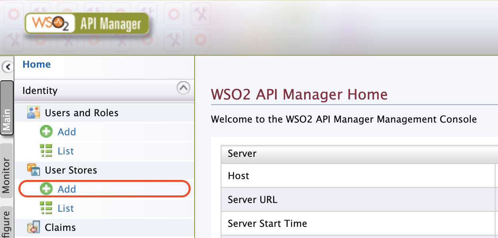
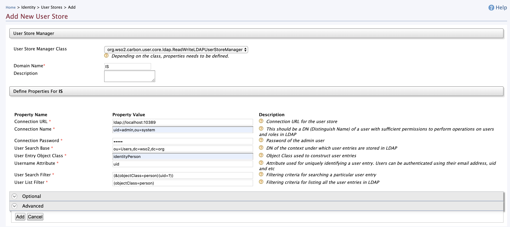
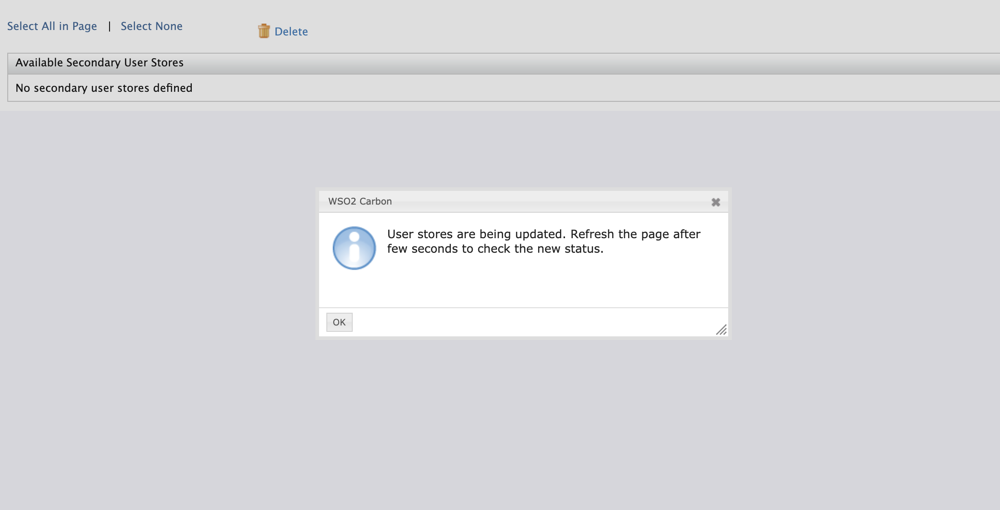
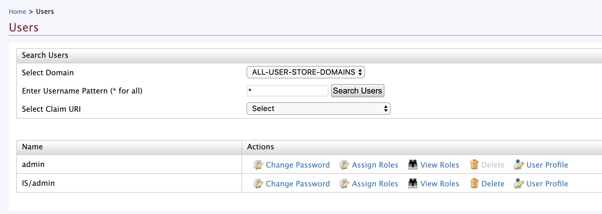
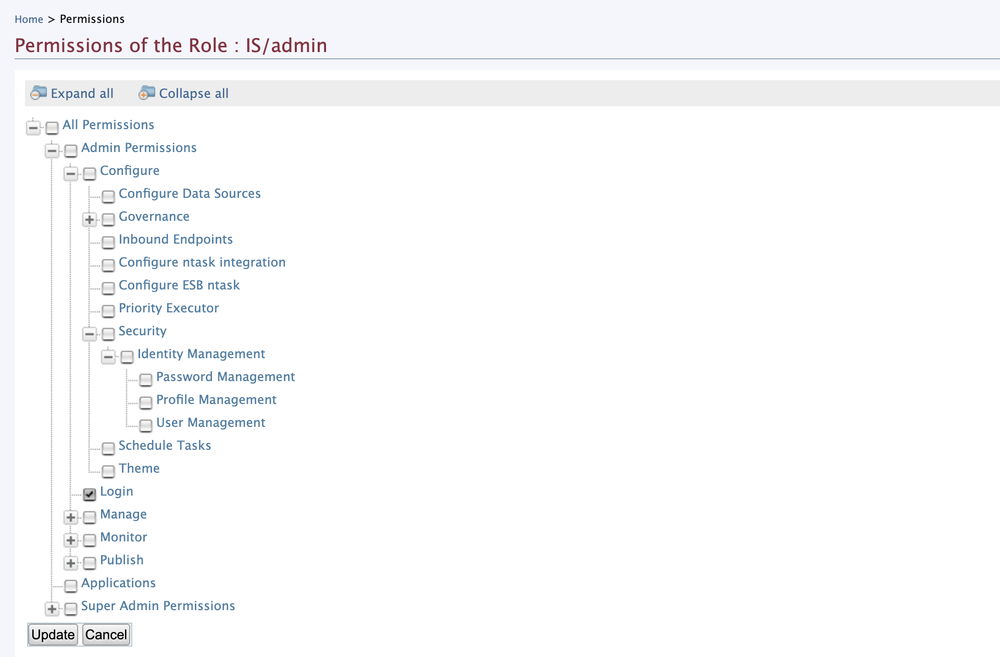

## Intro

This post illustrates how to add an LDAP user-store as a secondary user-store in WSO2 API Manager (in almost every WSO2 Product).

> For demo purposes, we will be using a pre-configured LDAP user-store which resides in **WSO2 Identity Server** and shipped by default

## Configure

Download both [WSO2 API Manager (2.6.0)](https://wso2.com/api-management/) and [WSO2 Identity Server (5.7.0)](https://wso2.com/identity-and-access-management/) as binary artifacts from the official download page and follow the given steps to configure port offset on them.

### WSO2 Identity Server

Extract the binary artifact of WSO2 Identity Server and navigate to `[IS]/bin` folder and execute the following command based on your environment to start the server …

```shell
# linux env
./wso2server.sh

# windows env
./wso2server.bat
```

### WSO2 API Manager

Extract the binary artifact of WSO2 API Manager and navigate to [APIM]/repository/conf/carbon.xml to edit the port offset configurations of API Manager.

> We will be using the default shipped LDAP user-store of WSO2 Identity Server as the secondary user-store in API Manager. Therefore, we will be running both the server nodes in a single machine. For this reason, we will be port off-setting the API Manager node

Open and edit the `<Offset>` element with the following …

```xml
<Offset>1</Offset>
```

Start the server by executing the following command based on your environment

```shell
# linux env
./wso2server.sh

# windows env
./wso2server.bat
```

And login to the management console by directing to [`https://localhost:9444/carbon`](https://localhost:9444/carbon) and enter `admin` as both the username and password. Next select `Add` under `User Stores` section in `Main` tab.



Enter the inputs as follows …

* User Store Manager Class: select `ReadWriteLDAPUserStoreManager` or `ReadOnlyLDAPUserStoreManager` based on your preference
* Domain Name: give a related domain name to identify the users from this user-store. We will be using `IS` as the domain name
* Connection URL: `ldap://localhost:10389`
* Connection Name: `uid=admin,ou=system`
* Connection Password: `admin`
* User Search Based: `ou=Users,dc=wso2,dc=org`
* User Entry Object Class: `identityPerson`
* Username Attribute: `uid`
* User Search Filter: `(&(objectClass=person)(uid=?))`
* User List Filter: `(objectClass=person)`

> Please enter relavant configuration values and properties if your LDAP configurations are different from the above-mentioned



Click on `Add` to save and add the user-store in WSO2 API Manager. The following alert box will appear if the user-store is added correctly.



## Run & Test

Direct to [`https://localhost:9444/carbon`](https://localhost:9444/carbon) and select `List` under `Users and Roles` section and select `Users` from the prompted page to list all available users from all defined user-stores.

You will see a similar page as follows …



Select `View Roles` of `IS/admin` user and click on `Permissions` of `IS/admin` role in the next page. Thereafter, select theLogin permission in the listed permission tree.



And select Update to update the permission tree. Now, logout from the carbon console and again Sign-in using the following credentials …

* Username: `IS/admin`
* Password: `admin`

> The above-mentioned credentials are related to the admin user of the secondary user-store

After a successful login, the management console will be displayed with allowed features set and panels (allowed permissions).

<hr class="three--dots"/>
