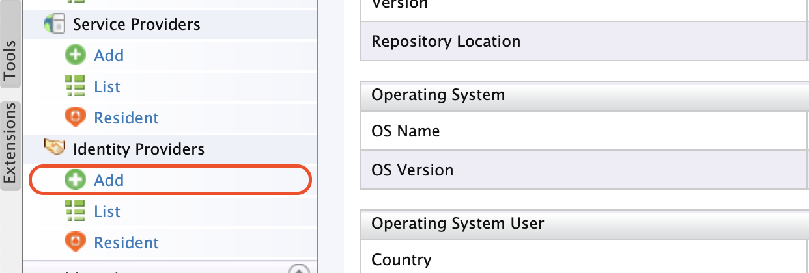
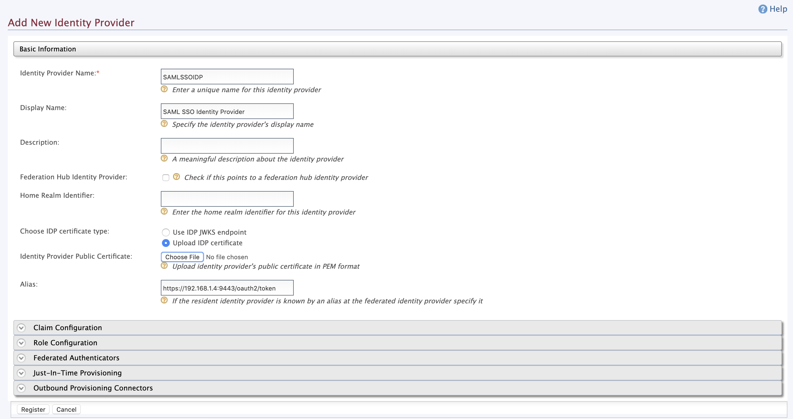

## Brief Introduction

### SAML 2.0

SAML2 or SAML 2.0 is an XML-based framework, which is used to describe and exchange security information. SAML is commonly used for Single Sign-On (SSO) and Identity Management and Federation.

### OAuth 2.0

OAuth2 is an authorization framework used to enable applications to obtain limited access to resource owner (user) accounts.

> A quick glance and a story guide on OAuth2 framework and its grant-flows can be found here.

Both OAuth2 and SAML have similar concepts and terms in between them.

* Resource Server = Service Provider
* Authorization Server = Identity Provider
* Client

## Story Guide

Stackcheats is a private blog platform which uses **SAML SSO** to authenticate and authorize different writers and bloggers. Since Stackcheats has been a private blog platform, they have a new requirement on their development road-map to access writer's technical blogs from their  Medium accounts.

However, the Medium platform has been using **OAuth2** mechanism to authorize different users and writers to access and view various medium posts.

> OAuth2 and SAML 2.0 are two different frameworks used to authorize and authenticate (OAuth doesn't authenticate).

This is where the SAML Bearer Assertion grant comes to play. The SAML Bearer Assertion grant is used to exchange the acquired SAML Assertion for an OAuth2 access token.

To simply put, SAML Bearer Assertion grant-flow is very similar to the Authorization code grant-flow in OAuth, wherein SAML Bearer Assertion flow, a SAML Assertion is used instead of a cryptography code to gain an OAuth2 access token.

Given below is a simple diagram of how SAML Bearer Assertion flow works.


## Experiential

For practical, we will be using **WSO2 API Manager** along with **WSO2 Identity Server** and a simple Passport-SAML express application to retrieve a SAML2 Bearer Assertion and to exchange to an OAuth2 access token and finally to invoke an API defined in the API Manager.

As first step, we'll configure our WSO2 Identity Server with the API Manager to function as a Federated Identity Provider. Then, we'll setup our Passport SAML application with the Identity Server as a service provider to gain SAML2 Token.

### WSO2 API Manager

Follow the steps to add our WSO2 Identity Server as a Federated Identity Provider in our API Manager.

Start the API Manager server by directing to `<APIM>/bin` folder and execute the startup command based on your environment ...

```shell
# linux env
./wso2server.sh

# windows env
./wso2server.bat
```

And login to the management console (`https://localhost:9443/carbon`), using `admin` for both the username and password.

Click on `Add` under `Identity Providers` accordian as following





### WSO2 Identity Server
