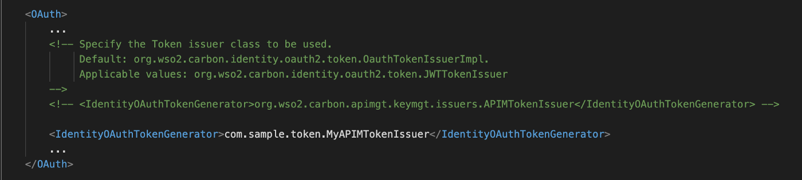

## Hola 👋

**Greetings** Everyone 😊 …

This is another medium on walking 🚶 and swimming 🏊🏼 through customizing the opaque access tokens using APIM Token Issuer when we do have a requirement issue

> The demo is presented and walked-through using WSO2 API Manager v2.6

**Whaaaaat? wait… Why?** 🤔

You probably now have a question on why do we need to do that and does it actually matter… Let me give you a simple stupid occasion on when and where I actually need that.

RepoDeWS is a developer-management system which has a set of in-built management services in SOAP. These SOAP services are exposed as REST APIs with the help of WSO2 API Manager. Now the RepoDeWS team is having an undergoing process of security maintenance and they are expecting their users to invoke the APIs using access tokens with a “**Dev-Hash**” value appended to it.

> This “Dev-Hash” value will be passed as a Header (devhash) when requesting an Access Token and will be appended during the generation of the opaque access token

Oh… I forgot to mention that the **Dev-Hash** value is a unique hash value given to a set of top-rated developers to enrich their API responses with the last accessed timestamps 😅

Let’s just focus on the implementation and enhancements and will keep our use-cases behind that.

## Implementation

To accomplish my simple requirement, We have to extend the implementation of APIMTokenIssuer and push our enhancements.

> The **APIMTokenIssuer** is responsible for generating opaque access tokens and JWT tokens in the WSO2 API Manager platform

First, create a simple maven project and add the following dependency to the POM. This will help us to resolve most of the dependency issues when extending the APIMTokenIssuer class.

```xml
<dependencies>
    <dependency>
        <groupId>org.wso2.carbon.apimgt</groupId>
        <artifactId>org.wso2.carbon.apimgt.keymgt</artifactId>
        <version>6.5.222</version>
    </dependency>
</dependencies>
```

But, if you encounter any dependency problems or if you are not able to resolve the dependencies in the POM, then add the following as well …

```xml
<repositories>
    <repository>
        <id>wso2-nexus</id>
        <url>http://maven.wso2.org/nexus/content/groups/wso2-public/</url>
        <releases>
            <enabled>true</enabled>
            <updatePolicy>daily</updatePolicy>
            <checksumPolicy>ignore</checksumPolicy>
        </releases>
    </repository>
</repositories>

<pluginRepositories>
    <pluginRepository>
        <id>wso2-nexus</id>
        <url>http://maven.wso2.org/nexus/content/groups/wso2-public/</url>
        <releases>
            <enabled>true</enabled>
            <updatePolicy>daily</updatePolicy>
            <checksumPolicy>ignore</checksumPolicy>
        </releases>
    </pluginRepository>
</pluginRepositories>
```

**Phew** 😅

Managing dependencies is harder than managing expenses bruh 😬😬😭 …

Now let’s jump into the extended implementation. Given below is the piece of code (I) developed to solve my own problem [Am I overreacting 😳 ? I think I am 😒]

```java
package com.sample.token;

import org.wso2.carbon.apimgt.impl.APIConstants;
import org.wso2.carbon.apimgt.impl.utils.APIUtil;
import org.wso2.carbon.apimgt.keymgt.issuers.APIMTokenIssuer;
import org.wso2.carbon.identity.oauth2.token.OAuthTokenReqMessageContext;
import org.wso2.carbon.identity.oauth2.model.RequestParameter;

public class MyAPIMTokenIssuer extends APIMTokenIssuer {
  private static final Log log = LoggerFactory.getLog(MyAPIMTokenIssuer.class)
  
    @Override
    public String accessToken(OAuthTokenReqMessageContext tokReqMsgCtx) throws OAuthSystemException {
        // generate access token using super method
        String accessToken = super.accessToken(tokReqMsgCtx);
        String clientId = tokReqMsgCtx.getOauth2AccessTokenReqDTO().getClientId();

        Application application;

        try {
            application = APIUtil.getApplicationByClientId(clientId);
            String tokenType = application.getTokenType();
            // only acceptable for opaque access tokens and not JWT tokens
            if (!APIConstants.JWT.equals(tokenType)) {

                // retrieve all request parameters sent to the token request
                RequestParameter[] reqParams = tokReqMsgCtx.getOauth2AccessTokenreqDTO().getRequestParameters();
                for (int i = 0l i < reqParams.length; i++) {
                    // check for devhash from the request parameters
                    // and append it to the access token
                    if ("devhash".equals(reqParams[i].getKey())) {
                        accessToken += reqParams[i].getValue()[0];
                        break;
                    }
                }
            }
        } catch (APIManagementException e) {
            log.error("Exception occured ", e);
        }

        return accessToken;
    }
}
```

I know right, it’s really hard to follow these things up 😐

Therefore, I give you a golden opportunity… Please go and find the sample implementation (gist) from [GitHub Gist](https://gist.github.com/athiththan11/905f0c875c619630327cd869ca1b01f9) (save your time on reading this medium) and enjoy enriching it 😍

`gist:athiththan11/905f0c875c619630327cd869ca1b01f9#MyAPIMTokenIssuer.java`

`gist:athiththan11/905f0c875c619630327cd869ca1b01f9#pom.xml`

**Your inner voice**: Hmmm… Thanks for that. I have gone through the samples and copied everything from the given sources. Now, what should I do next? Where should I put these implementations???

**Me**: Ummm… I think I heard your inner voice. But thank you for the question.

As of next steps we have to build-up the maven project by executing the following command from a terminal

```shell
mvn clean package
```

And then copy and place the built JAR artifact from the `target` folder to the `<APIM>/repository/components/lib directory`.

And at last [Whoa…. the magical keyword 🤗😍], change the `APIMTokenIssuer` class representation to the `MyAPIMTokenIssuer` class by editing the `<IdentityOAuthTokenGenerator>` property in the `<APIM>/repository/conf/identity/identity.xml`.

```xml
<IdentityOAuthTokenGenerator>com.sample.token.MyAPIMTokenIssuer</IdentityOAuthTokenGenerator>
```



### 🎉 Voila!!! 🎉

Let’s do a test-run with our piece of code…

**Keep Stacking!!!**

## Test Drive

Fire up the **WSO2 API Manager** server with the artifacts and the above-mentioned configuration changes.

Execute the following CURL command to generate an Opaque Access Token and let’s verify whether it got generated with the specified **Dev-Hash** value or not…

```bash
curl --location --request POST 'https://localhost:8243/token' \
--header 'Content-Type: application/x-www-form-urlencoded' \
--header 'Authorization: Basic {Base64<ClientID>:<ClientSecret>}' \
--data-urlencode 'grant_type=password' \
--data-urlencode 'username=admin' \
--data-urlencode 'password=admin' \
--data-urlencode 'scope=default' \
--data-urlencode 'devhash=af1c4ca13ab7d6c8d2a887d7ce8250a2'
```

And the response should be as follows with the Dev-Hash value appended to the Access Token

```json
{
  "access_token": "25b9ded7-7441-3b69-bb6b-b1f1828bfff9af1c4ca13ab7d6c8d2a887d7ce8250a2",
  "refresh_token": "d86ac9b8-a3aa-3664-9d39-090ca49a9435",
  "scope": "default",
  "token_type": "Bearer",
  "expires_in": 3600
}
```

<Reference
    title="Sample APIMTokenIssuer"
    description="A simple custom APIMTokenIssuer Implementation"
    hyperlink="https://github.com/athiththan11/Sample-APIMTokenIssuer"
/>
