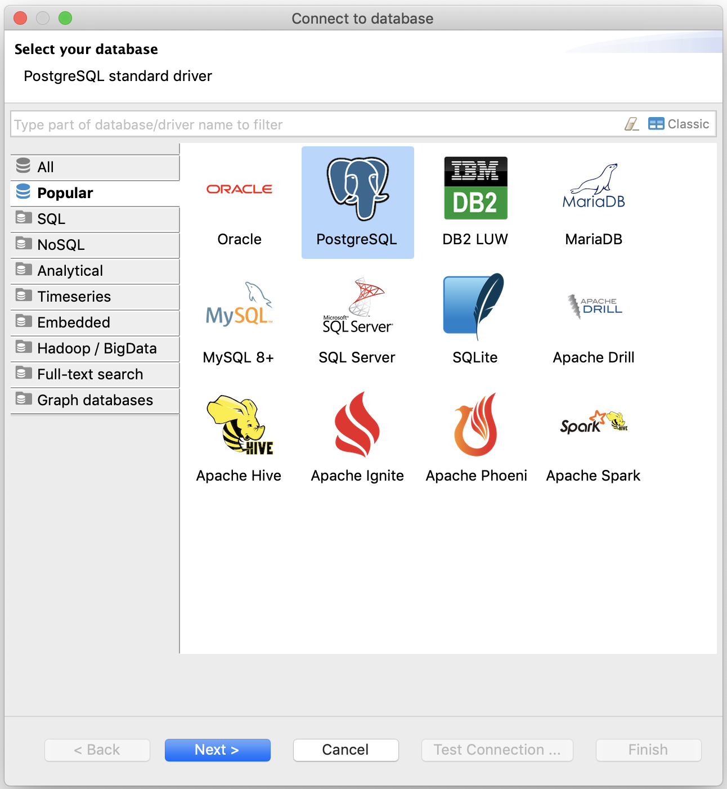
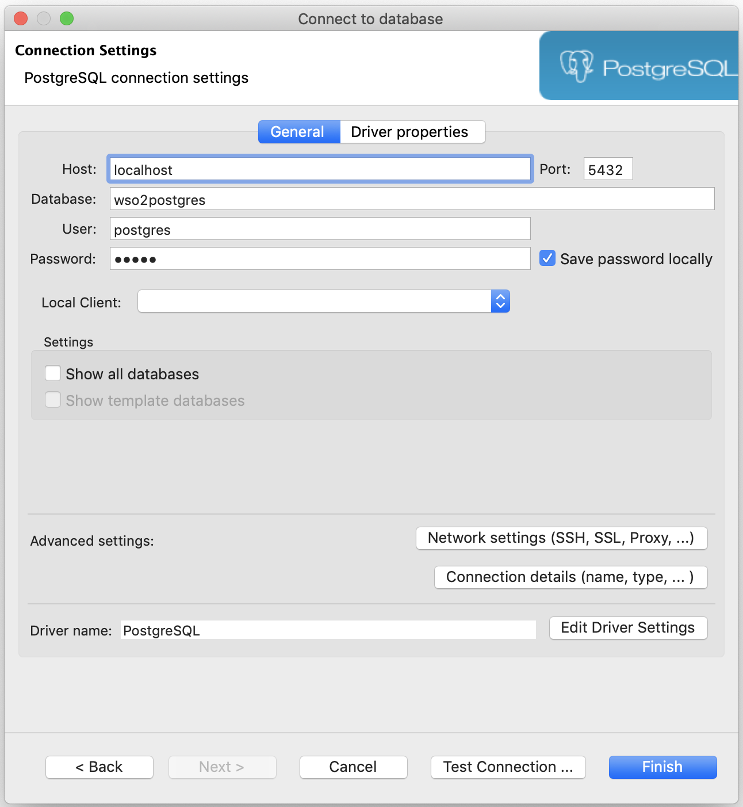
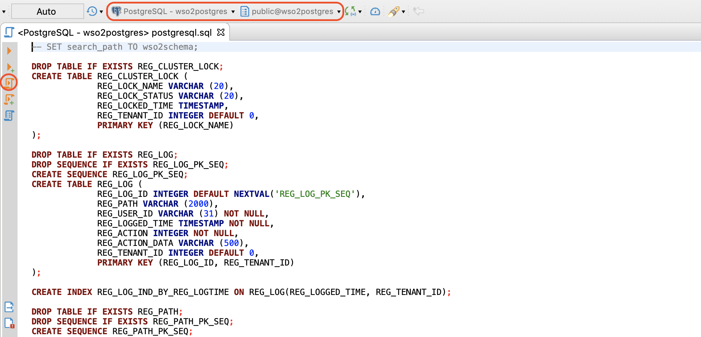

## Docker: Postgres

### Pull

> Prerequisites: Docker installed in your environment. You can follow the [Docker](https://www.docker.com/get-started) docs to get it done.

Follow the given steps to set up Postgres using Docker in your dev environments. For this demo, we will be using **Postgres - 9.6.14** and **WSO2 Identity Server 5.7**.

Start the Docker service and execute the following command to pull the Postgres (9.6.14) image from [DockerHub](https://hub.docker.com/_/postgres)

```bash
docker pull postgres:9.6.14
```

### Run

After a successful pull, execute the below command to create and run a docker container for our pulled Postgres image. Replace the `<CONTAINER_NAME>` tag with your preferred name or use `postgres-9.6.14` as the default value.

> You can change the Postgres password by changing the `POSTGRES_PASSWORD` value from `hydrogen` to any preferred secured password

```bash
docker run --name <CONTAINER_NAME || postgres-9.6.14> -e POSTGRES_PASSWORD=hydrogen -p 5432:5432 -d -v $HOME/docker/volumes/postgres:/var/lib/postgresql postgres:9.6.14
```

> Basic commands to `start` and `stop` a Docker container
>
> -   `docker start <CONTAINER_NAME>` to start a container
> -   `docker stop <CONTAINER_NAME>` to stop a running container

### PSQL Terminal

Use the following command to hop into the PSQL terminal session.

```bash
docker exec -ti <CONTAINER_NAME || postgres-9.6.14> psql -h localhost -U postgres
```

## Configurations

### Postgres

To replace the default packaged H2 database with Postgres, initially, we have to create the databases and tables in Postgres. Find and execute the following PostgreSQL scripts to create and set up all necessary tables and indexes.

> You can use either any database tools like DBeaver (Jump to [DBeaver](#dbeaver)) or you can straightaway execute them using PSQL terminal (Jump to [PSQL](#psql))

-   `<IS>/dbscripts/postgresql.sql`
-   `<IS>/dbscripts/identity/postgresql.sql`
-   `<IS>/dbscripts/identity/uma/postgresql.sql`
-   `<IS>/dbscripts/identity/stored-procedures/postgre/postgresql.sql`
-   `<IS>/dbscripts/consent/postgresql.sql`

Start the Postgres container (if not started before) using the following command

```bash
docker start postgres-9.6.14
```

#### PSQL

Execute the following command to enter the PSQL terminal session and run the create query to create a database named `wso2postgres`

```bash
docker exec -ti postgres-9.6.14 psql -h localhost -U postgres
```

```sql
create database wso2postgres;
```

After successful creation, try to connect to the `wso2postgres` database using the following command

```psql
\c wso2postgres;
```

Next, quite the terminal session using `\q` command and copy the `dbscripts` folder from the `<IS_HOME>` path to our `postgres-9.6.14` container volume to execute all related scripts using the Docker PSQL terminal.

```bash
docker cp <IS_HOME>/dbscripts postgres-9.6.14:/
```

and run the following commands one by one to execute the scripts

```bash
docker exec -ti postgres-9.6.14 psql -h localhost -U postgres -d wso2postgres -f /dbscripts/postgresql.sql
-----
docker exec -ti postgres-9.6.14 psql -h localhost -U postgres -d wso2postgres -f /dbscripts/identity/postgresql.sql
-----
docker exec -ti postgres-9.6.14 psql -h localhost -U postgres -d wso2postgres -f /dbscripts/identity/uma/postgresql.sql
-----
docker exec -ti postgres-9.6.14 psql -h localhost -U postgres -d wso2postgres -f /dbscripts/identity/stored-procedures/postgre/postgresql.sql
-----
docker exec -ti postgres-9.6.14 psql -h localhost -U postgres -d wso2postgres -f /dbscripts/consent/postgresql.sql
```

After a successful connection, execute the above-mentioned SQL scripts to create related tables and indexes. But, before executing them, we have to copy the `dbscripts` folder to the related container volume to execute the script using PSQL terminal. Execute the following command to copy the `dbscripts` folder from the `<IS_HOME>` path to our `postgres-9.6.14` container volume.

#### DBeaver

> Prerequisites: DBeaver installed in your environment. You can follow the [DBeaver](https://dbeaver.io) site.

Open DBeaver and create a new database connection. Select `PostgreSQL` from the list and click `Next`.



Enter `wso2postgres` for the `Database` field and use `hydrogen` as `Password`.

> Please change and use related values for the `Host`, `Port`, `Database`, `User` and `Password` fields if those are different from mentioned default values.
>
> If you have not installed any PostgreSQL driver for DBeaver, it will prompt you to follow a couple of instructions to install necessary drivers to work with Postgres databases and connections



Click on `Test Connection` to test the database connection and if successful then click on `Finish` to finish the connection configuration process. The created connection will be listed under the `Database Navigator` panel (on the left-side navigation panel). Navigate to `File` -> `Open File ...` and select and open the above-listed PostgreSQL scripts in the DBeaver.

Select the database connection and the Postgres schema if not selected by default and click `Execute SQL Script` to execute the script. Do this for all above-mentioned [PostgreSQL scripts](#postgres).



### WSO2 Identity Server

> Below described steps and guides are based on fresh-pack installation. If you have any pre-stored data inside the H2 database, then you have to migrate them to the new data-source which is not covered in this topic.

After setting up the databases, now we have to install the Postgres JDBC connector (driver) for our WSO2 Identity Server. Download the Postgres driver from [here](https://jdbc.postgresql.org/download.html), copy and place the `jar` file inside the `<IS>/repository/components/lib` directory.

Next, we have to configure our database connection settings in the Identity Server to connect to our Postgres source. Make changes to the following XML files to swap the connection from default H2 database to our Postgres database.

-   [`<IS>/repository/conf/datasources/master-datasources.xml`](#master-datasource)
-   [`<IS>/repository/conf/identity/identity.xml`](#identity)
-   [`<IS>/repository/conf/registry.xml`](#registry)

> Moreover, We will also be swapping the user store from the default LDAP server to the JDBC store

-   [`<IS>/repository/conf/user-mgt.xml`](#user-management)

> Replace and change the `host`, `port`, `username`, and `password` segments with respective values if different.

#### Master DataSource

Add the following data source configuration below the default H2 configuration.

```xml
<!-- master-datasources.xml -->
<datasource>
    <name>WSO2_CARBON_POSTGRES_DB</name>
    <description>The datasource used for registry and user manager</description>
    <jndiConfig>
        <name>jdbc/WSO2CarbonPostgresDB</name>
    </jndiConfig>
    <definition type="RDBMS">
        <configuration>
            <url>jdbc:postgresql://localhost:5432/wso2postgres</url>
            <username>postgres</username>
            <password>hydrogen</password>
            <driverClassName>org.postgresql.Driver</driverClassName>
            <maxActive>80</maxActive>
            <maxWait>60000</maxWait>
            <minIdle>5</minIdle>
            <testOnBorrow>true</testOnBorrow>
            <validationQuery>SELECT 1; COMMIT</validationQuery>
            <defaultAutoCommit>true</defaultAutoCommit>
            <validationInterval>30000</validationInterval>
        </configuration>
    </definition>
</datasource>
```

#### Identity

Change the data-source in `repository/conf/identity/identity.xml` with the Postgres JNDI configuration name.

```xml
<!-- identity.xml -->
<JDBCPersistenceManager>
        <DataSource>
            <!-- Include a data source name (jndiConfigName) from the set of data
                sources defined in master-datasources.xml -->
            <!-- <Name>jdbc/WSO2CarbonDB</Name> -->

            <Name>jdbc/WSO2CarbonPostgresDB</Name>
        </DataSource>
        ...
```

#### Registry

The following changes are made to mount the registries with our newly created Postgres data-source.

> Don't change the default `wso2registry` configurations unless if you want to. Add new registry mounting configurations below the default configurations.

```xml
<!-- registry.xml -->
<dbConfig name="wso2registry">
    <dataSource>jdbc/WSO2CarbonDB</dataSource>
</dbConfig>

<dbConfig name="govregistry">
    <dataSource>jdbc/WSO2CarbonPostgresDB</dataSource>
</dbConfig>
<remoteInstance url="https://localhost:9443/registry">
    <id>gov</id>
    <cacheId>postgres@jdbc:postgresql://localhost:5432/wso2postgres</cacheId>
    <dbConfig>govregistry</dbConfig>
    <readOnly>false</readOnly>
    <enableCache>true</enableCache>
    <registryRoot>/</registryRoot>
</remoteInstance>
<mount path="/_system/governance" overwrite="true">
    <instanceId>gov</instanceId>
    <targetPath>/_system/governance</targetPath>
</mount>
<mount path="/_system/config" overwrite="true">
    <instanceId>gov</instanceId>
    <targetPath>/_system/config</targetPath>
</mount>
```

#### User Management

> Below described steps are to change the default LDAP user-store to JDBC user-store. You can skip the following changes if you want to keep the default LDAP user-store as out-of-the-box.

Comment the existing `WSO2CarbonDB` data source property tag and place the `WSO2CarbonPostgresDB` property tag inside the `<Configuration>` element as described below

```xml
<Configuration>
    ...
    <!-- <Property name="dataSource">jdbc/WSO2CarbonDB</Property> -->

    <Property name="dataSource">jdbc/WSO2CarbonPostgresDB</Property>
</Configuration>
```

Further, comment the LDAP user store manager configurations and uncomment the JDBC user store manager. This will route our default LDAP user store with JDBC user store.

## Run & Test

Start the WSO2 Identity Server by navigating to the `<IS>/bin` folder and execute the following command based on your environment

```bash
# linux env
./wso2server.sh

# windows env
./wso2server.bat
```

The server will start and configure the platform to work with new configurations. After a successful startup, bring up your favorite browser and navigate to `https://localhost:9443/carbon` and enter `admin` as both username and password.
