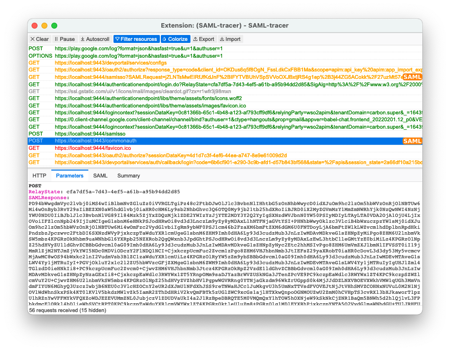

## Greetings Everyone !!! 👋

In this medium, I will be walking through how to configure and generate an access token in WSO2 API Manager using SAML Bearer Grant flow.

> As to demonstrate the flow and configurations, we will be using WSO2 API Manager v3.2.0 & WSO2 Identity Server v5.10.0

As out-of-the-box, the WSO2 API Manager v3.2.0 supports SAML Bearer grant flow to generate access tokens by providing a valid SAML Assertion to the system.

So, let’s dive in and start configuring our WSO2 API Manager & Identity Server to perform the SAML Bearer grant …

## 🌐 WSO2 API Manager

Let’s start with configuring the WSO2 API Manager.

As of the first step, we need a Service Provider configured in the API Manager environment to generate access tokens. We can either log in to the Devportal and create an Application to generate tokens or, we can log in to the Carbon Management console of the API Manager server and create a new Service Provider.

For this demonstration, I will be focusing on creating a Service Provider from the Carbon Management console of the API Manager server.

### ✋ Service Provider

Let’s log in to the Carbon Management console of the API Manager server by firing up your favourite browser and navigating to `https://localhost:9443/carbon`

Sign in to the console with the admin credentials. Once logged in, navigate to the `Service Providers` section and click on `Add`.

Configure the Service Provider with the following information

- Service Provider Name: `saml-bearer-sp`

and click on `Register`.

On the next screen, expand the `Inbound Authentication Configuration` > `OAuth/OpenID Connect Configuration` and click on `Configure`. Make sure, that you have selected the `SAML2` grant type in the `Allowed Grant Types` and add a `Callback URL` if you have enabled either `Code` or `Implicit` grant type. Once done, scroll down and click on `Add`

Make a note of the generated `OAuth Client Key` and `OAuth Client Secret` of the Service Provider, as we will be using these credentials when invoking the Token endpoint with SAML Bearer Token grant.

Click on `Update` to save the Service Provider configurations.

Next, we need to configure an Identity Provider in the API Manager server to validate the signature of the SAML Assertion that we are passing.

### ✋ Identity Provider

Navigate to the `Identity Providers` section and click on `Add` to add a new Identity Provider in the API Manager server.

Configure the Identity Provider with the following inputs

- Identity Provider Name: `wso2is`
- Display Name: `WSO2 IS`

Expand the `Federated Authenticators` > `SAML2 Web SSO Configuration` and perform the following

- Enable SAML2 Web SSO: `true`
- Service Provider Entity ID: `wso2apim` _(enter the Service Provider Entity ID that you have registered in the IS server)_
- Identity Provider Entity ID: `wso2is` _(enter the Identity Provider Entity ID of your IS Server)_
- SSO URL: `https://localhost:9444/samlsso` _(assuming that the Identity Server is running on a port offset of 1)_

click on `Register`

In addition to the above configurations, we also need to export the public certificate of the WSO2 Identity Server and import it under the created Identity Provider in the API Manager. This is because, we will be using the WSO2 Identity Server as our SAML provider, therefore the SAML Assertion is going to be signed with the private key of the Identity Server. Hence, in order to verify the signature of the assertion, we need to export and import the public certificate of the WSO2 Identity Server into API Manager.

> If you are planning to use any other SAML providers than WSO2 Identity Server, then it is required to import the public certificate of the respective provider in the created Identity Provider

Execute the following command to export the public certificate from the WSO2 Identity Server. Run the commands from `<WSO2_IS_HOME>/repository/resources/security` directory

> Provide the WSO2 Carbon JKS Keystore password when prompted

```sh
keytool -export -keystore wso2carbon.jks -alias wso2carbon -file wso2carbon.crt
```

Now, we have exported the public certificate as `.crt` format. Execute the following `openssl` command to convert the `.crt` to `.pem` format to upload certificate via the UI

```sh
openssl x509 -inform der -in wso2carbon.crt -out wso2carbon.pem
```

Now, that we have exported the public certificate of the WSO2 Identity Server as `.pem` format, let’s upload it via the Carbon Management console. Navigate to the `Identity Providers` section in the Carbon Management console of the WSO2 API Manager > `List` > and click on the `Edit` of our newly created Identity Provider.

Under Choose IDP certificate type, select Upload IDP certificate and choose the exported public certificate. And click on Update to save the configurations.

**and Done!!!** 🎉 🎉 🎉

We have now configured our WSO2 API Manager to successfully validate the SAML Assertion and to generate an access token using SAML Bearer grant flow.

## 🔍 Test & Verify

To try out and verify the SAML Bearer grant flow, let’s configure our existing API Manager to perform a federated authentication with the Identity Server using SAML SSO.

> This is an extra part of the configuration to acquire a valid SAML Response and Assertion from the WSO2 Identity Server to try out our SAML Bearer grant flow. If you have already acquired a SAML Assertion from the Identity Server using any App integration, then this section is not required for you to follow 😃

If you haven’t already started a WSO2 Identity Server, start one with a port offset of any desired (I will be using a port offset of 1 for this demonstration).

Let’s start configuring the WSO2 Identity Server for our SAML SSO

## 🔐 WSO2 Identity Server

### ✋ Service Provider for SAML SSO

Open up your favourite browser and navigate to `https://localhost:9444/carbon` and sign in to the Carbon Management console of the Identity Server using the `admin` credentials.

Go to the `Service Providers` section and click on `Add`. Create a Service Provider named `wso2apim` and click on `Register`.

On the next screen, expand the `Inbound Authentication Configuration` > `SAML2 Web SSO Configuration` and click on `Configure`.

Fill the form with the following

- Issuer: `wso2apim`
- Assertion Consumer URLs: `https://localhost:9443/commonauth` _(and click on Add to add the URL)_
- Enable Response Signing: `true`
- Enable Signature Validation in Authentication Requests and Logout Requests: `true`
- Enable Single Logout: `true`
- Enable Attribute Profile: `true`
- Include Attributes in the Response Always: `true`
- Enable Audience Restriction: `https://localhost:9443/oauth2/token`
- Enable Recipient Validation: `https://localhost:9443/oauth2/token`
- Enable Assertion Query Request Profile: `true`
- Idp Entity ID Alias: `wso2is`

and click on `Register`

Since we have enabled the Signature validation in authentication requests and log out requests, we have to upload the WSO2 API Manager’s public certificate to the Service Provider that we have registered.

Execute the following commands from `<WSO2_APIM_HOME>/repository/resources/security` directory

> Provide the WSO2 Carbon JKS Keystore password when prompted

```sh
keytool -export -keystore wso2carbon.jks -alias wso2carbon -file wso2carbon.crt
```

Now, we have exported the public certificate as `.crt` format. Execute the following `openssl` command to convert the `.crt` to `.pem` format to upload certificate via the UI

```sh
openssl x509 -inform der -in wso2carbon.crt -out wso2carbon.pem
```

Navigate to the Service Provider that we have registered, and under `Basic` Information section, select the `Upload SP certificate` and upload the `.pem` certificate under `Application Certificate`. Once uploaded, click on `Update` to update the configurations.

Now, let’s move to WSO2 API Manager and configure the API Manager to initiate and perform the SAML2 Web SSO with WSO2 Identity Server from the Devportal.

## 🌐 WSO2 API Manager

As we have already registered an IDP in the API Manager server providing the URLs of the WSO2 IS, let’s open the same and make a few more adjustments for our SAML Web SSO requirement.

### ✋ Identity Provider: wso2is

Log in to the Carbon Management console of the API Manager server and navigate to `Identity Providers` > `List` > `Edit` the registered `wso2is` IDP.

Expand the `Federated Authenticators` > `SAML2 Web SSO Configuration` and perform the following

- Enable Authentication Request Signing: `true`
- Enable Assertion Signing: `true`
- Enable Logout Request Signing: `true`
- Enable Authentication Response Signing: `true`
- Signature Algorithm: `RSA with SHA1`
- Digest Algorithm: `MD5`

click on `Update`.

Next, we’ll configure the Devportal’s Service Provider to perform a Federated Authentication with WSO2 Identity Server.

### ✋ Service Provider

Navigate to `Service Providers` > `List`. Select and `Edit` the Service Provider that is registered for the Devportal, `apim_devportal`.

Expand the `Local & Outbound Authentication Configuration` and tick the `Federated Authentication` and select the registered IDP from the list, `wso2is`. Click on `Update` and save the configurations.

Let’s make the configurations work!! <br/>
Open up the browser, and install the SAML Tracer extension to capture the SAML Responses while performing the SAML SSO. After installing the extension, hit `https://localhost:9443/devportal` to go to Devportal. Click on the `SIGN-IN` button at the top-right corner.

> Please make sure that the SAML Tracer extension is started and listening to the SAML transactions made in the browser.

This will take you to the WSO2 Identity Server’s login page, as you will be able to see and confirm the behaviour by inspecting the URLs in the browser. Sign in with your user’s credential and capture the successful SAML Response using the SAML Tracer.

Given below is a screenshot of the SAML Tracer and the SAML Response captured



Next, copy the raw SAML Response from the SAML Tracer extension (from `Parameters` tab and not `SAML tab`) and Base64 decode it.

> Do not perform any prettifying or beautifying process on the XML response. If the XML response is prettified, you might encounter unmarshalling errors and unexpected behaviours when trying to generate the Access Token

Extract the `saml2:Assertion` content (including the opening and closing tags: `<saml2:Assertion ...>`, `</saml2:Assertion>`) from the decoded content and Base64 URL encode it. As of final step, let’s prepare the Token request with the required inputs

- CLIENT_ID: The OAuth Client Key copied from the saml-bearer-sp
- CLIENT_SECRET: The OAuth Client Secret copied from the saml-bearer-sp
- ENCODED_SAML_ASSERTION: The SAML Assertion section that is extracted from the SAML Response and Base64 URL encoded

```sh
curl -u <CLIENT_ID>:<CLIENT_SECRET> \ 
-X POST https://localhost:8243/token \
--header 'Content-Type: application/x-www-form-urlencoded' \
--data-urlencode 'grant_type=urn:ietf:params:oauth:grant-type:saml2-bearer' \
--data-urlencode 'assertion=<ENCODED_SAML_ASSERTION>' \
-k
```

and **HIT**!!! _(make sure you hit the request prior to the expiration of the SAML Assertion, else, you will get an error indicating that the assertion is not valid)._

## Voila!!! 🎉

We have now successfully configured our environments and performed the SAML Bearer Grant and generated an Access Token from the API Manager using the SAML Assertion acquired from the WSO2 Identity Server.

**Happy Stacking!!!** 😃 ✌️
