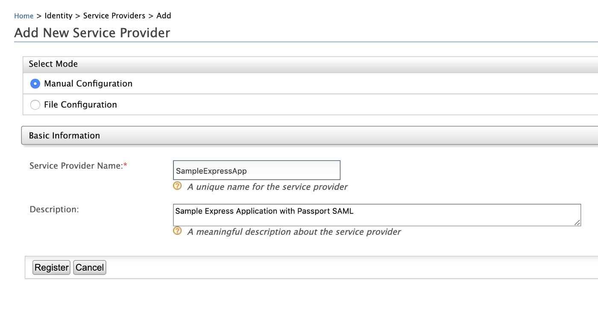
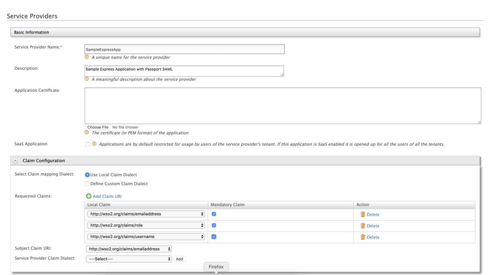
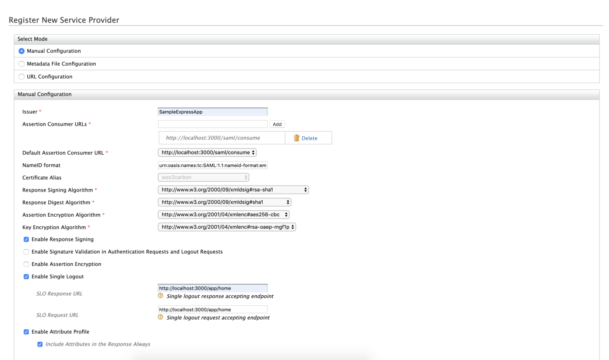
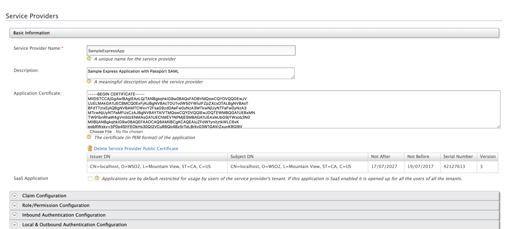
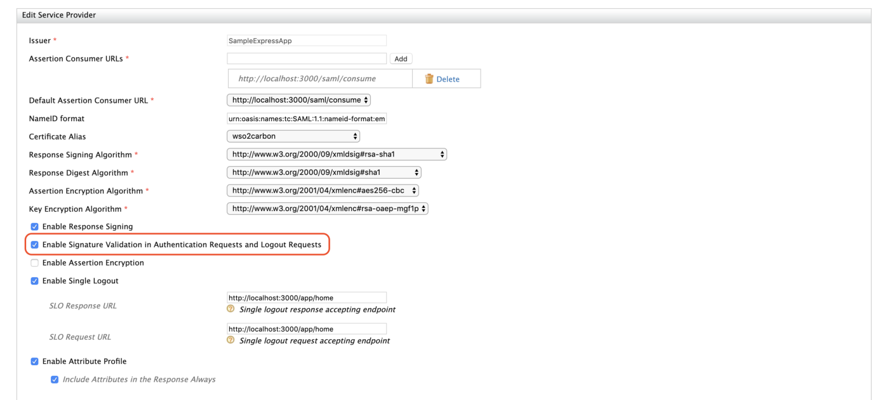
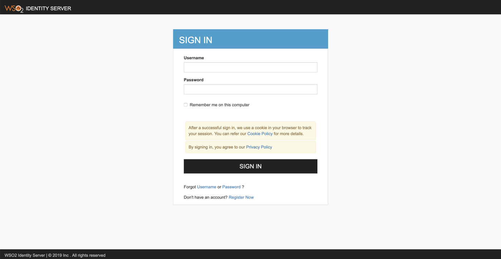
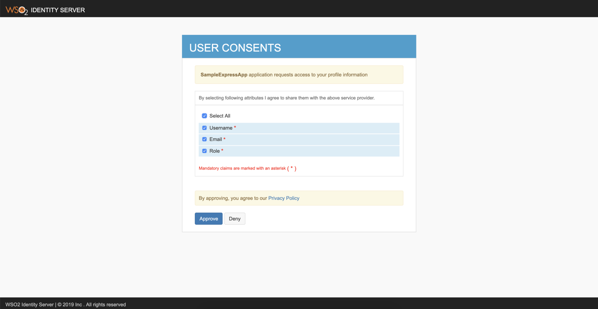
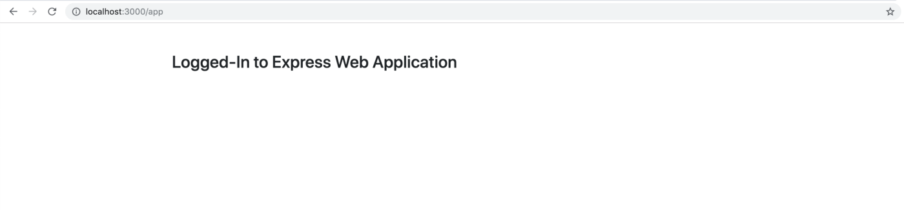

## Intro

This post narrates on how-to enable and register a service provider for SAML SSO using WSO2 Identity Server and to develop a simple Express-based web application with Passport-SAML component to support and authenticate the users via SAML SSO.

> Security Assertion Markup Language (SAML) is an XML-based framework for authentication and authorization between a Service Provider and an Identity Provider. SAML is a standard Single-Sign-On (SSO) format. Authentication information is exchanged through digitally signed XML documents.
>
> [For more on SAML](https://auth0.com/blog/how-saml-authentication-works)

## Implementation

### Express Application

Create an express application by executing `npm init` command, and provide all necessary properties to start the development.

Install all below-listed dependencies by either running `npm install <module> --save` command or by replacing the dependencies object with the values.

A complete package.json is given below.

`gist:athiththan11/dc553a891a27c379515860249caed35c#package.json`

Create a Javascript file named `server.js` in the root directory of our express application with the below-given code-segments.

>**Note: EJS template implementations are not covered here**
>
>Check out the complete implementation of our express application at the end of this blog followed by a [GitHub](https://github.com/athiththan11/Passport-SAML-WSO2) repo. The implementation contains simple EJS templates to render the pages and outputs.

`gist:athiththan11/9352d62cf837e5d05894a4a521d8bfd2#server.js`

### Passport

[Passport](http://www.passportjs.org) is authentication middleware for Node.js and can be used with any Express-based web applications.

> Passport has a comprehensive set of strategies to support different authentication mechanisms with different vendors.

For this implementation, we will be using [Passport-SAML](http://www.passportjs.org/packages/passport-saml) (which is an open-built strategy for SAML 2.0 authentication flows) strategy with our express web application to authenticate users.

Given below is a simple [Passport-SAML](http://www.passportjs.org/packages/passport-saml) strategy configuration …

`gist:athiththan11/9c1c2fa4a7948ae1b320cde8c089c7cb#strategy.js`

## Configurations

### WSO2 Identity Server

Create a new Service Provider in the WSO2 Identity Server to register our express application as one. Follow the given step by step guide to create new Service Provider and to register our express application enabling SAML SSO.

Navigate to *Main (Tab) -> Identity (Section) -> Service Providers* (Sub-section) and select *Add*. The management console will display you the following screen to add a new service provider.

Provide …

* Service Provider Name: SampleExpressApp
* Description: Any valid description of the service provider



And click *Register* to register and create a new service provider. Afterward, the management console will display you the following screen to configure claim configuration, inbound authentication configurations and etc.

Expand the *Claim Configurations (accordion)* to configure wanted claims and subject claim URI. We will be using the *Local Claim Dialect* as the *Claim mapping Dialect*.

> You can add all your wanted (requested claims) by clicking on the Add Claim URI button and selecting one from the drop-down menu

For the demo, we will be selecting the following claims

* `http://wso2.org/claims/emailaddress`
* `http://wso2.org/claims/username`
* `http://wso2.org/claims/role`

And choose `http://wso2.org/claims/emailaddress` as the *Subject Claim URI*.



Next, expand the *Inbound Authentication Configuration (accordion)* and click on *SAML2 Web SSO Configuration* and select *Configure* to configure SAML web SSO for our implemented express application.

Configure the SAML SSO as follows …

* Issuer: `SampleExpressApp`
* Assertion Consumer URLs: `http://localhost:3000/saml/consume`
* Enable Response Signing: `True`
* Enable Signature Validation in Authentication Requests and Logout Requests: False

> To enable signature validate in both authentication requests and logout requests, please refer the `Certificates and Signing` section.

* Enable Single Logout: `True`
* SLO Response URL: `http://localhost:3000/app/home`
* SLO Request URL: `http://localhost:3000/app/home`
* Enable Attribute Profile: `True`
* Include Attributes in the Response Always: `True`



And select *Register* to register your SAML SSO configurations and the management console will prompt you to the previous configuration screen. Leave other configurations as it is and click on *Update*.

> Expand Local & Outbound Authentication Configuration and select Default as the Authentication Type and enable Use user store domain in roles configuration.

### Express Application

After implementing the express application, create a `.env` file in the root path and enter the following properties.

> Change the `SAML_ENTRYPOINT` and `SAML_LOGOUTURL` properties if the IP-address and ports are different from default configurations

```env
SESSION_SECRET="a well secured secret"

SAML_ENTRYPOINT="https://localhost:9443/samlsso"
SAML_ISSUER="SampleExpressApp"
SAML_PROTOCOL="http://"
SAML_LOGOUTURL="https://localhost:9443/samlsso"

WSO2_ROLE_CLAIM="http://wso2.org/claims/role"
WSO2_EMAIL_CLAIM="http://wso2.org/claims/emailaddress"
```

## Certificates and Signing

To validate both authentication request and logout requests, we need to add relevant application certificates and private keys in both Identity Server and in our express application.

> For this demo, we will be using the default wso2carbon key-store to generate application certificates and private keys. The wso2carbon key-store can be found inside <IS_HOME>/repository/resources/security directory

To export the certificate from the key-store, execute the following command from the `security` folder

```bash
keytool -export -keystore wso2carbon.jks -alias wso2carbon -file wso2carbon.crt
```

The above-generated certificate will be in binary format. Use the following command to convert the above binary encoded certificate to PEM encoded certificate

```bash
openssl x509 -inform der -in wso2carbon.crt -out wso2carbon.pem
```

> Copy the generated `wso2carbon.pem` file to another easily accessible folder

### Configure: WSO2 Identity Server

Open the Identity Server and navigate to *Main (Tab) -> Identity (Section) -> Service Providers (Sub-section)* -> select *List* and *Edit (our service provider)*.

In the Basic Information panel, select the `Choose File` button which is associated with the *Application Certificate* field. Choose the above-created `wso2carbon.pem` file and open.



Next, expand the *Inbound Authentication Configuration (accordion)* and click on *SAML2 Web SSO Configuration* and select Edit to update our SAML web SSO configurations. Enable signature validation in authentication requests and logout requests.



Click *Update* and *Update* again to update the service provider configurations.

### Configure: Passport & Express App

Generate a private certificate for our express application. Execute the following commands to generate a private certificate from the default wso2carbon key-store.

> Use `wso2carbon` as the password for any password-prompts.

```bash
keytool -importkeystore -srckeystore wso2carbon.jks -destkeystore wso2carbon.p12 -deststoretype PKCS12 -srcalias wso2carbon -deststorepass wso2carbon -destkeypass wso2carbon
-------------
openssl pkcs12 -in wso2carbon.p12  -nodes -nocerts -out private-key.pem
```

Create folder named `security` in the root path of our express application and place both the generated `private-key.pem` and `wso2carbon.pem` inside.

After placing the certificates, update the passport SAML strategy as follows

`gist:athiththan11/d5c4fdcd7adad232b6f7f018fbc76efd#strategy.js`

## Run & Test

### Run

Run the express application by executing the given command from the root folder

```bash
npm start
```

Also, start your WSO2 Identity Server instance using the following command from your `<IS_HOME>/bin` directory

```bash
sh wso2server.sh
```

### Test

Open your favorite browser and navigate to `http://localhost:3000/app`. The browser will redirect to the WSO2 Identity Server’s sign-in page to enter the login credentials.

>For this demo, you can use `admin` as both the username and password to sign in with the WSO2 Identity Server



After presenting the login credentials, the Identity Server will prompt a user consent page to either approve or deny requested claims. Choose *Select All* and *Approve*.



After successful authentication, the browser will redirect and displays you the logged-in page of our express application.



Navigate to `http://localhost:3000/app/logout` to log-out from the SAML SSO session.

### GitHub

<Reference
    title="Passport SAML WSO2"
    description="A sample express application with Passport-SAML for WSO2 SAML2 SSO"
    hyperlink="https://github.com/athiththan11/Passport-SAML-WSO2"
/>
