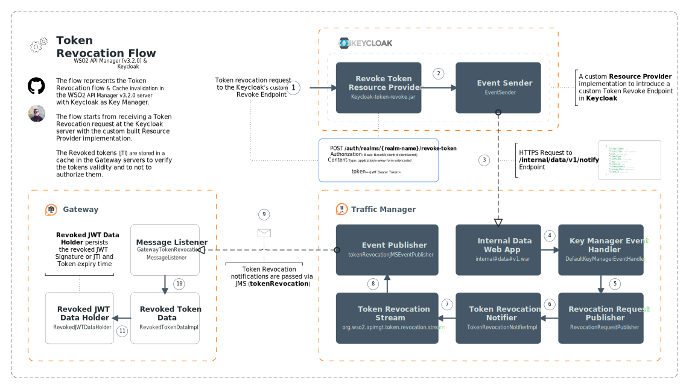

## Greetings Everyone!!! 👋

In this blog, I will be presenting a custom implementation to achieve the Immediate Token (cache) Revocation in WSO2 API Manager v3.2.0 with Keycloak configured as Key Manager.

As you all may aware, **[WSO2 API Manager v3.2.0](https://apim.docs.wso2.com/en/3.2.0/)** got released!!! 🎉🎊🎉 <br/>and it is packed with a lot of new features and functionalities to support various use-cases and requirements. One of the praised features is the immediate Token (cache) revocation. 

The API Manager v3.2.0 now also supports configuring third-party Key Managers with less hassle through the Admin portal. You can learn more about the out-of-the-box key-manager connectors and the respective instructions below.

<Reference
    title="Overview - WSO2 API Manager Key Managers"
    description="Multiple Key Manager Support in WSO2 API Manager"
    hyperlink="https://apim.docs.wso2.com/en/3.2.0/administer/key-managers/overview/"
/>

<Reference
    title='Configure a Third-Party Key Manager'
    description='Configure third-party Key Managers in WSO2 API Manager'
    hyperlink='https://apim.docs.wso2.com/en/3.2.0/install-and-setup/setup/distributed-deployment/configure-a-third-party-key-manager/'
/>

As out-of-the-box, the Token cache revocation is supported by the WSO2 API Manager when using the in-built Resident Key Manager or when using the WSO2 Identity Server as Key Manager. But, this feature was made as an extension to other supported Key Managers to achieve the requirement if required.

> You can learn more about the default Token (cache) Revocation flow the WSO2 API Manager v3.2.0 at [Token Revocation](https://stackcheats.github.io/token-revocation/content/)

Hence, in this writing, we will be going through a sample implementation on achieving the Token (cache) revocation feature with Keycloak & WSO2 API Manager.

**Let's get started …**

## ✋ Implementation & Execution Flow

First, let me brief you on the presented implementation and the requirement around it and then will explain how it works.

The custom implementation is an extension for the Keycloak server to introduce and expose a custom Token Revocation endpoint. The extension implements the `RealmResourceProvider` to expose the custom revocation endpoint per Realm basis.

You may wonder why a custom revocation endpoint is needed in the Keycloak server; Well, Keycloak's default Revocation endpoint only supports revoking the Refresh tokens and not the JWT Access Tokens.

> The above-statement is made considering the Keycloak v11 as the latest version in the community while delivering this blog 😃

The best-practice and security measure followed by the Keycloak community is to generate JWT Access Tokens with smaller validity. 

But let's assume that we have a requirement and we need to generate tokens with an hour validity. Further, the JWT tokens can be revoked by the client, and once the token is revoked the API Manager Gateway nodes needs to be aware of these in order to block the API requests that are associated with them.

Hence, to achieve the above requirement, I have come up with an extension introducing a custom revoke endpoint to verify the JWT and to send the notifications to the API Manager servers.

If you are eager to try out the solution, the complete source and instructions on applying those are available in the following Git repository 👏 👏 👌

<Reference
    title='Token Revocation Resource'
    description='A sample Keycloak RealmResourceProvider implementation to revoke the Token Caches in WSO2 API Manager'
    hyperlink='https://github.com/athiththan11/Token-Revocation-Resource'
/>

Let's get some more insights into the execution flow and the data flow of our custom implementation to understand the complete picture of the solution.

Given below is the HTTP definition of our custom Token Revocation endpoint in the Keycloak.

> The `{realm-name}` needs to be replaced with the realm name of the Keycloak that you are using to generate the JWT Tokens. Basically the Realm of the Keycloak clietns presented

```http
POST /auth/realms/{realm-name}/revoke-token
Authorization: Basic (base64<consumerkey:consumersecret>)
Content-Type: application/x-www-form-urlencoded

token=<JWTToken>
```

As soon our custom revocation endpoint receives a request with an active JWT token, the endpoint (implementation) verifies the passed JWT token's signature, and validity.

If the token is found active and not expired, the following data are extracted from the presented JWT token to send the notification to the API Manager
- JTI: JWT Token Identifier
- Expiry Time of the token
- Consumer Key

<br/>

👉 Once the required data are extracted, those are composed and passed to the Event Sender to publish them to the Traffic Manager node. The data publishing is handled asynchronously and it is done by invoking the newly introduced Notification endpoint of Internal API of the Traffic Manager node.

Please find the HTTP definition of the Notification endpoint of the Traffic Manager node which is called from our custom extension

```http
POST /internal/data/v1/notify
Host: traffic-manager:9443
Authorization: Basic (base64<username:password>)
Content-Type: application/json

{
  "accessToken": <JTI>,
  "expiryTime": <expiry time>,
  "user": <username>,
  "tokenType": "JWT",
  "timeStamp": <current timestamp>,
  "type": "token_revocation",
  "tenantId": -1234,
  "tenantDomain": "carbon.super",
  "consumerKey": <consumer key>,
  "eventId": <random UUID>
}
```

Once the Traffic Manager receives the request, the data is sent to the **`Token Revocation JMS Event Publisher`** through a set of pre-defined **`Event Streams`** deployed in the Traffic Manager server. And from the **`Event Publisher`**, a Token Revocation message is pushed to all subscribed Gateway nodes to mark the specific JTI (JWT) as revoked.

The Gateway node processes the received JMS message and persists the JTI record along with the Token expiry value in a temporary map named RevokedJWTDataHolder and clears the respective token entries from all other Token caches of the Gateway. This process ensures that the Gateway to not allow API requests if any of the revoked JWT tokens are used.

<br />

I know that it is hard to visualize the flow that I have explained above in my own words 😕 😟 … <br/>But, I believe you all may be familiar with the following saying

<br/>

<p class="text-center h2 text-muted">"A Picture Speaks a Thousand Words"</p>

<br/>

Therefore, I have created a high-level diagram plotting the communications and data flows between the servers and components for an easier understanding …👌 👏



## 🎉 Voila!!! 🎉

Hope this blog presented you with a little bit of information and insight on the Token Revocation feature of the WSO2 API Manager and how possible it is to make an extension and to achieve them through other supported Key Managers. 👌

> `Clone the source >  build >  deploy and test the scenarios` and share your experience
>
> As this is a custom implementation, there can be bugs. Warmly welcome your contributions to the Repo if you find anything that needs to be fixed or improved. Issues and PRs are welcome 😃

## Happy Stacking !!!! 🤘 ✌️
