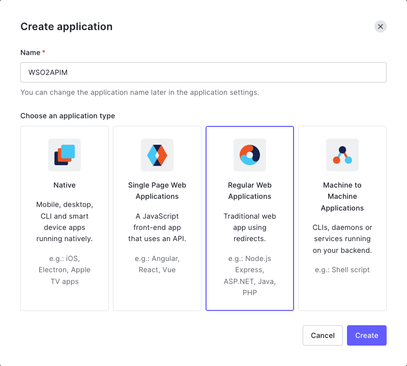
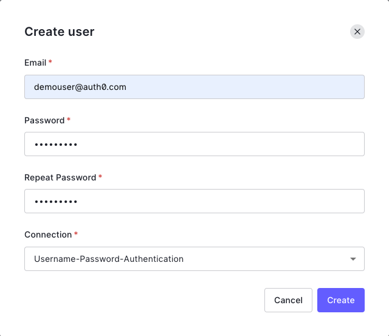
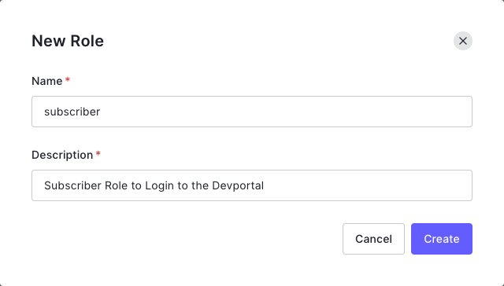
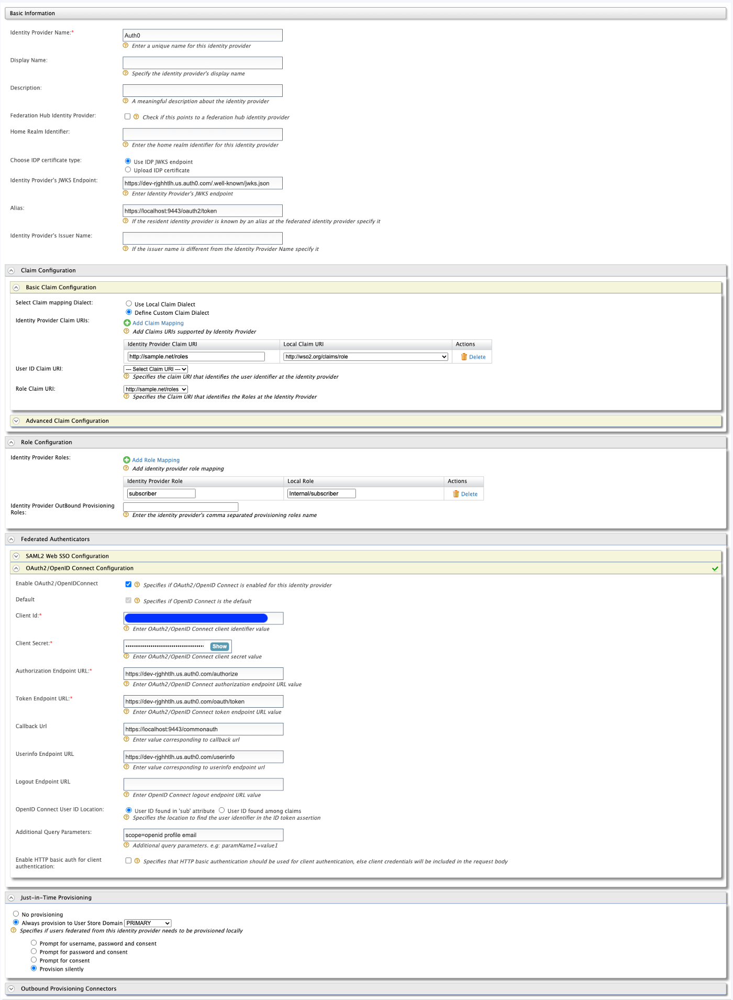

## Greetings Everyone!!! 👋

In this medium, we will be walking through how to configure OIDC SSO between WSO2 API Manager and Auth0.

> We will be using the WSO2 API Manager v4.0.0 for this demo

Let’s break in…

## 🔐 Auth0

Before continuing with the SSO configurations in the WSO2 API Manager, there are a few configurations and rules that need to be added to the Auth0 platform to experience the expected outcome.

If you already have an Auth0 account, you can move on to the next steps, if you are not, then navigate to [Auth0](https://auth0.com/) (`https://auth0.com`) and register for a trial account to continue with this demo.

### ✋ OIDC Client Registration

Let’s start by creating and configuring an Application in Auth0.

Once you have successfully logged in to the Auth0 dashboard, expand the `Applications` menu from the side-bar and click on `Applications`, and `Create Application`. Fill the following

- Name: `WSO2APIM`
- Choose an application type: `Regular Web Applications`

and `Create`.



On the next page, move to `Settings` tab view, and provide the following inputs

- Allowed Callback URLs: `https://localhost:9443/commonauth`

and `Save Changes`.

Next, expand the `Advanced Settings`, and move to `Endpoints` tab to gather all OIDC related endpoints of the Auth0 application to configure with the WSO2 API Manager.

### ✋ User Registration

We have now, successfully configured an application in Auth0 for our OIDC SSO flow. Next, we’ll register a demo user and a role in the Auth0 platform.

Expand the `User Management` menu from the sidebar and click on `Users` > `Create User`. Create a user with the following details

- Email: `demouser@auth0.com`
- Connection: `Username-Password-Authentication`

and click on `Create`.



On the next view, edit the `Name` field and provide `Demo User` as the value.

Next, expand the `User Management` from the side navigation bar and click on `Roles` to create a role in the Auth0 platform. Click on `Create Role` and add the following

- Name: `subscriber`
- Description: `Subscriber Role to Login to the Devportal`

and `Create`.



Navigate to the `Users` tab, and click on `Add Users`. Select the user that we registered previously and click on `Assign` to assign the `subscriber` role to our user.

### ✋ Rules to add Roles

As the next step, we are going to create a Rule in the Auth0 to include the Role details of the User in the ID token. To perform this, navigate to `Auth Pipeline` section and click on `Rules`.

Click on `Create` and select `Empty Rule` and provide the following as inputs

- Name: Add Roles to User ID Token
- Script
    ```js
    function addRoles(user, context, callback) {
        const namespace = 'http://sample.net';
        const assignedRoles = (context.authorization || {}).roles;
        
        let idTokenClaims = context.idToken || {};
        let accessTokenClaims = context.accessToken || {};
        
        idTokenClaims[`${namespace}/roles`] = assignedRoles;
        accessTokenClaims[`${namespace}/roles`] = assignedRoles;
        
        context.idToken = idTokenClaims;
        context.accessToken = accessTokenClaims;
        
        callback(null, user, context);
    }
    ```

and Save changes.

The rule will get applied to all necessary flows and applications in the Auth0 platform. With this, we have now completed configuring the Auth0 platform to perform OIDC SSO. Now, let’s start configuring the other end, WSO2 API Manager.

## 🌐 WSO2 API Manager

Let’s start running a WSO2 API Manager v4.0.0 pack locally and then configure the SSO with Auth0 for the Devportal.

If you haven’t already run a WSO2 API Manager in your environment, download the distribution from [here](https://wso2.com/api-management/) and start the server by executing `sh api-manager.sh` command from the `<apim_home>/bin` directory.

Once the server is started, navigate to `https://localhost:9443/devportal` and click on `Sign-in` to auto-create the Service Provider entries.

### ✋ Identity Provider

First, let’s register an Identity Provider in the API Manager server to represent the Auth0.

Open up your favourite browser, go to the Carbon Management console of the API Manager server by hitting to `https://localhost:9443/carbon` and logging in with the `admin` credentials.

Once logged in, click on `Add` under the `Identity Providers` section. Create an IDP with the following

- Identity Provider Name: `Auth0`
- Display Name: `Auth0`
- Identity Provider’s JWKS Endpoint: Enter the `JSON Web Key Set URL` of the Application, we created in Auth0 (ex: `https://dev-.....auth0.com/.well-known/jwks.json`)

Expand the `Claim Configuration` > `Basic Claim Configuration` and add a Claim Mapping for the `roles`. Select `Define Custom Claim Dialect` and add the following claim mappings by clicking on `Add Claim Mapping`

- `http://sample.net/roles` : `http://wso2.org/claims/role`

Next, expand the `Role Configuration` > `Add Role Mapping` and add the following

- `subscriber` : `Internal/subscriber`

And choose the `Role Claim URI` as `http://sample.net/roles`.

Then, expand the `Federated Authenticators` > `OAuth2/OpenID Connect Configuration` and perform the following

- Enable OAuth2/OpenIDConnect: `true`
- Default: `true`
- Client ID: Enter the Client ID of the `WSO2APIM` Application
- Client Secret: Enter the Client Secret of the `WSO2APIM` Application
- Authorization Endpoint URL: Enter the `OAuth Authorization URL` captured from Auth0
- Token Endpoint URL: Enter the `OAuth Token URL` captured from Auth0
- Userinfo Endpoint URL: Enter the `OAuth User Info URL` captured from Auth0
- Additional Query Parameters: `scope=openid profile email`

Next, expand the Just-in-Time Provisioning section and perform the following

- Always provision to User Store Domain: `PRIMARY`
- Provision silently: `true`

and Register.

Attached below is the IDP configurations of `Auth0` configured in the WSO2 API Manager server.



### ✋ Devportal Service Provider

Now, let’s open up the auto-created Devportal Service Provider by going to `Service Providers` > `List` > `apim_devportal` > `Edit`.

Expand the `Local & Outbound Authentication Configuration` and perform the following

- Authentication Type: `Federated Authentication` : `Auth0`
- Assert Identity using mapped local subject identifier: `true`

and click on `Update`.

## 🎉 Voila!!! 🎉

We have successfully configured OIDC SSO between WSO2 API Manager and Auth0. As the final step, let’s perform a few testing and verify the flow

Open up your favourite browser and navigate to `https://localhost:9443/devportal`. Click on `Sign-in`, this will direct you to the Auth0’s login page to log in with the user that we have created for this demo, `demouser@auth0.com`. Provide the credentials and proceed with the sign-in flow.

Once the login flow is successful, you will be redirected back to the Devportal’s page and will be signed in with the user that we have registered in the Auth0, along with the same user provisioned in the WSO2 API Manager side.

**Happy Stacking!!!** ✌️
