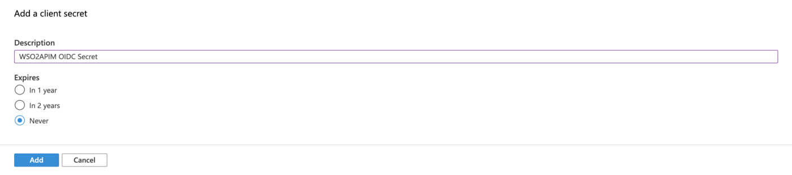

## Greetings Everyone !!! 👋

In this medium, I will be running over on how to configure Federated OpenID Connect SSO flow between WSO2 API Manager and Azure AD service.

> I will be using the WSO2 API Manager 3.1 to illustrate the configurations and the flows.
>
> You can refer to one of my OIDC SSO mediums along with this to configure older versions of WSO2 API Manager.
>
> * [OIDC SSO flow with Gluu](https://medium.com/@athiththan11/wso2-api-manager-gluu-sso-oidc-8e0bc3f59b18)
> * [OIDC SSO with Keycloak](https://medium.com/@athiththan11/wso2-api-manager-keycloak-sso-50bffa2353c7)
> * [OIDC SSO with Okta](https://medium.com/@athiththan11/wso2-api-manager-okta-sso-f04e9c6141e1)

I hope you’ll find this one useful and illustrative enough to go through the configurations … 👐

## Azure

### ✋ App Registration

I hope you have an active Azure account to continue with the demo. If not, click [here](https://portal.azure.com/#home) and register for a trial account to continue with the demonstrations.

Once, you are done with the registration, direct to the [Azure portal](https://portal.azure.com/#home) and log-in with your credentials. After a successful login, you will find a similar screen as prompted below

> If you can’t find the Azure Active Directory, search for it using the search bar presented at the top


Select the **Azure Active Directory**. Then, click on **Create Directory** in the top-bar to create a Directory.

> This is because we don't have any registered Active Directory to continue with our demo. Hence, we will be creating a new Directory.


On the following form, select the **Azure Active Directory** and click on **Next**.


Enter the following

* Organization Name: `Demo OIDC Organization`
* Initial Domain Name: `demooidcorg`
* Country/Region: `United States` (you choose any)


and **Review + Create**, then select **Create**. It will take a moment to create an Active Directory in your environment. After successful creation, you will receive a notification. Click on the link to direct to the created Active Directory.

On the left navigation panel, select the **App Registration** to register an OpenID Connect client.

> The following screen can be different to you, if you have any registered Apps


Click on the **New Registration** and input the following

* Name: `WSO2APIM`
* Supported Account Types: `Personal Microsoft Accounts Only` (I have chosen this as per demo purposes)
* Redirect URI: `Web` & `https://localhost:9443/commonauth` (change the hostname according to your environment)


and **Register**.

After successful creation, you will be directed to a general info page of the registered application. On the following screen copy and save the Client ID as we will be in need to configure the WSO2 API Manager.

Then, click on the **Certificates & Secrets** section in the left-sidebar, and select the **New Client Secret** to generate a secret for our `WSO2APIM` app


Enter the following in the prompted modal

* Description: `WSO2APIM OIDC Secret`
* Expires: `Never`



and **Add**.

Copy and save the generated Client Secret.

After making the note, click on the **API Permissions** section in the left navigation panel to configure the OpenID and Profile scope permissions to our App.

You will see a similar screen as follows after clicking on the **API Permissions**


Select the **Add a Permission** button arranged in the top to add new permissions to the existing tree. Once you click on the **Add a Permission** button, you will see a side-window popped-up with the following options


choose the **Microsoft Graph**. On the following screen, select the following permissions

* `email`
* `openid`
* `profile`


and **Add Permission** (leave the existing permissions as it is). You will end up in a similar screen as below with all the configured API Permissions


### ✋ Group Registration

Since we are using a trial account to experiment and configure the SSO flow with Azure AD, we will be creating a **Security Group** named **Subscriber** to represent the Subscriber role in the Azure service.

> If you have an active paid subscription, then you can follow on creating Roles in the Azure service and assign them to the Users. In addition, you can also create Groups in the Azure AD and assign it to your Users

Go to our **Demo OIDC Organization** and click on the **Groups**. You will find a similar window


Click on the New Group placed in the top and fill the following on the prompted window

* Group Type: `Security`
* Group Name: `Subscriber`
* Group Description: `Group for Subscriber`


Then click on the **No owners selected**. On the prompted side-window, select our Azure account and **Add Owner**. Then click on the **No members selected** and perform the same as described above and click on **Create** to create the Subscriber Group.


Select our **Subscriber** group from the list and make a note of the **Object ID** value.

> This is to map the Groups with the API Manager’s internal roles. As of the demo (for simplicity), we will be using the Object IDs of the groups to map the roles in the API Manager

### 👉 Add Groups Claim

Now we have to configure our Azure app to populate the Groups claim in the ID Token. Go to our Azure app `WSO2APIM` and click on **Token Configurations**.


Click on the **Add Groups Claim** and tick the **Security Groups**. Then, expand the **ID** section and choose the **Group ID** and enable **Emit groups as role claims**.


and **Add**.

Now we are all set with the Azure configurations. But before moving forward, we’ll make a note on the Authorization and Token endpoint of our Azure application. We will need these endpoints when configuring an Identity Provider in the API Manager.


Go to the **Overview** page of our Azure App and click on the Endpoints button. This will pop a side-window with all the necessary endpoints of our application. Make a note on the Authorization v2 and Token v2 endpoints. In addition to the above-set, also make a note on the **OpenID Connect metadata document** endpoint.

If you go to the endpoint URL mentioned in the **OpenID Connect metadata document**, you will find a set of metadata to configure an Identity Provider in the API Manager.

## WSO2 API Manager

### ✋ Configure Email Username

Before starting our configurations with the Identity Provider creation and Service Provider registrations, we will be enabling a property called EnableEmailUsername in the API Manager server.

> This is because of the `preferred_username` claims in the Azure ID Tokens are represented with the email usernames. Hence, as for this demo, we will be enabling email username in our API Manager server to provision and log-in to the Store nodes.
>
> Without `preferred_username`, we can also make use of the `sub` claim presented in the Azure ID Token, which will be a unique ID value. If you are planning to use the sub claim as the User ID in the API Manager, then you may have to increase the number of characters of the Username Regex Pattern in the `user-mgt.xml` (you scroll to the very bottom for the full configurations)

Navigate to `<apim>/repository/conf` and open and add the following configurations in the `deployment.toml` file

```toml
[tenant_mgt]
enable_email_domain = true
```

After making the change, fire-up the server to configure the required Identity Provider and the Service Provider to demo our OIDC SSO.

### ✋ Identity Provider Configurations

Direct to the Carbon Management console, and log-in with the admin credentials. Select the Add under the Identity Providers and input the following

* Identity Provider Name: `AzureADIDP`
* Display Name: `Azure AD IDP`
* Choose IDP Certificate Type: `Use IDP JWKS Endpoint`
* Identity Provider’s JWKS Endpoint: *the* `JWKS URI` *found in the OpenID Connect metadata document*


Next, expand the **Claim Configurations** > **Define Custom Claim Dialect** > **Add Claim Mapping** and add the following mappings

* `preferred_username` : `http://wso2.org/claims/displayName`
* `roles` : `http://wso2.org/claims/role`

and

* User ID Claim URI: `preferred_username`
* Role Claim URI: `roles`


Expand the **Role configurations** and click on the **Add Role Mapping**. Paste the Object ID acquired from the Subscriber group in the Azure service and map it with our internal subscriber role

* The `Object ID` of Subscriber Group : `Internal/subscriber`

Given below is a sample Role mapping configuration …


Then, expand the **Federated Authenticators** > **OAuth2/OpenID Connect Configurations** and perform the following

* Enable OAuth2 / OpenID Connect: `true`
* Default: `true`
* Client ID: *the* `Client ID` *of our* `WSO2APIM` *Azure app*
* Client Secret: *the generated secret of our* `WSO2APIM` *Azure app*
* Authorization Endpoint URL: *the* `authorization_endpoint` *in the OpenID Connect metadata document*
* Token Endpoint URL: *the* `token_endpoint` *in the OpenID Connect metadata document*
* Userinfo Endpoint URL: *the* `userinfo_endpoint` *in the OpenID Connect metadata document*
* Additional Query Parameters: `scope=openid%20profile%20email`


And finally, expand the **Just-In-Time Provisioning** accordion and configure as follows


and **Register**.

Given below is a complete snap of the `AzureADIDP` Identity Provider’s configuration in the API Manager server


### ✋ Service Provider Configurations

From API Manager 3.x onwards, both Publisher and Devportal (A.K.A Store) nodes are configured with **OIDC SSO** flows as default.

Hence, go to both Publisher and Devportal nodes and click on the Sign-in button to automatically create and register a Service Provider for the OIDC SSO flow. You don't have to log-in to the portals, the above-mentioned process is to create the respective Service Providers in the API Manager.

Navigate to the **Carbon Management** console and sign-in with the Admin credentials.

Click on **List** under **Service Providers** section to list the automatically created Service Providers respective to Publisher `apim_publisher` and Devportal `apim_devportal`.


Click the **Edit** of the `apim_devportal` and expand the **Claim Configurations** and make the following changes

* `preferred_username` : `http://wso2.org/claims/displayName` : `Requested`


Next, expand the Local & Outbound Authentication Configuration and select the `AzureADIDP` as the Federated Authentication and make the following changes


and **Update**.

## 🎉 Voila!!! 🎉

We have now successfully configured OpenID Connect Federated Authentication between Azure AD and Single Sign-On with OpenID Connect with API Devportal (Store).

## 👏 👏 👏

I hope you find this one useful to try-out and configure Federated Authentication & SSO between WSO2 API Manager and Azure Server.

Next, we’ll do a small test…

## Test Drive

Direct to the Store portal using `https://localhost:9443/devportal/` and click on `Sign-In`.

You will be redirected to the Microsoft’s login page to enter the credentials. Enter the credentials of our Microsoft User and then allow the attributes on the consent screen to continue with the federation and provision of the Gluu users to the WSO2 API Manager.

> Login to the **Carbon Management** console of WSO2 API Manager and list the Users. If the Federation is successful and JIT Provisioned performed without any errors, you will be able to see our user in the prompted list.

### Happy Stacking !!!! 🤘 ✌️

## Troubleshooting

### Username Regex

If you are planning to use the default `sub` claim value as the Username in the API Manager then, it is required to change the regex pattern of the Username in the `user-mgt.xml`.

API Manager 3.x series follows a new configuration model; a `deployment.toml` file to configure the entire server. Following are the TOML configurations related to the Regex patterns in the `user-mgt.xml`.

> In the following, I have increased the length from 30 to 50. if the value recieved via `sub` claim is less than 30 characters, you don’t have to perform the following changes

```toml
# deployment.toml configurations

[user_store.properties]
UsernameJavaRegEx = "^[\\S]{3,50}$"
```

### JIT Provisioning & Authentication Framework

If you want to enable the debug logs for the JIT Provisioning flow and the Federated authentication flows, then open and add the following property in the `<server>/repository/conf/log4j2.properties`

```properties
# to enable DEBUG logs in the authentication framework
logger.authentication_framework.name=org.wso2.carbon.identity.application.authentication.framework
logger.authentication_framework.level=DEBUG
```

And specify the `authentication_framework` name in the loggers property as follows (you mention the logger anywhere in the loggers property)

```properties
loggers = authentication_framework, AUDIT_LOG, ...
```

> It is not required to restart the server after making the changes in the `log4j2.properties`. It is hot-applied 😍
