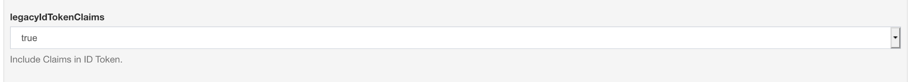
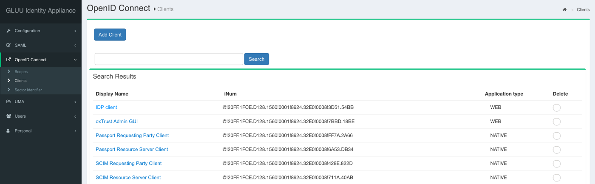
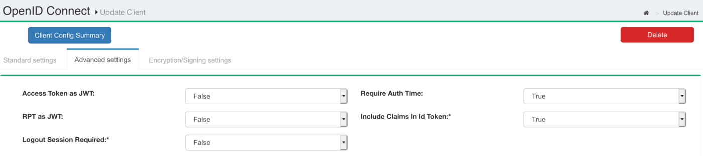
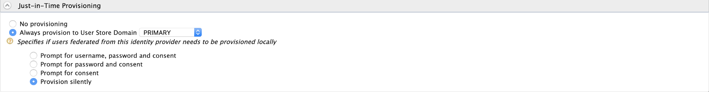
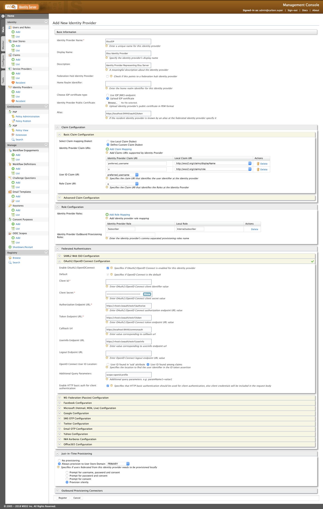
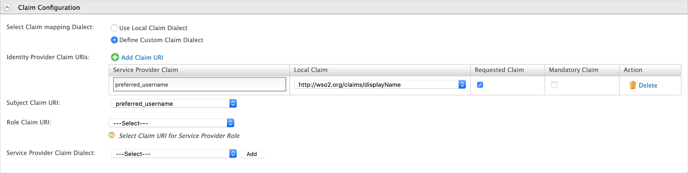
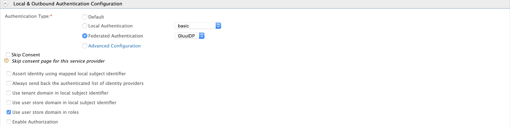

## Greetings Everyone!!! 👋

In this medium, I will be 🚶 ‍walking through on how to Federate and configure OpenID Connect SSO flow between the WSO2 API Manager and the Gluu Identity Server.

> I will be using WSO2 API Manager v2.6 with WSO2 Identity Server as Key Manager v5.7 and Gluu Server v3.1.7 and performing SSO to the API Store node

I hope you enjoy it and find it useful 🙌

## Gluu Identity Server

### Quick Installation & Start

Let's start the demo with the Gluu Identity Server installation. You can refer here for quick installation on the Google Cloud Platform.

<Reference
    title='Gluu Google Cloud Platform'
    description='Configure Gluu Server in Google Cloud Platform'
    hyperlink='https://youtu.be/0RskrQG8km8'
/>

Following are the commands executed to install and configure the Gluu server in the above-given reference …

```bash
# add the sources
echo "deb https://repo.gluu.org/ubuntu/ xenial main" > /etc/apt/sources.list.d/gluu-repo.list
# download key
curl https://repo.gluu.org/ubuntu/gluu-apt.key | apt-key add -
# udpate the existing packages
apt-get update
# install gluu-server 3.1.7
apt-get install gluu-server-3.1.7
# start the gluu-server
service gluu-server-3.1.7 start
# login to the gluu-server
service gluu-server-3.1.7 login
# execute the following to setup the gluu-server
cd /install/community-edition-setup/
./setup.py
```

### ✋ OpenID Connect Configurations & Metadata

Once the installation is done and the server is up and running as expected, log-in to the Gluu’s management console using the Admin credentials.


Click on the **Configuration** section in the navigation panel and select the **JSON Configurations** to list all required configurations and metadata of the Gluu Server.

In the following screen, move to the **oxAuth Configuration** tab and scroll down to the bottom or search for `legacyIdTokenClaims`. Change the configuration to true. This is to enable the Gluu Identity Server to pass the requested claims and information via the ID Tokens.



Scroll to the top and make a note on the following endpoints. We need the following endpoint URIs when configuring the WSO2 servers

- `authorizationEndpoint` : *will look like `<host>/oxauth/restv1/authorize`*
- `tokenEndpoint` : *will look like `<host>/oxauth/restv1/token`*
- `userInfoEndpoint` : *will look like `<host>/oxauth/restv1/userinfo`*

After taking the notes, click on **Certificates** listed under the Configurations section and download the **IDP Signing** certificate and store it.

### ✋ OpenID Connect Client Registration

Next, we will be configuring an OpenID Connect client in the Gluu Identity Server to communicate and perform SSO flow with the WSO2 servers.

Expand the **OpenID Connect** section in the left navigation panel and select the **Clients** to list and create new clients.



Click on the **Add Client**, and on the next screen input the following

- Client Secret: *Click on the **Generate Client Secret** to generate one*
- Client Name: `WSO2ISKM`
- Redirect Login URIs: `https://localhost:9444/commonauth`
- Scopes: `openid` & `profile`
- Response Types: `code` `token` & `id_token`
- Grant Types: `authorization_code` & `password`

and **Add**.

Next, move to the **Advanced Settings** tab of our OpenID Connect client and enable the **Include Claims In Id Token** option by selecting true from the dropdown selection.

> Please note that you have to enable the `legacyIdTokenClaims` in the **JSON Configuration** of the Gluu Server to make changes in the **Include Claims In Id Token** property in the Advanced Settings



and **Update**

Click on the **Client Config Summary** on the top and copy and save the Client ID and the Secret of our `WSO2ISKM` OpenID Connect client.

### ✋ User Registration

Next, click on the **Users** section and **Add person** to register a new User for this demo.


Add the following

- Username: `gluuuser`
- First Name: `Gluu`
- Display Name: `UserGluu`
- Last Name: `User`
- Email: `user@gluu.org`
- Password: *any preferred passwords for your user* 😃
- User Status: `Active`

select and include the `Preferred Username` and `Organization` fields from the list displayed in the left-side

- Preferred Username: `gluuuser` *(same as Username)*
- Organization: `Subscriber` *(to demo SSO with the API Manager Store node)*


and **Add**.

### ✋ Scope & Claim Configurations

We are almost done configuring the Gluu server. As final steps in the Gluu Server, go to the OpenID Connect and select the Scopes.


Open the profile scope and click on Add Claim and include the following claims along with the existing

- Preferred Username
- Organization

> For demo purposes, I have configured and included all required claims to the available scopes. As a best practice, try creating a new scope and including all additionally required claims into it. If so, then we have to include the newly created scope in our OpenID Connect client in the Gluu Server to serve the tokens.

## WSO2 Identity Server as Key Manager

We are done with the Gluu configurations. Our next stop is on the WSO2 Identity Server as Key Manager.

> I will be using WSO2 API Manager 2.6 and WSO2 Identity Server as Key Manager 5.7 on this demo. You can refer [here](https://docs.wso2.com/display/AM260/Configuring+WSO2+Identity+Server+as+a+Key+Manager) to configure IS-KM in your environment.
>
> As a bonus bonanza, you can use the [Hydrogen](https://github.com/athiththan11/hydrogen-cli) (deprecated version can be found [here](https://github.com/athiththan11/hydrogen)) to configure the environment within minutes

### ✋ Identity Provider Configurations

Let’s start the journey 🚀 by configuring an Identity Provider to Federate with the Gluu Server.

Start the IS-KM server and sign-in to the Carbon Management console. Select the **Add** under the **Identity Providers** section to register an Identity Provider.

On the following screen, add the followings

- Identity Provider Name: `GluuIDP`
- Display Name: `Gluu Identity Provider`
- Identity Provider Public Certificat: upload the certificate we downloaded from the Gluu Server `IDP Signing Cert`


Next, expand the **Claim Configuration** and the **Basic Claim Configuration** and click on the **Define Custom Claim Dialect** and make the following

- `preferred_username` : `http://wso2.org/claims/displayName`
- `o` : `http://wso2.org/claims/role`

> The organization claim from the Gluu Server is passed as `o` in the ID Token


Next, expand the **Role Configuration** section and map the `Subscriber` organization retrieved from the Gluu Server with our `Internal/subscriber` role as follows


Expand the **Federated Authenticators** > **OAuth2/OpenID Connect Configuration** and make the following changes

- Enable OAuth2 / OpenIDConnect: `true`
- Default: `true`
- Client ID: *the* Client ID *of the* `WSO2ISKM`
- Client Secret: *the* Client Secret *of the* `WSO2ISKM`
- Authorization Endpoint URL: *the* `authorizationEndpoint` *from the configurations*
- Token Endpoint URL: *the* `tokenEndpoint` *from the configurations*
- Userinfo Endpoint URL: *the* `userInfoEndpoint` *from the configurations*
- OpenID Connect User ID Location: `User ID found among claims`
- Additional Query Parameters: `scope=openid profile`

> if you have introduced a new scope to include the `preferred_username` and `organization` claims, then append that scope as well

- Enable HTTP Basic Auth for Client Authentication: `true` *(as default Gluu server expects Basic auth header for authentication)*


Expand the **Just-In-Time Provisioning** and select the `PRIMARY` as the provisioning User Store Domain



and **Register**.

Attached is a complete-snap of our `GluuIDP` configurations in the Identity Server as Key Manager server 👌👌



### ✋ Service Provider Configurations

Next, we need a Service Provider to communicate with the API Store node. Click on **Add** under the **Service Providers** and do the following


and **Register**.

On the next screen, expand the **Claim Configurations** and select the Define Custom Claim Dialect to and define the following to pass the `preferred_username` claim to the Store node

- `preferred_username` : `http://wso2.org/claims/displayName` : `Requested`



Next, expand the **OAuth2/OpenID Connect Configuration** under the **Inbound Authentication Configuration** and click on Configure. On the following screen add

- Callback URL: `https://localhost:9443/store/jagg/jaggery_oidc_acs.jag`

and **Add**.

Finally, expand the **Local & Outbound Authentication Configuration** and select the `GluuIDP` as the **Federated Authentication**



and **Update**.

As always, a complete-snip of the `API_STORE` Service Provider configuration is given below👌 🤓


👉 Before moving to the next part, make a note or copy the `client_id` and the `client_secret` which are generated in our Service Provider as we need ’em when configuring the site.json.

## WSO2 API Manager

We are almost done with our configurations. As of the final steps, we have to configure the `site.json` which is related to the API Manager’s Store node to initiate the SSO flow.

### ✋ Store: Site.json

Open-up the WSO2 API Manager’s directory and move to `<apim>/repository/deployment/server/jaggeryapps/store/site/conf` and open the **site.json** to configure the OIDC

Given below is a complete segment of the **OpenID Connect** configuration model in the site.json. You can refer to the following to configure your site.json in your environment.

> Replace the `Client ID` and `Client Secret` with the credentials acquired from the API_STORE Service Provider

```json
"oidcConfiguration" : {
    "enabled": "true",
    "issuer": "API_STORE",
    "identityProviderURI": "https://localhost:9444/oauth2/token",
    "authorizationEndpointURI": "https://localhost:9444/oauth2/authorize",
    "tokenEndpointURI": "https://localhost:9444/oauth2/token",
    "userInfoURI": "https://localhost:9444/oauth2/userinfo",
    "jwksURI": "https://localhost:9444/oauth2/jwks",
    "logoutEndpointURI": "https://localhost:9444/oidc/logout",
    "authHttpMethod": "POST",
    "clientConfiguration" : {
        "clientId" : "Client ID",
        "clientSecret" : "Client Secret",
        "responseType" : "code",
        "authorizationType" : "authorization_code",
        "scope" : "phone email address openid profile",
        "redirectURI" : "https://localhost:9443/store/jagg/jaggery_oidc_acs.jag",
        "postLogoutRedirectURI" : "https://localhost:9443/store/",
        "clientAlgorithm" : "RS256"
    }
}
```

## 🎉 Voila!!! 🎉

We have now successfully configured OpenID Connect Federated Authentication between Gluu and Single Sign-On with OpenID Connect with API Store.

👏 👏 👏

I hope you find this one useful to try-out and configure Federated Authentication & SSO between WSO2 API Manager and Gluu Server.

Next, a small (alpha) test drive…

### Test Drive

Direct to the Store portal using `https://localhost:9443/store/` and click on Sign-In.

You will be redirected to the Gluu’s login page to enter the credentials. Enter the credentials of our Gluu User and then allow the attributes on the consent screen to continue with the federation and provision of the Gluu users to the WSO2 API Manager.

> Login to the Carbon Management console of WSO2 API Manager and list the Users. If the Federation is successful and JIT Provisioned performed without any errors, you will be able to see our Gluu User in the prompted list.

**Happy Stacking !!!!** 🤘 ✌️

<br/>

## Troubleshooting

### SSL Handshake | PKIX

If you encounter any SSL Handshake related issues or more precisely any PKIX Exceptions, then download the Public Certificate of the Gluu Server’s domain and add it to the WSO2 Identity Server as Key Manager’s trust-store.

You can download the Public certificate of the Gluu Server’s domain from the Browser. For example in Chrome, you can click on the padlock 🔒 icon near the URL and can download the certificate.

After successfully acquiring the certificate execute the following keytool command against the trust-store inside the `<iskm>/repository/resources/security` directory

```bash
# execute the following command and wso2carbon for the password
keytool -import -alias gluu -file <path-of-the-cert> -storetype JKS -keystore client-truststore.jks
```

After a successful import, try the SSO flow again in a new window.

### JIT Provisioning & Authentication Framework

If you want to enable the debug logs for the JIT Provisioning flow and the Federated authentication flows, then open and add the following property in the `<server>/repository/conf/log4j.properties`

```bash
# to enable DEBUG logs in the authentication framework
log4j.logger.org.wso2.carbon.identity.application.authentication.framework = DEBUG
```

And the JIT Provisioning is handled by `org.wso2.carbon.identity.application.authentication.framework.handler.request.impl.JITProvisionningPostAuthenticationHandler`.
