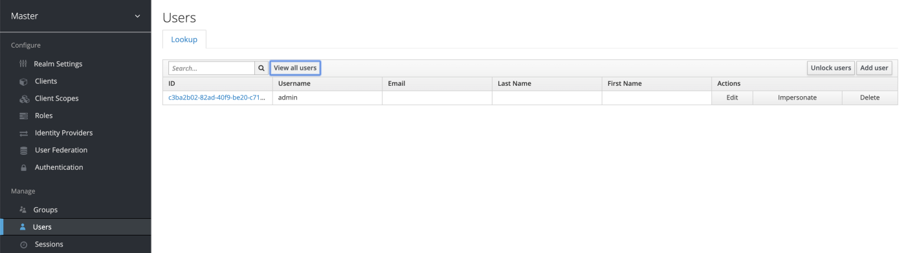
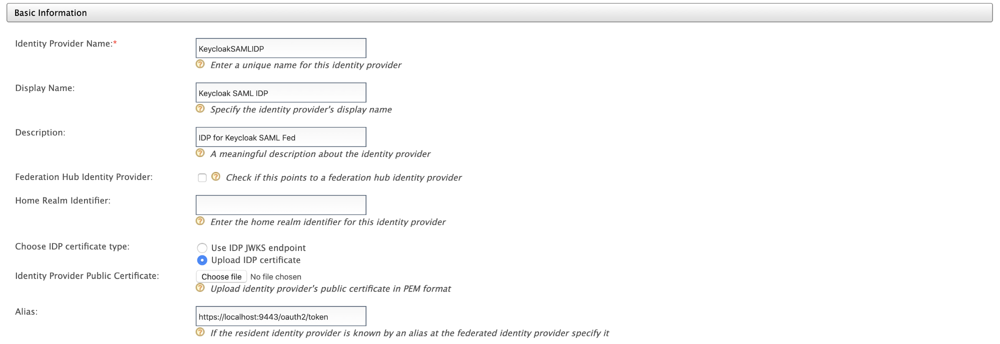
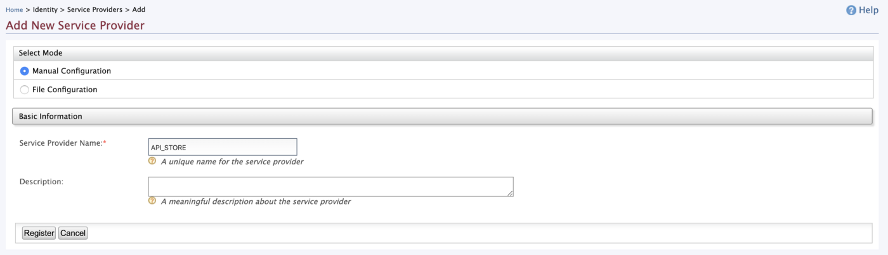
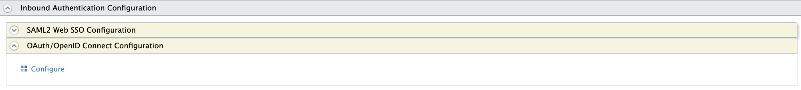

## Greetings Everyone !!! 👋

In this medium, I will be 🚶walking through on how to configure SAML Federated Authentication & SSO flow between WSO2 API Manager and Keycloak including JIT (User) Provisioning.

> In my previous mediums, I have used WSO2 API Manager 2.6 & WSO2 Identity Server as Key Manager 5.7 to achieve the SAML2 SSO Federated authentication flows.
>
> Today, I will be using only the API Manager 2.6 pack and the Out-Of-The-Box features to achieve the requirement

As out-of-the-box, the WSO2 API Manager 2.6 provides a platform to configure SAML2 Federation.

But, please note that it is advised (best-practice) to use WSO2 Identity Server as Key Manager to perform Federated Authentication with External Identity Providers in Production grade environments.

Let’s break-in…

## 🔐 Keycloak

Let’s start our configurations from the External Identity Provider.

I hope you already have an active Keycloak server up and running. If not please follow the below section to download and start a Keycloak server in your environment.

### Starting-Up Keycloak

Click [Here](https://www.keycloak.org/downloads.html) to download the Keycloak standalone distribution to your environment. Extract the archive and navigate to the `<keycloak>/bin` directory and execute the following command to start the Keycloak server …

<Reference
    title='Keycloak'
    description='Keycloak is an open-source identity and access management solution'
    hyperlink='https://www.keycloak.org/downloads.html'
/>

```bash
# move to bin directory and execute the following
# unix
sh standalone.sh
# windows
standalone.bat
```

Then, fire-up your favorite browser and go to `http://localhost:8080/auth`. In the prompted page, register an admin user for our Keycloak server.

& Done … simple as that 👏 👏

> 👉 You can follow up on the following Doc to get started with the Keycloak server …

<Reference
    title='Getting Started Guide'
    description='This guide helps you get started with Keycloak'
    hyperlink='https://www.keycloak.org/docs/latest/getting_started/'
/>

### ✋ SAML 2.0 Metadata

After a successful log-in to the Keycloak server with our admin user, you will be looking into a similar UI as follows


Click on the **SAML 2.0 Identity Provider Metadata** to get the required configurations metadata.

Save the metadata as we will be using that in the following sections to configure Federated Identity Provider.

### ✋ SAML2 Client Registration

Click on the **Clients** under **Configure** to list all the existing registered clients of Keycloak Server. You will be looking into a similar screen as follows

> We will be using the existing Master realm to create required Clients, Users, and Roles in the Keycloak server


Select the **Create** button to add a new client. Set the following

- Client ID: `wso2apim-saml`
- Client Protocol: `saml`

and **Save**.


In the next screen, add the following to configure our `wso2apim-saml` client in the Keycloak

- Name: `WSO2 APIM SAML Client`
- Enabled: `true`
- Client Protocol: `saml`
- Include AuthnStatement: `true`
- Sign Documents: `true`
- Signature Algorithm: `RSA_SHA1`
- SAML Signature Key Name: `NONE`
- Canonicalization Method: `EXCLUSIVE`
- Force POST Binding: `true`
- Front Channel Logout: `true`
- Force Name ID Format: `true`
- Name ID Format: `username`
- Valid Redirect URIs: `https://localhost:9443/commonauth`
- Master SAML Processing URL: `https://localhost:9443/commonauth`

and under **Fine Grain SAML Endpoint Configuration**

- Assertion Consumer Service POST Binding URL: `https://localhost:9443/commonauth`
- Assertion Consumer Service Redirect Binding URL: `https://localhost:9443/commonauth`

and **Save**.


Next, click on the **Roles** tab to create a role in Keycloak server representing the Subscriber role in the WSO2 API Manager


Click on **Add Role** to create a new Role and fill the following …

- Role Name: `subscriber`

and **Save**


### User Registration

We have now successfully configured our APIM SAML Client `wso2apim-saml` in the Keycloak Server. Next, we will be creating a new user to do our test runs.

Select the **Users** under the **Manage** section in the Left Navigation Panel and you will find a similar screen as follows



Smash the **Add User** button and feed the following

- Username: `keycloakuser`
- Email: `key@cloak.com`
- First Name: `Keycloak`
- Last Name: `User`
- User Enabled: `true`
- Email Verified: `true`

and **Save**.


Move to the **Credentials** tab and enter a password for the created user. Disable the **Temporary Password** and click on the **Set Password**.


Then, move to the **Role Mappings** tab to map our Subscriber role with the newly created User.

Select the `wso2apim-saml` client in the **Client Roles** dropdown and then select the `subscriber` roles under the **Available Roles** section and click on the **Add Selected** to assign it.


Now, we have successfully created a temp user to perform our test runs. Next, we want to configure the scopes which are related to SAML in the Keycloak server to send all assigned Roles.

### SAML Scope for Roles

Select the **Client Scopes** listed under **Configure** section and Edit the `role_list` scope.


Go to the **Mappers** section and click on **Edit** to edit the default configured Mapper to send the Roles which are assigned to the User and the application as SAML Response


Make the **Single Role Attribute** to true and Save.

> This is because, as default Keycloak server will send back the SAML Response with multiple Role attributes.
>
> If we enable the **Single Role Attribute**, a single attribute named Role will be passed along with the associated roles as its child element.


and as one last step in the Keycloak server, we need to get the public certificate of the Keycloak server.

### 🔒 Keycloak Cert

Go to the **Realm Settings** under **Configure** and select the Keys tab. Click on the **Certificate** of the **RS256 Algorithm** and copy the cert value to a text editor.


Add the `-----BEGIN CERTIFICATE-----` and `-----END CERTIFICATE-----` to the copied value respectively at the beginning and at the end and save it as `keycloak.cert`

Following is the default Keycloak server’s Public Cert

```txt
-----BEGIN CERTIFICATE-----
MIICmzCCAYMCBgFxK7QtbzANBgkqhkiG9w0BAQsFADARMQ8wDQYDVQQDDAZtYXN0ZXIwHhcNMjAwMzMwMTM0NzQwWhcNMzAwMzMwMTM0OTIwWjARMQ8wDQYDVQQDDAZtYXN0ZXIwggEiMA0GCSqGSIb3DQEBAQUAA4IBDwAwggEKAoIBAQCNH2xuTvfh4+GMhXnawavMi+Ro02XmtH5GDYR9MU+ERV1tm5ZqEDEERD7XPAMh5xjZn7iN0Wqp8x8j68Cy+k3Z8o3HanO/YShd+QBzU4JQ4VuhS8Kvn/KRiIUPA7NkD/o/TmopWWrxho/hj3HfJm82mKAMGKUsfMLOH8Iy+8Q106QrgeN0FWaseiqfBMAlaRrGDI4VsPAlHvT+JbL8NNgQB1gEIn6hhwFVbzHcofOXrRj1kpO9Vmd5VmdDtMorGrxrLyBhE4/opl22jvHgS8Ae3/R0kCiw81NZpxYieiz+kpUxDU95BG0twkwdMMJYt7YAm48qyD5knoOKmkLtLpqxAgMBAAEwDQYJKoZIhvcNAQELBQADggEBACLoLH+DiVVcngWGcGMdaLHjBt/DwmMHbfBlcwZZJ8q3W8vFB6CZQqVUtaEDPolj6FpdSzHUxZGEDuRINr1I/n9QIoofhgZNXuUpn0FMjH5RZa1kkvkxbTOOjSzuLh76gqpJchmbthUBPwrOtZ5oE8y2LenF4TzrZsDuEiSgwFtQNpbvoJbZ7iofVuV+C7evzwIZUmAI14jQ1EcPGJtb7aSzP2GkVH3zmXO48wLWUKcKXYIt7kJYiZPjwN0m0v/cwAI7Td1VtlA0hc4FIGhc8ouVoYd9DMDDklKJOgGeM9xK0nH6URtutQsmf+3cn19XA1VIS12C0eLkJpqK5Bw/lWY=
-----END CERTIFICATE-----
```

👏 👏 👏 one domain is done.

Next, we will be moving to the WSO2 API Manager to configure an Identity Provider and a Service Provider to perform Federated SAML2 SSO.

## WSO2 API Manager

### ✋ Identity Provider for Keycloak

Fire-up the **WSO2 API Manager** server and navigate to the Carbon Management console and login with your admin credentials.

Click on **Add** under **Identity Providers** section and feed the following Basic Information

- Identity Provider Name: `KeycloakSAMLIDP`
- Display Name: `Keycloak SAML IDP`



Select the **IDP Certificate** as **Upload IDP Certificate** and upload the `keycloak.cert` that we have created in the previous steps.

Next, expand the `Claim Configurations` and map our Role claim with the Internal Role claim.

Select the `Define Custom Claim Dialect` and click on `Add Claim Mapping` and enter the following

- `Role` : `http://wso2.org/claims/role`

Select the **Role** in the **Role Claim URI** dropdown as well


Then, expand the Role Configuration accordion and enter the following to map the `subscriber` role of the Keycloak with the `Internal/subscriber` role of the API Manager

- `subscriber` : `Internal/subscriber`


Next, click and expand the Federated Authenticators section and SAML SSO to configure the Federated authentication with our Keycloak Server

Put the following in the respective fields

- Enable SAML2 Web SSO: `true`
- Service Provider Entity ID: `wso2apim-saml` *(our client name in the Keycloak Server)*
- NameID Format: `urn:oasis:names:tc:SAML:1.1:nameid-format:unspecified`
- Identity Provider Entity ID: `http://localhost:8080/auth/realms/master` *(Entity ID can be found in the **SAML Metadata** of the Keycloak)*
- SSO URL: `http://localhost:8080/auth/realms/master/protocol/saml` *(SSO URL can be found in the **SAML Metadata** of the Keycloak)*

Finally, expand the **Just-In-Time Provisioning** and select the `Always Provision` to `User Store Domain` to `PRIMARY` and `Provision Silently`


and **Save**.

Attached is a full-snap of the configurations 😍 👌


### ✋ Service Provider

We are done with the Identity Provider configurations. Now, we have to create and register a Service Provider to SSO with the API Store node.

Log-in to the **Carbon Management** console and click on the Add under the Service Providers section and enter the following in the following screen

- Service Provider Name: `API_STORE`



and **Register**.

On the following screen, expand the **Inbound Authentication Configuration** and select the **OAuth/OpenID Connect Configuration** to configure an OAuth app.



> As default the WSO2 API Manager doesn’t support the **SAML2 Web SSO Configurations** in Service Provider. Hence, we are configuring an OAuth service provider to perform SSO with the API Store

On the prompted screen add the following

- Callback URL: `https://localhost:9443/store/jagg/jaggery_oidc_acs.jag`

and **Save**.

Next, expand the **Local & Outbound Authentication Configuration** and select our `KeycloakSAMLIDP` as the **Federated Authentication** and Register (Save).


As always, I have attached the full-snap of the Service Provider configuration below 🤓


👉 Before moving to the next part, make a note or copy the `client_id` and the `client_secret` which are generated in our Service Provider as we need ’em when configuring the site.json.

### ✋ Store: Site.json

We are in the latter part of our demo flow.

As the last part, now we have to configure the `site.json` related to the Store node to communicate with our Service Provider.

The Store will start to communicate with our Service Provider and it will start to communicate with our Identity Provider and finally, our Identity Provider Federates with the Keycloak Server

**Phew ….** 🤓😅😅

Open-up the WSO2 API Manager’s directory and move to `<apim>/repository/deployment/server/jaggeryapps/store/site/conf` and open the `site.json` to configure the OIDC

Given below is a complete segment of the OpenID Connect configuration model in the `site.json`. You can refer to the following to configure your `site.json` in your environment.

> Replace the Client ID and Client Secret with the credentials acquired from the API_STORE Service Provider
>
> Also, if you notice, I have used `usernameClaim` property in the **OIDC Configuration** to look for the `sub` claim to acquire the username for our Store node. As default it will be referred to the `preferred_username` field. In **SAML2 SSO** Federation the `preferred_username` field is not guaranteed when provisioning the Users. Hence, it is required to configure the `usernameClaim` property in the OIDC configuration

```json
"oidcConfiguration" : {
    "enabled": "true",
    "issuer": "API_STORE",
    "identityProviderURI": "https://localhost:9443/oauth2/token",
    "authorizationEndpointURI": "https://localhost:9443/oauth2/authorize",
    "tokenEndpointURI": "https://localhost:9443/oauth2/token",
    "userInfoURI": "https://localhost:9443/oauth2/userinfo",
    "jwksURI": "https://localhost:9443/oauth2/jwks",
    "logoutEndpointURI": "https://localhost:9443/oidc/logout",
    "authHttpMethod": "POST",
    "usernameClaim": "sub",
    "clientConfiguration" : {
        "clientId" : "Client ID",
        "clientSecret" : "Client Secret",
        "responseType" : "code",
        "authorizationType" : "authorization_code",
        "scope" : "phone email address openid profile",
        "redirectURI" : "https://localhost:9443/store/jagg/jaggery_oidc_acs.jag",
        "postLogoutRedirectURI" : "https://localhost:9443/store/",
        "clientAlgorithm" : "RS256"
    }
}
```

## 🎉 Voila!!! 🎉

We have successfully configured SAML2 Federated Authentication between Keycloak and Single Sign-On with OpenID Connect with API Store. Next, we will be doing a small test drive…

👏 👏 👏

## Test Drive

Direct to the Store portal using `https://localhost:9443/store/` and click on Sign-In.

You will be redirected to the Keycloak’s login page to enter the credentials. Enter the credentials of our Keycloak User and then allow the attributes on the consent screen to continue with the federation and provision of the Keycloak users to the WSO2 API Manager.

> Login to the **Carbon Management** console of WSO2 API Manager and list the Users. If the Federation is successful and JIT Provisioned performed without any errors, you will be able to see our **Keycloak User** in the prompted list.

**Happy Stacking !!!!** 🤘 ✌️
