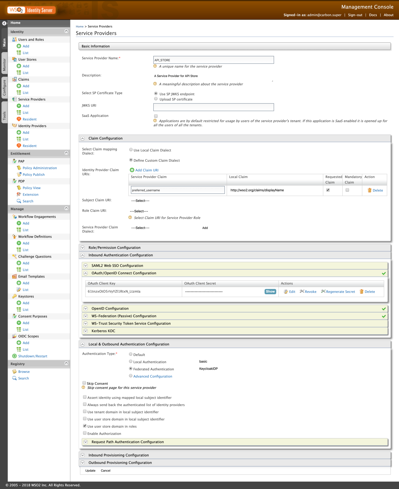

In this medium, I will be 🚶 walking through on how to configure OpenID Connect SSO flow between WSO2 API Manager and Keycloak including JIT (User) Provisioning.

> I will be using WSO2 API Manager 2.6 along with Identity Server as Key Manager 5.7 to instruct and configure the SSO flow with Keycloak

I have broken the guide into 3 tiers and we will be going through them as follows …

- Keycloak Configurations
- WSO2 IS-KM Configurations
- WSO2 API Manager Configurations

## Keycloak 🔑

Let’s start our journey by downloading and configuring the Keycloak server in our local environments.

### 🚧 Downloading & Starting-Up the Keycloak

You can click on Here to download the Standalone Keycloak server distribution to your environment. If you already have a Keycloak server up and running you can ignore these steps and move on to the creation of realms.

<Reference 
    title="Keycloak" 
    description="Keycloak is an open-source identity and access management solution"
    hyperlink="https://www.keycloak.org/downloads.html" 
/>

Extract the archive and execute the following command from the bin directory to start the Keycloak server

```bash
# move to bin directory and execute the following
# unix
sh standalone.sh
# windows
standalone.bat
```

After a successful server start, fire-up your favorite browser and go to `http://localhost:8080/auth` and register an Admin User for our Keycloak Server.

👉 You can follow up on the following Doc to get started with the Keycloak server …

<Reference 
    title="Getting Started Guide" 
    description="Getting started with Keycloak"
    hyperlink="https://www.keycloak.org/docs/latest/getting_started/" 
/>

### OpenIDConnect Endpoint URLs

After a successful log-in to the Keycloak server, you will be looking into a similar UI as follows

<!-- TODO:  -->

Click on the **OpenID Endpoint Configuration** to list all required Endpoint URLs and data to configure OpenID Connect in our Identity Providers.

Make a note of the Endpoint URLs and continue forward with the demo. We will be using these endpoint URLs to configure the Federated Authenticator in the WSO2 Identity Server as Key Manager.

### OIDC Client Registration

Next, we will be creating and registering an OIDC Client in the Keycloak server to represent our WSO2 Identity Server as Key Manager.

> We will be using the existing Master realm to create required Clients, Users, and Roles in the Keycloak server

Click on the **Clients** under Configure to list all the existing registered clients. You will see a similar screen as follows

<!-- TODO: -->

Click on the **Create** button to add a new client. Set the following

- Client ID: `wso2is-km`
- Client Protocol: `openid-connect`

and **Save**.

<!-- TODO: -->

In the following prompted screen add the following to configure our `wso2is-km` client in the Keycloak

> The IS KM server is configured with the port offset of 1. Hence, the common-auth URLs are presented with `https://localhost:9444`

- Name: `WSO2 IS KM`
- Enabled: `true`
- Access Type: `confidential`
- Standard Flow Enabled: `true`
- Implicit Flow Enabled: `true`
- Direct Access Grants Enabled: `true`
- Root URL: `https://localhost:9444/commonauth`
- Valid Redirect URIs: `https://localhost:9444/commonauth/*`
- Admin URL: `https://localhost:9444/commonauth`

and click on **Save**.

<!-- TODO: -->

Next, go to the **Credentials** tab of our `WSO2IS-KM` client in the Keycloak server and make a copy of the `client-secret` value for later usage.

> If you want you can regenerate the secret and make a copy of it to configure Keycloak IDP in the WSO2 IS KM server

<!-- TODO: -->

After noting down the Secrets, click on the **Roles** tab to create a Subscriber Role.

> We will be creating a Subscriber role in the `WSO2IS-KM` client to federate and give permissions to access the Store portal of WSO2 API Manager.

You will find a similar UI under the Roles tab

<!-- TODO: -->

Click on **Add Role** to create a new Role and input the following …

- Role Name: `subscriber`

and **Save**

<!-- TODO: -->

And finally, click on the **Mappers** tab, to configure a claim mapping to send and expose our created Roles through the OIDC SSO flow (incl. ID Token) and via the User Info endpoint.

You’ll find a similar UI under the **Mappers** section …

<!-- TODO: -->

Select the **Add Builtin**, and enable the client roles in the prompted screen and Save

<!-- TODO: -->

Edit the **Client Roles** mapper with the following properties …

- Client ID: `wso2is-km`
- Multivalued: `true`
- Token Claim Name: `roles`
- Claim JSON Type: `String`
- Add to ID token: `true`
- Add to access token: `true`
- Add to userinfo: `true`

and **Save**.

<!-- TODO: -->

### User Registration

As the first step, we are done configuring our WSO2 IS-KM Client in the Keycloak. Next, we will be creating a new User in the Keycloak server for our demo.

Select the **Users** under the **Manage** section in your Left Navigation Panel. You will find the created Admin user in the prompted screen

<!-- TODO: -->

Click on **Add User** and prompt the following …

- Username: `keycloakuser`
- Email: `key@cloak.com`
- First Name: `Keycloak`
- Last Name: `User`
- User Enabled: `true`
- Email Verified: `true`

and **Save**

<!-- TODO: -->

Move to the **Credentials** tab our created user and enter a password. Disable the **Temporary Password** and click on **Set Password** to save.

<!-- TODO: -->

Next, move to the **Role Mappings** tab to map the Subscriber (which we created earlier) with our User.

Select the `WSO2IS-KM` client in the **Client Roles** dropdown and then it will list all the associated roles under the **Available Roles** section. Select the `subscriber` role and click on **Add Selected** to assign it …

<!-- TODO: -->

<!-- TODO: -->

And that’s all, we are done with the Keycloak initialization and configurations. 👏

<br/>

## 🔐 WSO2 Identity Server as Key Manager

We have successfully configured our Keycloak Server to send required claims and the roles to perform SSO and User Federation.

> You can find [Docs](https://docs.wso2.com/display/AM260/Configuring+WSO2+Identity+Server+as+a+Key+Manager) to configure WSO2 Identity Server as Key Manager with API Manager. The IS-KM server will be running with a port offset of 1
> 
> 💡 Bonus <br/>
> You can use the [Hydrogen CLI](https://github.com/athiththan11/hydrogen-cli) tool to configure both WSO2 API Manager & Identity Server as Key Manager within seconds

<!-- TODO: Reference -->

### Registering an Identity Provider

Now we have to register an Identity Provider in the WSO2 IS KM to represent our Keycloak server. Let’s fire up the WSO2 IS-KM Server and log-in to the Carbon Management console.

Click on Add under the Identity Provider section to register an Identity Provider

<!-- TODO: -->

Enter the Basic Informations

- Identity Provider Name: `KeycloakIDP`
- Display Name: `Keycloak Identity Provider`
- Description: `Identity Provider for Keycloak`
- Alias: `https://localhost:9444/oauth2/token`

<!-- TODO: -->

Expand the **Claim Configurations** to map User ID and Role claims with the associated claims exposed by the Keycloak server. Click on **Define Custom Claim Dialect** and **Add Claim Mapping** to add custom claim mappings. Add the following …

- `preferred_username` : `http://wso2.org/claims/displayName`
- `roles` : `http://wso2.org/claims/role`

Then, define the **User ID Claim URI** as `preferred_username` and the **Role Claim URI** as `roles`

<!-- TODO: -->

Next, expand the **Role Configuration** accordion to map our Keycloak’s Subscriber role with the `Internal/subscriber` role respectively in the WSO2 IS KM.

Click on **Add Role Mapping** and add the following

- `subscriber` : `Internal/subscriber`

<!-- TODO: -->


## Greetings Everyone! 👋

In this medium, I will be 🚶with you all on how to configure SAML2 SSO (Single-Sign-On) between Okta Cloud Identity Provider 🔒 and WSO2 API Manager.

> The demonstrations are made using WSO2 API Manager v2.6 and WSO2 Identity Server as Key Manager v5.7 <br/>
> Sensitive data are masked in all attached screenshots [Therefore, don’t waste your time investigating 🕵 blank spaces]

## 🔐 Configuring Okta

We’ll start the demo by setting up the Okta and creating a SAML2 Provider.

We need an Okta account to continue. So, go to the Okta Developer portal, and sign-up for a developer account (it’s FREE 🎉 🙌 👌) if you don’t have one. After a successful creation and verification, log-in to your developer account and follow me …

Change the appearance of the Developer Console to Classic UI


Next, select the `Add Application` as shown below


Select the `Create New App` in the displayed UI, and select `SAML 2.0` and click on `Create` as following


Prompt the following in the next screen (which will a step-progress form)

- App Name: `OktaSAMLApplication`
- Single Sign-On URL: `https://localhost:9444/commonauth`
- Audience URI: `OktaSAML`


Now go to the `Assignments` tab and click on `Assign` to assign people and groups to the created SAML2 Provider.

> **Tip:** <br/>
> Assign the default profile to continue with the demo. If you don’t assign any people or group of people (Everyone), then at the point of SSO execution, Okta will throw an Error message

Go back to the `Sign On` tab and select `View Setup Instructions` as follows to download the Okta’s public Certificate and Metadata to configure Identity Provider in the WSO2 Identity Server.


Scroll down to the bottom, and you’ll find a `Download Certificate` button and a section named `Optional`.

Download and save them both in your environment for future references …

> Note:
> 
> Configure Okta User Profile with Roles and add the `Subscriber` role. You can follow [WSO2 API Manager & Okta SSO](https://medium.com/@athiththan11/wso2-api-manager-okta-sso-f04e9c6141e1) to configure `Roles` attribute. <br/>
> Or, scroll to the very bottom (this article) to find the instructions …

😐 😐 🤐

> Another Note: <br/>
> If you want to change the `Username` pattern of the Okta User, refer `Okta Username Format` section in [here](https://medium.com/@athiththan11/wso2-api-manager-okta-sso-f04e9c6141e1)

We are done with Okta

## WSO2 Server Configurations 🛠

### WSO2 API Manager & IS Key Manager

To get a fully-fledged SAML2 SSO experience, and User Provisioning features, we need to configure WSO2 Identity Server as Key Manager with the WSO2 API Manager.

You can follow up on this official Doc to configure WSO2 API Manager & IS Key Manager.

But, if you are too lazy to follow up on the docs (no hard feelings though), then I have a little SURPRISE for you …

> May I introduce you to the one and only “Hydrogen CLI”, an interactive CLI tool to configure WSO2 Servers

Clone or download the latest release and fire up configuring WSO2 API Manager with WSO2 Identity Server as Key Manager.

> Brief instructions on how to use hydrogen is given at the tail of this article

## Identity Provider Configurations

I hope you all are good to continue the demo with a working environment… Yes ??? 🤔

If all are good, then we are good to go …

Fire up the WSO2 IS as Key Manager and navigate to the Carbon management console [https://localhost:9444/carbon]

> I assume that you have configured port offset 0 to WSO2 API Manager & offset 1 to IS KM

Go to `Main > Identity > Identity Providers > Add` and enter the following to create an Identity Provider in the IS KM for our Okta Cloud IdP

- Identity Provider Name: `OktaSAMLIDP`
- Display Name & Description
- Alias: `https://localhost:9444/oauth2/token`


Expand the `Federated Authenticators` and expand the `SAML2 Web SSO Configuration` accordion to register a SAML IDP.

- Enable SAML2 Web SSO: `true`
- Service Provider Entity ID: `OktaSAML` (which is the same value given when creating a SAML application in Okta)

Select the `Metadata File Configuration` for the `Select Mode` and upload the downloaded Okta metadata and click `Register`


After making the above-changes as the last step, expand the `Just-In-Time Provisioning` and select and mark the `Always provision to User Store Domain` to `PRIMARY` and make `Provision Silently` and Save.

**Ohh, wait I forgot one thing…** 😱😱😱

If we are doing User Provisioning then we have to map the Roles and Claims. Go back again to the Identity Provider Configurations [So sorry for that 😢] and expand the `Claim Configurations > Basic Claim Configuration` and `Define a Custom Claim Dialect`

- `roles` : `http://wso2.org/claims/role`

Next, expand the `Role Configurations` and `Add Role Mapping`

- `subscriber` : `Internal/subscriber`


Again I made your life easy with the following screenshot… I hope you have the same thing as mine or maybe more enhanced … 😏


😫 😓 Let’s meet again after a short commercial break …

## Service Provider Configurations

Now, we’ll start configuring a Service Provider for our API Manager.

Direct (again) to the Carbon management console of the WSO2 Identity Server as Key Manager and route to `Main > Identity > Service Providers > Add` to create a Service Provider.

- Service Provider Name: `API_STORE`
- SaaS Application: `true` (enable it after registering the provider)


Expand `Inbound Authentication Configuration > SAML2 Web SSO Configuration` and click on `Configure`.

- Issuer: `API_STORE`
- Assertion Consumer URLs: `https://localhost:9443/store/jagg/jaggery_acs.jag`


Expand `Local & Outbound Authentication Configuration` and do the following …

- Federated Authentication: `OktaSAMLIDP`
- Use user store domain in roles: `true`



## WSO2 API Manager & Site JSON

We have come to the last episode of our configurations (a new beginning). With all the above-mentioned guides and configurations, we have successfully created both Identity Provider as well as a Service Provider

In this section, we will be configuring the Store node of the WSO2 API Manager to contact the Identity Providers and Service Providers to federate with Okta. Route to `<APIM>/repository/deployment/server/jaggeryapps/store/site/conf` directory and edit the `site.json` file as follows…

> Replace and configure the `keyStoreName` by pointing to the **WSO2 Carbon JKS** of the WSO2 IS KM pack. It has to be an actual path and not a relative path

```json
"ssoConfiguration" : {
    "enabled" : "true",
    "issuer" : "API_STORE",
    "identityProviderURL" : "https://localhost:9444/samlsso",
    "keyStorePassword" : "wso2carbon",
    "identityAlias" : "wso2carbon",
    "responseSigningEnabled":"true",
    "assertionSigningEnabled":"true",
    "verifyAssertionValidityPeriod":"true",
    "timestampSkewInSeconds":"300",
    "audienceRestrictionsEnabled":"true",
    "keyStoreName" :"/Users/foo/wso2is-km-5.7.0/repository/resources/security/wso2carbon.jks",
    "passive" : "true",
    "signRequests" : "true",
    "assertionEncryptionEnabled" : "false",
    "idpInit" : "false",
    "idpInitSSOURL" : "https://localhost:9444/samlsso?spEntityID=API_STORE",
    "loginUserNameAttribute" : ""
}
```

## 🎉 Voila!!! 🎉

We have now successfully configured SAML2 SSO between Okta & WSO2 API Manager [more precisely with the API Store Portal] 👏 👏 👏

**Happy Stacking !!!!** 🤘 ✌️

Next, we’ll do a simple UAT to verify the reliability …

### User Acceptance Testing

Fire up both the WSO2 API Manager & WSO2 Identity Server as Key Manager and direct to the Store portal [https://localhost:9443/store/] and click on Sign-In.

You will be redirected to the Okta’s login page to perform SSO with the Okta user. Enter the Okta credentials and then allow the attributes on the consent screen to continue with the federation and provisioning of the Okta users to the WSO2 API Manager & IS Key Manager.

## 💡 Bonus

### Hydrogen 🔥🔥🔥

Hydrogen is an interactive CLI tool to configure WSO2 Servers (🚧 under construction & active development).

To configure WSO2 API Manager & WSO2 Identity Server as Key Manager, clone or download the hydrogen-cli from here, and follow the given instructions …

> **Toll-Free Tips:**
> 
> I would recommend you to use NodeJS v8.9.0 to build the packages without any dependency conflicts <br/>
> Please install and start your Docker environment, to create Databases and to persist

<Reference 
    title="Hydrogen" 
    description="A Interactive CLI Tool for WSO2 Servers"
    hyperlink="https://github.com/athiththan11/hydrogen" 
/>

Download both WSO2 API Manager & WSO2 IS KM packs and unzip and place them inside a new folder (ex: `Setup`)

Navigate to the `Setup` folder and execute the following command (from inside of the folder) to configure IS KM with API Manager including Database creations and configurations

```bash
hydrogen distribute:am --is-km --datasource postgres --container --generate
```

This will configure both the WSO2 API Manager & IS KM packs with appropriate configurations. Download and place the Postgre (or relative) JDBC driver in `<APIM>/repository/components/lib` directory and start the servers and continue hacking … 🙌 👌

> You can find more interesting examples and guides about hydrogen in here as well as from here

### 👨 Okta User Profile & Roles

To login to the WSO2 API Manager Store portal, Okta users need to have the `Internal/subscriber` roles assigned to them. As well as the Okta has to pass the assigned Roles with the SAML Assertion response to the WSO2 API Manager at the point of the federation to sign-in the Okta user to the Store portal.

In the Okta Developer portal (Developer console view and not Classic UI), navigate to `Users > Profile Editor` and select the Okta user profile to edit. On the following, select `Add Attribute` and make the following changes and `Save` the attribute


After the above, move to `Users > People` and select the current User and on the following screen select the `Profile` tab and click on `Edit` to add the `subscriber` role in the `Roles` field …


Even though we have introduced the `Roles` attribute to the Okta Users, still, we are missing one part which is we haven’t configured to add the `Roles` in the SAML Response Assertion

Switch back to `Classic UI` and navigate to `Applications > Applications` and select and edit [from the `General > SAML Setting`] our SAML2 Application. On the `Configure SAML` screen of the `Progress-Form`, make the following changes and save …


