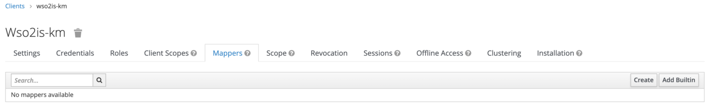
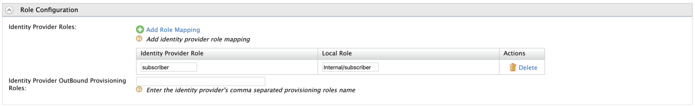

In this medium, I will be 🚶 walking through on how to configure OpenID Connect SSO flow between WSO2 API Manager and Keycloak including JIT (User) Provisioning.

> I will be using WSO2 API Manager 2.6 along with Identity Server as Key Manager 5.7 to instruct and configure the SSO flow with Keycloak

I have broken the guide into 3 tiers and we will be going through them as follows …

- Keycloak Configurations
- WSO2 IS-KM Configurations
- WSO2 API Manager Configurations

## Keycloak 🔑

Let’s start our journey by downloading and configuring the Keycloak server in our local environments.

### 🚧 Downloading & Starting-Up the Keycloak

You can click on Here to download the Standalone Keycloak server distribution to your environment. If you already have a Keycloak server up and running you can ignore these steps and move on to the creation of realms.

<Reference
    title="Keycloak"
    description="Keycloak is an open-source identity and access management solution"
    hyperlink="https://www.keycloak.org/downloads.html"
/>

Extract the archive and execute the following command from the bin directory to start the Keycloak server

```bash
# move to bin directory and execute the following
# unix
sh standalone.sh
# windows
standalone.bat
```

After a successful server start, fire-up your favorite browser and go to `http://localhost:8080/auth` and register an Admin User for our Keycloak Server.

👉 You can follow up on the following Doc to get started with the Keycloak server …

<Reference
    title="Getting Started Guide"
    description="Getting started with Keycloak"
    hyperlink="https://www.keycloak.org/docs/latest/getting_started/"
/>

### OpenIDConnect Endpoint URLs

After a successful log-in to the Keycloak server, you will be looking into a similar UI as follows


Click on the **OpenID Endpoint Configuration** to list all required Endpoint URLs and data to configure OpenID Connect in our Identity Providers.

Make a note of the Endpoint URLs and continue forward with the demo. We will be using these endpoint URLs to configure the Federated Authenticator in the WSO2 Identity Server as Key Manager.

### OIDC Client Registration

Next, we will be creating and registering an OIDC Client in the Keycloak server to represent our WSO2 Identity Server as Key Manager.

> We will be using the existing Master realm to create required Clients, Users, and Roles in the Keycloak server

Click on the **Clients** under Configure to list all the existing registered clients. You will see a similar screen as follows


Click on the **Create** button to add a new client. Set the following

- Client ID: `wso2is-km`
- Client Protocol: `openid-connect`

and **Save**.


In the following prompted screen add the following to configure our `wso2is-km` client in the Keycloak

> The IS KM server is configured with the port offset of 1. Hence, the common-auth URLs are presented with `https://localhost:9444`

- Name: `WSO2 IS KM`
- Enabled: `true`
- Access Type: `confidential`
- Standard Flow Enabled: `true`
- Implicit Flow Enabled: `true`
- Direct Access Grants Enabled: `true`
- Root URL: `https://localhost:9444/commonauth`
- Valid Redirect URIs: `https://localhost:9444/commonauth/*`
- Admin URL: `https://localhost:9444/commonauth`

and click on **Save**.


Next, go to the **Credentials** tab of our `WSO2IS-KM` client in the Keycloak server and make a copy of the `client-secret` value for later usage.

> If you want you can regenerate the secret and make a copy of it to configure Keycloak IDP in the WSO2 IS KM server


After noting down the Secrets, click on the **Roles** tab to create a Subscriber Role.

> We will be creating a Subscriber role in the `WSO2IS-KM` client to federate and give permissions to access the Store portal of WSO2 API Manager.

You will find a similar UI under the Roles tab


Click on **Add Role** to create a new Role and input the following …

- Role Name: `subscriber`

and **Save**


And finally, click on the **Mappers** tab, to configure a claim mapping to send and expose our created Roles through the OIDC SSO flow (incl. ID Token) and via the User Info endpoint.

You’ll find a similar UI under the **Mappers** section …



Select the **Add Builtin**, and enable the client roles in the prompted screen and Save


Edit the **Client Roles** mapper with the following properties …

- Client ID: `wso2is-km`
- Multivalued: `true`
- Token Claim Name: `roles`
- Claim JSON Type: `String`
- Add to ID token: `true`
- Add to access token: `true`
- Add to userinfo: `true`

and **Save**.


### User Registration

As the first step, we are done configuring our WSO2 IS-KM Client in the Keycloak. Next, we will be creating a new User in the Keycloak server for our demo.

Select the **Users** under the **Manage** section in your Left Navigation Panel. You will find the created Admin user in the prompted screen


Click on **Add User** and prompt the following …

- Username: `keycloakuser`
- Email: `key@cloak.com`
- First Name: `Keycloak`
- Last Name: `User`
- User Enabled: `true`
- Email Verified: `true`

and **Save**


Move to the **Credentials** tab our created user and enter a password. Disable the **Temporary Password** and click on **Set Password** to save.


Next, move to the **Role Mappings** tab to map the Subscriber (which we created earlier) with our User.

Select the `WSO2IS-KM` client in the **Client Roles** dropdown and then it will list all the associated roles under the **Available Roles** section. Select the `subscriber` role and click on **Add Selected** to assign it …


And that’s all, we are done with the Keycloak initialization and configurations. 👏

<br/>

## 🔐 WSO2 Identity Server as Key Manager

We have successfully configured our Keycloak Server to send required claims and the roles to perform SSO and User Federation.

> You can find [Docs](https://docs.wso2.com/display/AM260/Configuring+WSO2+Identity+Server+as+a+Key+Manager) to configure WSO2 Identity Server as Key Manager with API Manager. The IS-KM server will be running with a port offset of 1
> 
> 💡 Bonus <br/>
> You can use the [Hydrogen CLI](https://github.com/athiththan11/hydrogen-cli) tool to configure both WSO2 API Manager & Identity Server as Key Manager within seconds

<Reference
    title='Hydrogen CLI'
    description='An Interactive CLI Tool for WSO2 Servers'
    hyperlink='https://github.com/athiththan11/hydrogen-cli'
/>

### Registering an Identity Provider

Now we have to register an Identity Provider in the WSO2 IS KM to represent our Keycloak server. Let’s fire up the WSO2 IS-KM Server and log-in to the Carbon Management console.

Click on Add under the Identity Provider section to register an Identity Provider


Enter the Basic Informations

- Identity Provider Name: `KeycloakIDP`
- Display Name: `Keycloak Identity Provider`
- Description: `Identity Provider for Keycloak`
- Alias: `https://localhost:9444/oauth2/token`


Expand the **Claim Configurations** to map User ID and Role claims with the associated claims exposed by the Keycloak server. Click on **Define Custom Claim Dialect** and **Add Claim Mapping** to add custom claim mappings. Add the following …

- `preferred_username` : `http://wso2.org/claims/displayName`
- `roles` : `http://wso2.org/claims/role`

Then, define the **User ID Claim URI** as `preferred_username` and the **Role Claim URI** as `roles`


Next, expand the **Role Configuration** accordion to map our Keycloak’s Subscriber role with the `Internal/subscriber` role respectively in the WSO2 IS KM.

Click on **Add Role Mapping** and add the following

- `subscriber` : `Internal/subscriber`



Expand the **Federated Authenticators** and **OAuth2/OpenID Connect Configuration** accordion to configure federated authentication with the Keycloak Server

Enter the following respective to the secrets and information retrieved from the `WSO2IS-KM` client in the Keycloak

- Enable OAuth2/OpenIDConnect: `true`
- Client ID: `wso2is-km` *(our client name in the Keycloak Server)*
- Client Secret: *Paste the secret we acquired under credentials*
- Authorization Endpoint URL: *Authorization Endpoint URL collected from the **OpenID Connect Endpoint Configuration***
- Token Endpoint URL: *Token Endpoint URL collected from the **OpenID Connect Endpoint Configuration***
- Callback URL: `https://localhost:9444/commonauth`
- Userinfo Endpoint URL: *Userinfo Endpoint URL collected from the **OpenID Connect Endpoint Configuration***


Finally, expand the **Just-In-Time Provisioning** accordion and select the `Always Provision to User Store Domain` to `PRIMARY` and make it **Provision silently**.


and **Save**.

Given below is a full-snap of the `KeycloakIDP` configurations in the WSO2 Identity Server as Key Manager 😍


<br/>

### Registering a Service Provider

Since we are focusing on configuring the SSO flow for the API Store portal of the API Manager server, we will be creating and registering a Service Provider in the WSO2 Identity Server as Key Manager.

Log-in to the Carbon Management console of the WSO2 IS KM Server and click on the **Add** under the **Service Provider** section.

Enter the following in the initial screen

- Service Provider Name: `API_STORE`
- Description: `A Service Provider for API Store`

and click on **Register**


On the next screen, expand the **Claim Configuration** accordion and a custom claim mapping for the Display Name as follows

- `preferred_username` : `http://wso2.org/claims/displayName`


Then, expand the **Inbound Authentication Configuration > OAuth/OpenID Connect Configuration** and register a provider. On the following screen input the following

? The following callback URL is the OIDC ACS URL of the API Store

- Callback URL: `https:/localhost:9443/store/jagg/jaggery_oidc_acs.jag`

and **Register**


Copy and make a note of the generated *Client ID* and the *Client Secret* to configure the Store Site JSON in the API Manager server.

Expand the **Local & Outbound Authentication Configuration** and select the **Federated Authentication** as the `KeycloakIDP` we have registered earlier and click on Update to update the configuration of the Service Provider.


Given below is a full-snap of the `API_STORE` SP configuration in the WSO2 Identity Server as Key Manager 😍😍


And we are done with the configurations on the WSO2 Identity Server as Key Manager 😎🙂

<br/>

## WSO2 API Manager

Now we are in the last tier of our guide. In this section, we will be configuring the site.json of the Store node to initiate the SSO flow with the WSO2 Identity Server as Key Manager and then to Federate the flow with the Keycloak server.

> WSO2 API Manager is running on the same server with the default port offset of 0

### API Store Site JSON

Open-up the WSO2 API Manager’s directory and move to `<apim>/repository/deployment/server/jaggeryapps/store/site/conf` and open the `site.json` to edit and configure the required params.

Given below is a complete segment of the OIDC Configuration model in the `site.json`. You can refer to the following object to configure your site.json in your environment

> Replace the `Client ID` and `Client Secret` with the credentials acquired from the `API_STORE` Service Provider

```json
"oidcConfiguration": {
    "enabled": "true",
    "issuer": "API_STORE",
    "identityProviderURI": "https://localhost:9444/oauth2/token",
    "authorizationEndpointURI": "https://localhost:9444/oauth2/authorize",
    "tokenEndpointURI": "https://localhost:9444/oauth2/token",
    "userInfoURI": "https://localhost:9444/oauth2/userinfo",
    "jwksURI": "https://localhost:9444/oauth2/jwks",
    "logoutEndpointURI": "https://localhost:9444/oidc/logout",
    "authHttpMethod": "POST",
    "clientConfiguration": {
        "clientId": "{{Client ID}}",
        "clientSecret": "{{Client Secret}}",
        "responseType": "code",
        "authorizationType": "authorization_code",
        "scope": "phone email address openid profile",
        "redirectURI": "https://localhost:9443/store/jagg/jaggery_oidc_acs.jag",
        "postLogoutRedirectURI": "https://localhost:9443/store/",
        "clientAlgorithm": "RS256"
    }
}
```

## 🎉 Voila!!! 🎉

We have successfully configured Single Sign-On with OpenID Connect between WSO2 API Manager and Keycloak. Next, we will be doing a small test drive…

👏 👌 👏

### Test Drive

Direct to the Store portal using `https://localhost:9443/store/` and click on Sign-In.

You will be redirected to the Keycloak’s login page to perform SSO. Enter the credentials of our Keycloak User and then allow the attributes on the consent screen to continue with the federation and provision of the Keycloak users to the WSO2 IS KM and API Manager.

> Login to the Carbon Management console of either the WSO2 API Manager or the WSO2 Identity Server as Key Manager and list the Users. <br/>
> If the Federation is successful and JIT Provisioned performed without any errors, then you will be able to see our Keycloak User in the prompted list.

**Happy Stacking !!!!** 🤘 ✌️
