## Greetings Everyone! 👋

In this medium, I will be 🚶with you all on how to configure SAML2 SSO (Single-Sign-On) between Okta Cloud Identity Provider 🔒 and WSO2 API Manager.

> The demonstrations are made using WSO2 API Manager v2.6 and WSO2 Identity Server as Key Manager v5.7 <br/>
> Sensitive data are masked in all attached screenshots [Therefore, don’t waste your time investigating 🕵 blank spaces]

## 🔐 Configuring Okta

We’ll start the demo by setting up the Okta and creating a SAML2 Provider.

We need an Okta account to continue. So, go to the Okta Developer portal, and sign-up for a developer account (it’s FREE 🎉 🙌 👌) if you don’t have one. After a successful creation and verification, log-in to your developer account and follow me …

Change the appearance of the Developer Console to Classic UI

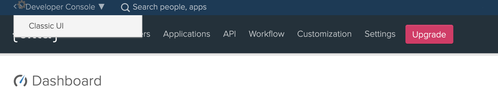

Next, select the `Add Application` as shown below

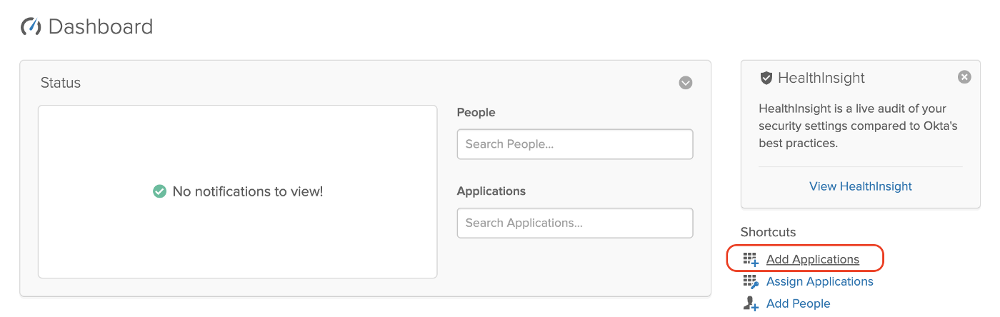

Select the `Create New App` in the displayed UI, and select `SAML 2.0` and click on `Create` as following

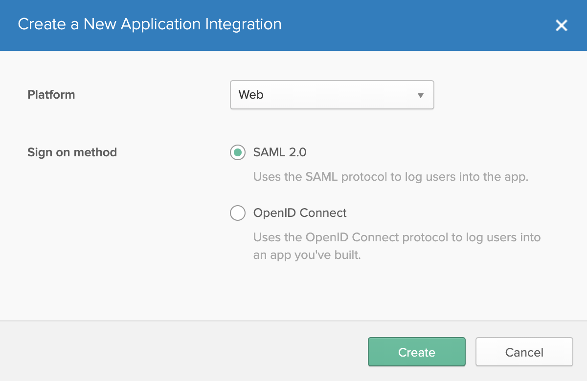

Prompt the following in the next screen (which will a step-progress form)

- App Name: `OktaSAMLApplication`
- Single Sign-On URL: `https://localhost:9444/commonauth`
- Audience URI: `OktaSAML`


Now go to the `Assignments` tab and click on `Assign` to assign people and groups to the created SAML2 Provider.

> **Tip:** <br/>
> Assign the default profile to continue with the demo. If you don’t assign any people or group of people (Everyone), then at the point of SSO execution, Okta will throw an Error message

Go back to the `Sign On` tab and select `View Setup Instructions` as follows to download the Okta’s public Certificate and Metadata to configure Identity Provider in the WSO2 Identity Server.

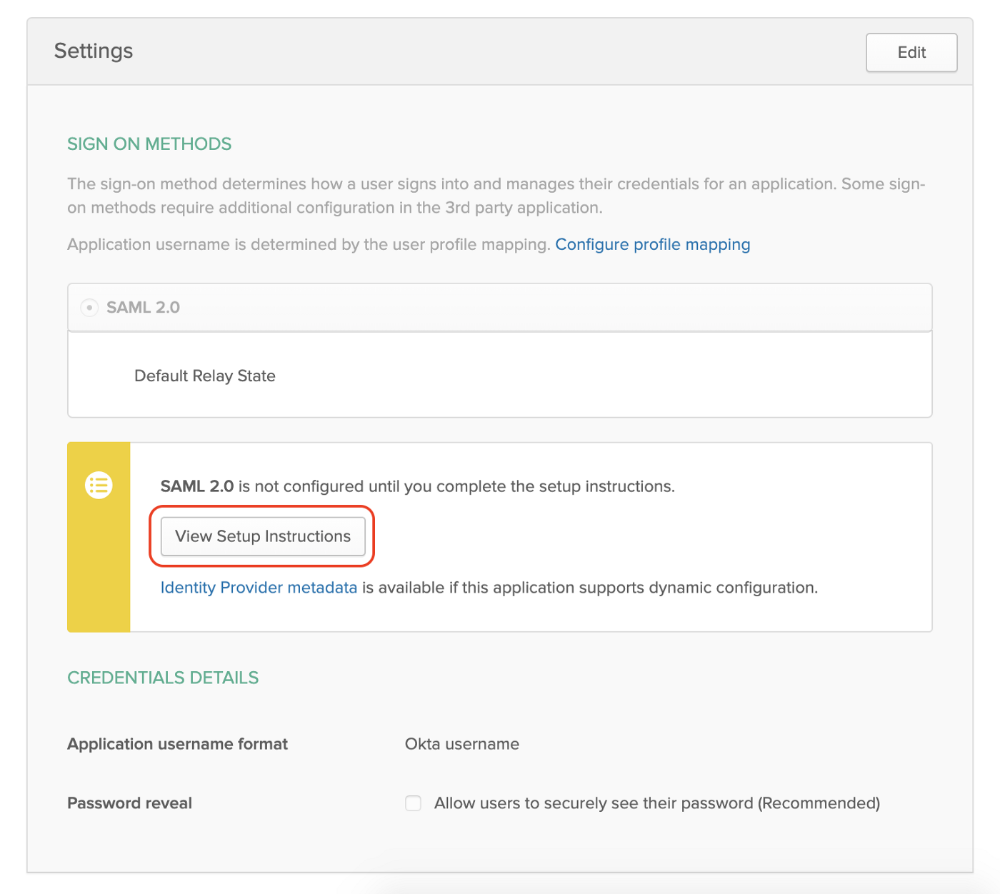

Scroll down to the bottom, and you’ll find a `Download Certificate` button and a section named `Optional`.

Download and save them both in your environment for future references …

> Note:
>
> Configure Okta User Profile with Roles and add the `Subscriber` role. You can follow [WSO2 API Manager & Okta SSO](https://medium.com/@athiththan11/wso2-api-manager-okta-sso-f04e9c6141e1) to configure `Roles` attribute. <br/>
> Or, scroll to the very bottom (this article) to find the instructions …

😐 😐 🤐

> Another Note: <br/>
> If you want to change the `Username` pattern of the Okta User, refer `Okta Username Format` section in [here](https://medium.com/@athiththan11/wso2-api-manager-okta-sso-f04e9c6141e1)

We are done with Okta

## WSO2 Server Configurations 🛠

### WSO2 API Manager & IS Key Manager

To get a fully-fledged SAML2 SSO experience, and User Provisioning features, we need to configure WSO2 Identity Server as Key Manager with the WSO2 API Manager.

You can follow up on this official Doc to configure WSO2 API Manager & IS Key Manager.

But, if you are too lazy to follow up on the docs (no hard feelings though), then I have a little SURPRISE for you …

> May I introduce you to the one and only “Hydrogen CLI”, an interactive CLI tool to configure WSO2 Servers

Clone or download the latest release and fire up configuring WSO2 API Manager with WSO2 Identity Server as Key Manager.

> Brief instructions on how to use hydrogen is given at the tail of this article

## Identity Provider Configurations

I hope you all are good to continue the demo with a working environment… Yes ??? 🤔

If all are good, then we are good to go …

Fire up the WSO2 IS as Key Manager and navigate to the Carbon management console [https://localhost:9444/carbon]

> I assume that you have configured port offset 0 to WSO2 API Manager & offset 1 to IS KM

Go to `Main > Identity > Identity Providers > Add` and enter the following to create an Identity Provider in the IS KM for our Okta Cloud IdP

- Identity Provider Name: `OktaSAMLIDP`
- Display Name & Description
- Alias: `https://localhost:9444/oauth2/token`

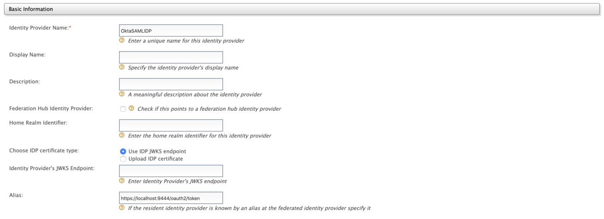

Expand the `Federated Authenticators` and expand the `SAML2 Web SSO Configuration` accordion to register a SAML IDP.

- Enable SAML2 Web SSO: `true`
- Service Provider Entity ID: `OktaSAML` (which is the same value given when creating a SAML application in Okta)

Select the `Metadata File Configuration` for the `Select Mode` and upload the downloaded Okta metadata and click `Register`

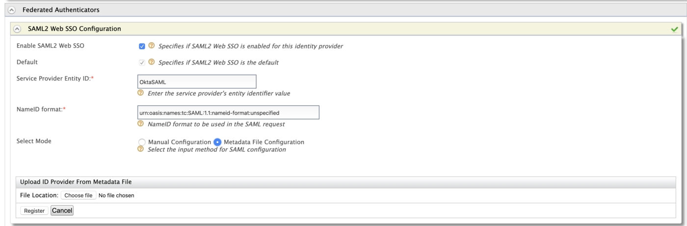

After making the above-changes as the last step, expand the `Just-In-Time Provisioning` and select and mark the `Always provision to User Store Domain` to `PRIMARY` and make `Provision Silently` and Save.

**Ohh, wait I forgot one thing…** 😱😱😱

If we are doing User Provisioning then we have to map the Roles and Claims. Go back again to the Identity Provider Configurations [So sorry for that 😢] and expand the `Claim Configurations > Basic Claim Configuration` and `Define a Custom Claim Dialect`

- `roles` : `http://wso2.org/claims/role`

Next, expand the `Role Configurations` and `Add Role Mapping`

- `subscriber` : `Internal/subscriber`

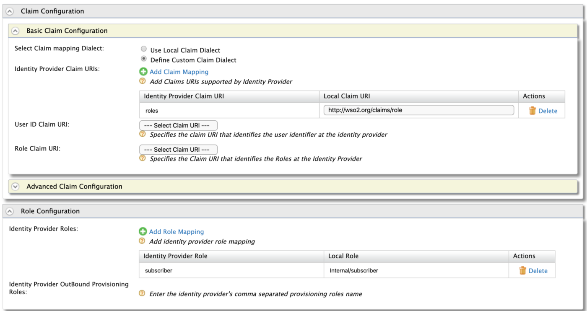

Again I made your life easy with the following screenshot… I hope you have the same thing as mine or maybe more enhanced … 😏

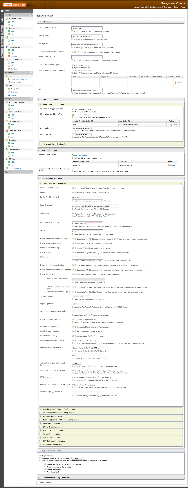

😫 😓 Let’s meet again after a short commercial break …

## Service Provider Configurations

Now, we’ll start configuring a Service Provider for our API Manager.

Direct (again) to the Carbon management console of the WSO2 Identity Server as Key Manager and route to `Main > Identity > Service Providers > Add` to create a Service Provider.

- Service Provider Name: `API_STORE`
- SaaS Application: `true` (enable it after registering the provider)

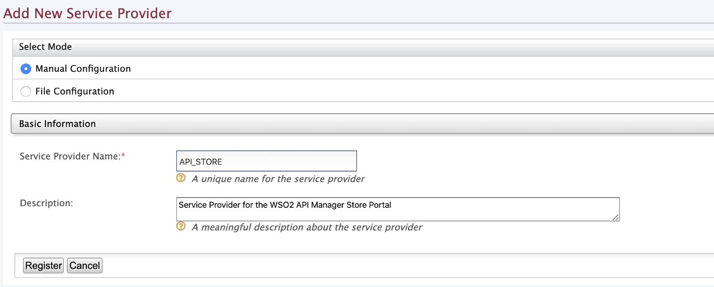

Expand `Inbound Authentication Configuration > SAML2 Web SSO Configuration` and click on `Configure`.

- Issuer: `API_STORE`
- Assertion Consumer URLs: `https://localhost:9443/store/jagg/jaggery_acs.jag`

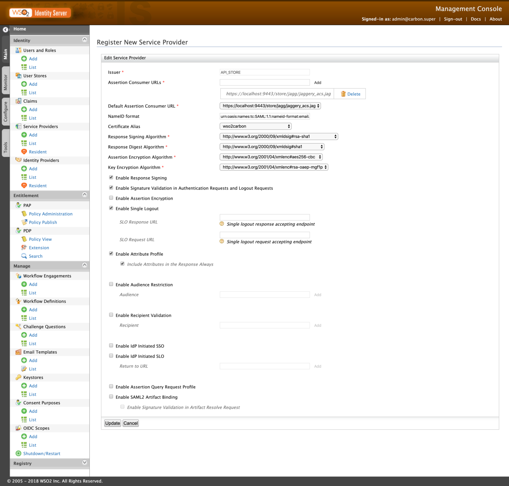

Expand `Local & Outbound Authentication Configuration` and do the following …

- Federated Authentication: `OktaSAMLIDP`
- Use user store domain in roles: `true`

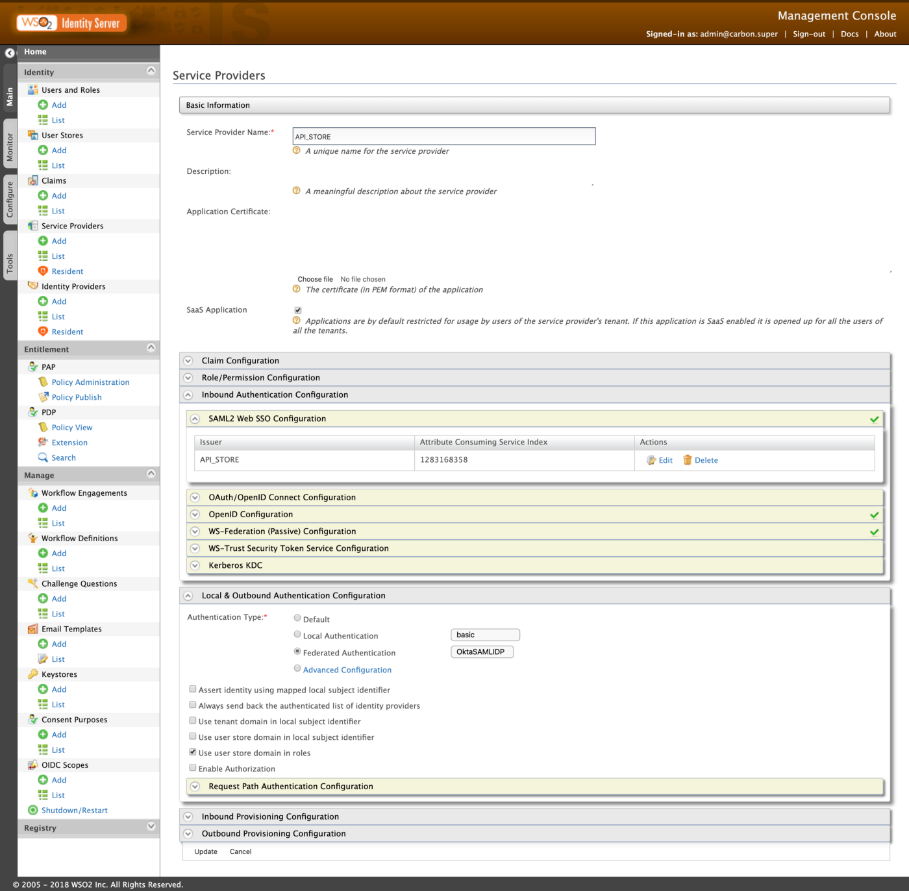

## WSO2 API Manager & Site JSON

We have come to the last episode of our configurations (a new beginning). With all the above-mentioned guides and configurations, we have successfully created both Identity Provider as well as a Service Provider

In this section, we will be configuring the Store node of the WSO2 API Manager to contact the Identity Providers and Service Providers to federate with Okta. Route to `<APIM>/repository/deployment/server/jaggeryapps/store/site/conf` directory and edit the `site.json` file as follows…

> Replace and configure the `keyStoreName` by pointing to the **WSO2 Carbon JKS** of the WSO2 IS KM pack. It has to be an actual path and not a relative path

```json
"ssoConfiguration" : {
    "enabled" : "true",
    "issuer" : "API_STORE",
    "identityProviderURL" : "https://localhost:9444/samlsso",
    "keyStorePassword" : "wso2carbon",
    "identityAlias" : "wso2carbon",
    "responseSigningEnabled":"true",
    "assertionSigningEnabled":"true",
    "verifyAssertionValidityPeriod":"true",
    "timestampSkewInSeconds":"300",
    "audienceRestrictionsEnabled":"true",
    "keyStoreName" :"/Users/foo/wso2is-km-5.7.0/repository/resources/security/wso2carbon.jks",
    "passive" : "true",
    "signRequests" : "true",
    "assertionEncryptionEnabled" : "false",
    "idpInit" : "false",
    "idpInitSSOURL" : "https://localhost:9444/samlsso?spEntityID=API_STORE",
    "loginUserNameAttribute" : ""
}
```

## 🎉 Voila!!! 🎉

We have now successfully configured SAML2 SSO between Okta & WSO2 API Manager [more precisely with the API Store Portal] 👏 👏 👏

**Happy Stacking !!!!** 🤘 ✌️

Next, we’ll do a simple UAT to verify the reliability …

### User Acceptance Testing

Fire up both the WSO2 API Manager & WSO2 Identity Server as Key Manager and direct to the Store portal [https://localhost:9443/store/] and click on Sign-In.

You will be redirected to the Okta’s login page to perform SSO with the Okta user. Enter the Okta credentials and then allow the attributes on the consent screen to continue with the federation and provisioning of the Okta users to the WSO2 API Manager & IS Key Manager.

## 💡 Bonus

### Hydrogen 🔥🔥🔥

Hydrogen is an interactive CLI tool to configure WSO2 Servers (🚧 under construction & active development).

To configure WSO2 API Manager & WSO2 Identity Server as Key Manager, clone or download the hydrogen-cli from here, and follow the given instructions …

> **Toll-Free Tips:**
>
> I would recommend you to use NodeJS v8.9.0 to build the packages without any dependency conflicts <br/>
> Please install and start your Docker environment, to create Databases and to persist

<Reference
    title="Hydrogen"
    description="A Interactive CLI Tool for WSO2 Servers"
    hyperlink="https://github.com/athiththan11/hydrogen"
/>

Download both WSO2 API Manager & WSO2 IS KM packs and unzip and place them inside a new folder (ex: `Setup`)

Navigate to the `Setup` folder and execute the following command (from inside of the folder) to configure IS KM with API Manager including Database creations and configurations

```bash
hydrogen distribute:am --is-km --datasource postgres --container --generate
```

This will configure both the WSO2 API Manager & IS KM packs with appropriate configurations. Download and place the Postgre (or relative) JDBC driver in `<APIM>/repository/components/lib` directory and start the servers and continue hacking … 🙌 👌

> You can find more interesting examples and guides about hydrogen in here as well as from here

### 👨 Okta User Profile & Roles

To login to the WSO2 API Manager Store portal, Okta users need to have the `Internal/subscriber` roles assigned to them. As well as the Okta has to pass the assigned Roles with the SAML Assertion response to the WSO2 API Manager at the point of the federation to sign-in the Okta user to the Store portal.

In the Okta Developer portal (Developer console view and not Classic UI), navigate to `Users > Profile Editor` and select the Okta user profile to edit. On the following, select `Add Attribute` and make the following changes and `Save` the attribute

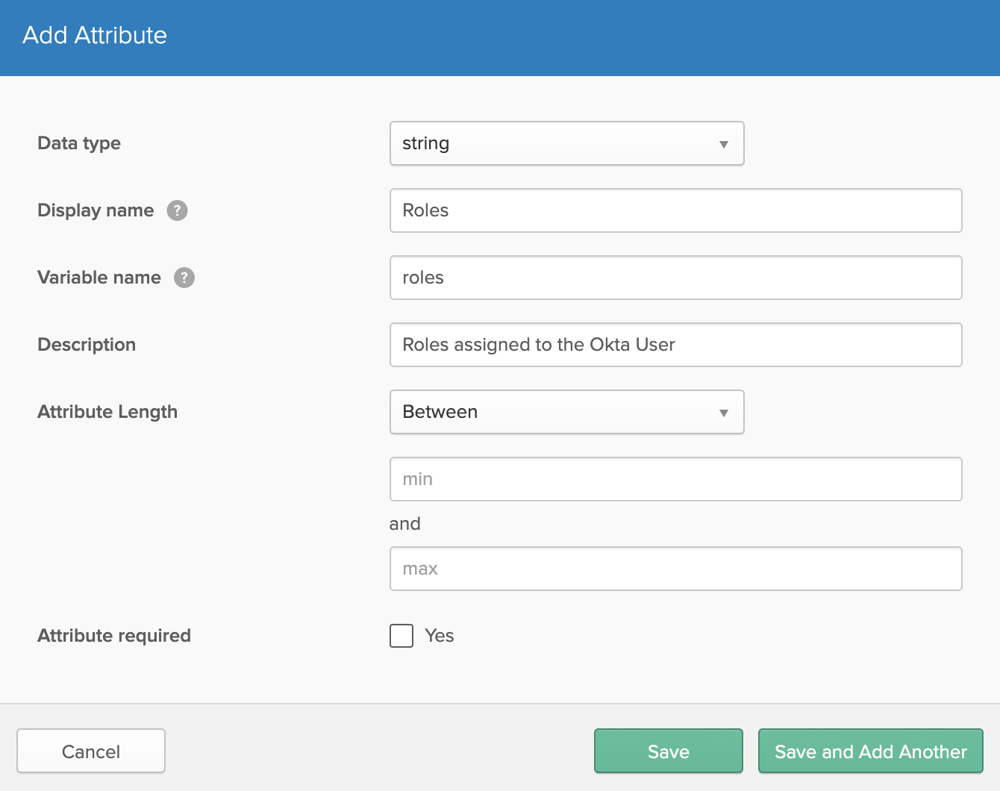

After the above, move to `Users > People` and select the current User and on the following screen select the `Profile` tab and click on `Edit` to add the `subscriber` role in the `Roles` field …

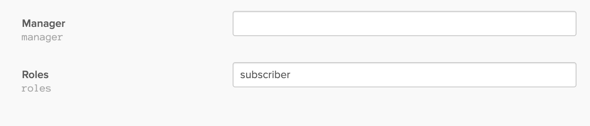

Even though we have introduced the `Roles` attribute to the Okta Users, still, we are missing one part which is we haven’t configured to add the `Roles` in the SAML Response Assertion

Switch back to `Classic UI` and navigate to `Applications > Applications` and select and edit [from the `General > SAML Setting`] our SAML2 Application. On the `Configure SAML` screen of the `Progress-Form`, make the following changes and save …

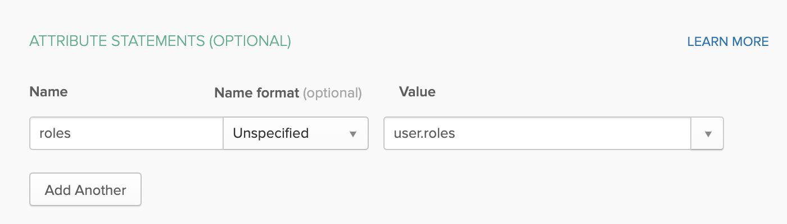
