## 🔑 Intro

This medium illustrates and walk-through on how to configure OpenID Connect SSO between WSO2 API Manager and Okta Identity Provider as well as to provision users from Okta to the WSO2 API Manager.

> We will be using WSO2 API Manager v2.6 for this demo

We will be going through flows and the configurations with the following breakdowns

* Okta Developer Account Creation
* Okta Authorization Server
* Okta Application
* Okta User & Claims
* WSO2 API Manager: Identity Provider
* WSO2 API Manager: Service Provider
* WSO2 API Manager: Store Configurations

Let’s get started…

## Okta

### Okta Developer Account

As of our very first step, we need an Okta Cloud IDP account. Therefore, for demo purposes, we will be creating an Okta Developer account for trial and error scenarios.

Open up your favorite browser and direct to [https://developer.okta.com](https://developer.okta.com) and register for a new Developer account to enjoy free trial on using Okta Cloud IDP.

### Okta Authorization Server

After creating an Okta developer account, sign-in to the developer console and navigate to `API` > `Authorization Server` to list down the default Okta Authorization server.


We will be looking at a similar page as follows with a default Authorization server created in Okta.

> For security concerns, all attached screenshots are masked

We can either create a new Authorization server or we can continue using the default Authorization server to configure Okta. As for this demo, we will be continuing our configurations with the Default Authorization Server created by Okta...


### Okta OIDC Application

Next, we will be creating an Okta application for our OpenID Connect SSO flow. In the Okta developer portal, select `Applications` from the top navigation bar as follows...


Then, click on `Add Application` to create a new Okta application.

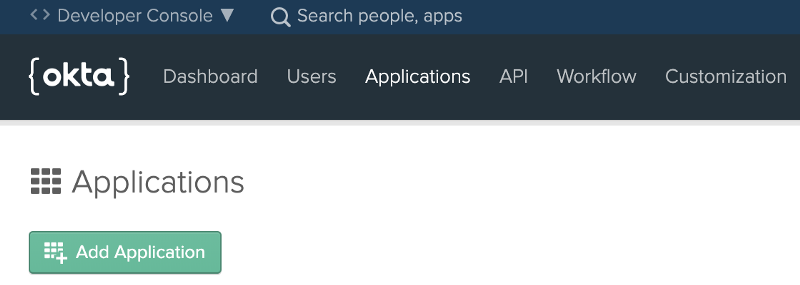

On the next UI, select the platform as `Web` and click on `Next`. Enter the Application Name and tick the `Client Credentials` under the `Grant Type Allowed` section and `Done`.


After successful creation of our Okta Application, click on Edit and make the following changes

* Login Redirect URI: `https://localhost:9443/commonauth`
* Logout Redirect URI: `https://localhost:9443/commonauth`
* Initiate Login URI: `https://localhost:9443/store/`

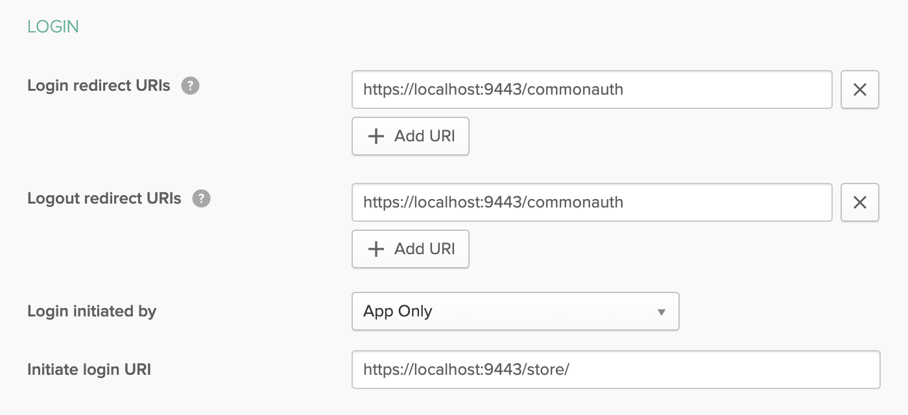

### Okta User & Claims

To login to the WSO2 API Manager Store portal, the Okta users need to have the `internal/subscriber` roles assigned to them. As well as the Okta has to pass the assigned Roles with the JWT to the WSO2 API Manager at the point of the federation to sign-in the Okta user to the Store portal.

Navigate to `Users` > `Profile Editor` and select the Okta user profile to edit it. On the following screen, select `Add Attribute` and make the following changes and `Save` the attribute

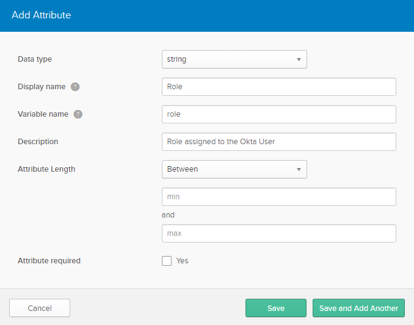

Then move to `API` > `Authorization Server` and select our default Authorization server. Direct to `Claims` tab and click on `Add Claim` to create a new claim for our Role attribute.

Do the following configurations and save…

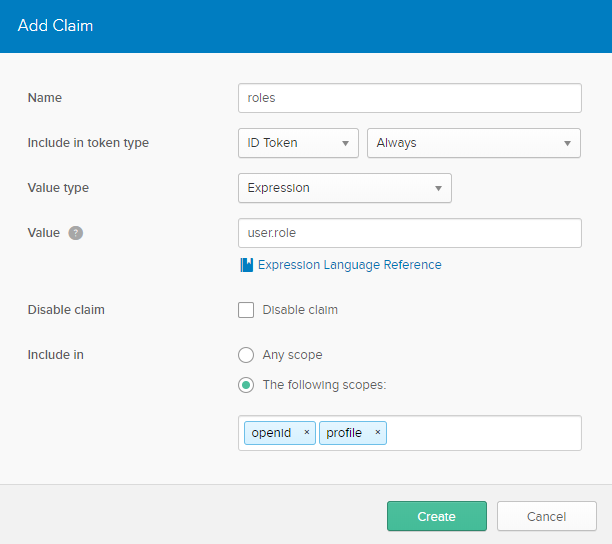

At last, move to `Users` > `People` and select the current User and on the following screen select the `Profile` tab and click on `Edit` to add the `subscriber` role in the `Role` field.

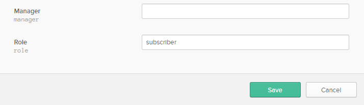

## WSO2 API Manager

### OpenID Connect Federated Extension

By default as Out-Of-The-Box, the WSO2 API Manager is only shipped wit the SAML2 Federated Authentication configurations and artifacts. Therefore, to enable OpenID Connect, download the following [OpenID Connect Authenticator artifact from here](https://drive.google.com/file/d/1ZawWbWCjsx_Z3u6Bpg3OztLqrdDq_N7v/view?usp=sharing) and place it inside the `<APIM>/repository/components/dropins` directory.

> Please note that adding the above-mentioned artifact to the WSO2 API Manager to enable OpenID Connect features is not a best practice and not recommended in production environments. Since this is a demo, we have configured it by dropping the artifact inside the `dropins` folder.
>
> If you want to enable OpenID Connect features in a Production environment, please setup and use WSO2 Identity Server as Key Manager for the WSO2 API Manager and follow the configurations on the WSO2 IS-KM

### Identity Provider

After ensuring the OpenID Connect features in the WSO2 API Manager, we will be creating an Identity Provider to federate with our Okta Cloud provider.

Fire up the WSO2 API Manager server, and navigate to the Carbon management console and select `Add` under the `Identity Providers` section to register an Identity Provider.

Enter a name for the Identity Provider (for example OktaIDP) and select the `OAuth2/OpenID Connect Configurations` under the `Federated Authenticators` accordion.

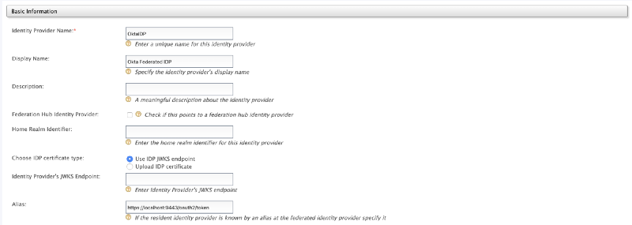

Make the following configurations

* `Specifies if OAuth2/OpenID Connect is enabled for this Identity Provider`: `enable`
* `Client ID`: Paste the Consumer Key obtained from the Okta Application
* `Client Secret`: Paste the Consumer Secret obtained from the Okta Application
* `Authorization Endpoint URL`: `https://<your-okta>.com/oauth2/default/v1/authorize`
* `Token Endpoint URL`: `https://<your-okta>.com/oauth2/default/v1/token`
* `Callback URL`: `https://localhost:9443/commonauth`
* `Userinfo Endpoint URL`: `https://<your-okta>.com/oauth2/default/v1/userinfo`
* `Additional Query Parameters`: `scope=openid profile`

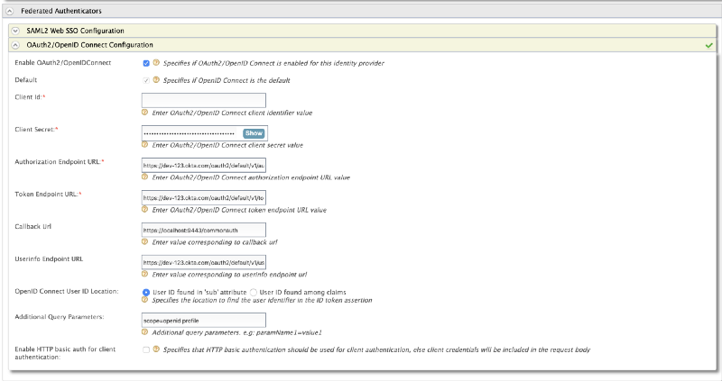

Next, expand the `Claim Configuration` > `Basic Claim Configuration` and select `Define Custom Claim Dialect` to add a custom mapping for the `Roles` claims for the Okta and WSO2 API Manager.

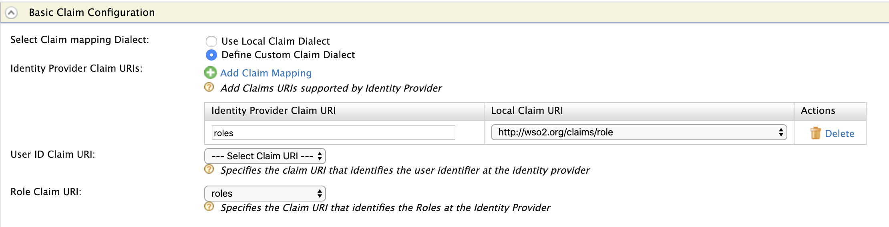

After making the above configurations, expand the `Role Configuraiton` and select the `Add Role Mapping` and enter the following to map the `subscriber` role with the `internal/subscriber` role of the WSO2 API Manager.

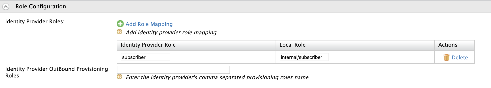

And at last, expand the `Just-In-Time Provisioning` and select the `Always Provision to User Store Domain` with the `PRIMARY` user store to provision the Okta users to the Primary user-store of the WSO2 API Manager. Please refer to the attached screenshot...

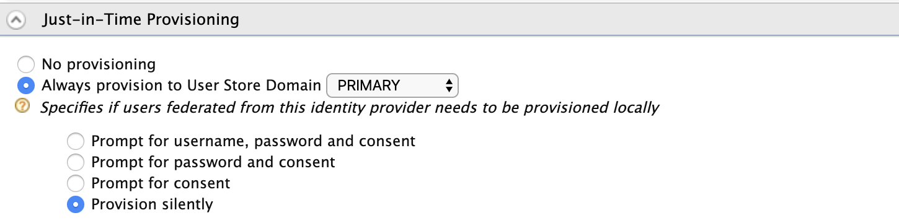

And save all the configurations.

Given below is a full rollover screenshot of the configurations of the created `OktaIDP` Identity Provider...

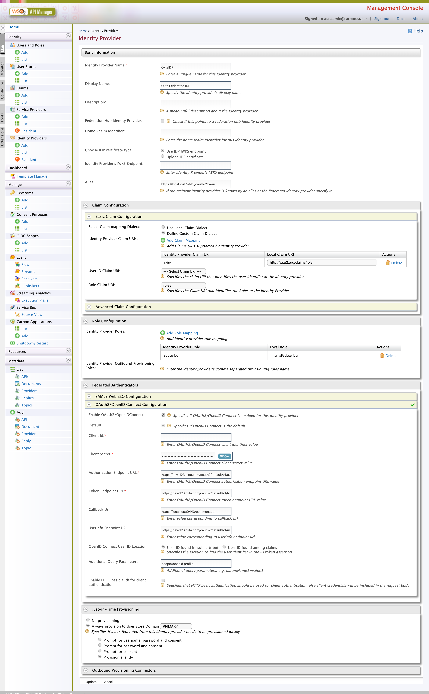

### Service Provider

Now we have created an Identity Provider successfully to perform federated authentication with the Okta. As of the next step, we will be creating a Service Provider for the Store portal of the WSO2 API Manager.

Direct to the Carbon management console of the WSO2 API Manager server, and select `Add` under the `Service Providers` section to register a Service Provider.

Enter `API_STORE` as the name of the Service Provider and click on `Register`


On the following screen, expand the `Inbound Authentication Configuration` and select `Configure` under the `OAuth/OpenID Connect Configuration`.

And prompt the following

* `Callback URL`: `https://localhost:9443/store/jagg/jaggery_oidc_acs.jag`


And register and save the configurations.

As a result, a Consumer Key and a Secret. Copy these credentials and store them as we will need them when configuring the `site.json` of the Store node.

Next, expand the `Local & Outbound Authentication` Configuration and select `Federated Authentication` with our created Identity Provider `OktaIDP`.

Proceeding further, expand the `Local & Outbound Authentication Configuration` and select the `Federated Authentication` along with created `OktaIDP` Identity Provider.

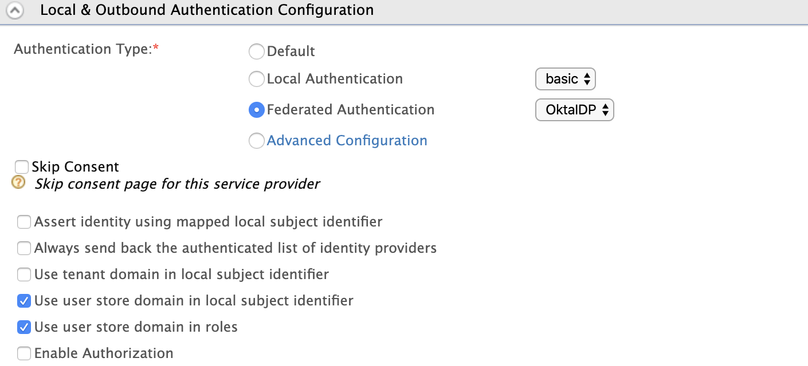

And at last, expand the `Claim Configuration` and select the `Define Custom Claim Dialect` and make the following changes to extract the `preferred_username` from the generated JWT to make it as the username and Display Name of the provisioned user.

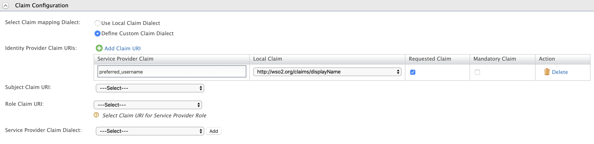

And save and register all the configurations to create a Service Provider for the Store portal.

Given below is a full rollover screenshot of the configurations of the created `API_STORE` Service Provider...

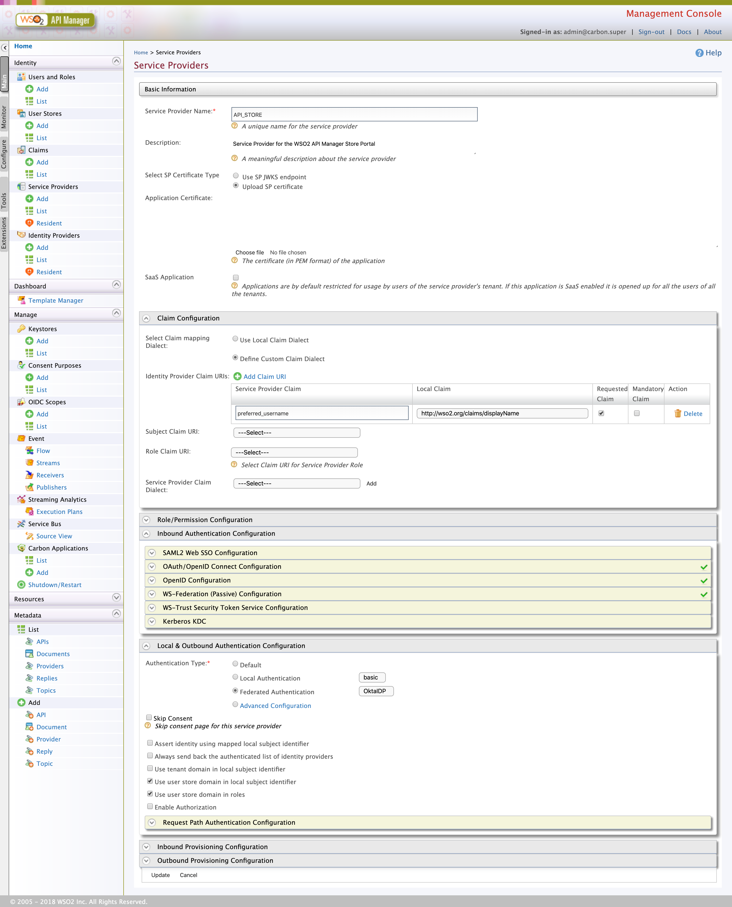

### Store Site.JSON

We have come to the last steps of our configurations. With all the above-mentioned guides and configurations, we have successfully created both Identity Provider as well as a Service Provider the OpenID Connect SSO flow.

In this section, we will be configuring the Store node of the WSO2 API Manager to contact the Identity Providers and Service Providers to federate with Okta. Route to `<APIM>/repository/deployment/server/jaggeryapps/store/site/conf` directory and edit the site.json file as follows…

> Replace the `API_STORE SP OIDC Client ID` and `API_STORE SP OIDC Client Secret` with the consumer credentials created by the `API_STORE` service provider

```json
"oidcConfiguration": {
    "enabled": "true",
    "issuer": "API_STORE",
    "identityProviderURI": "https://localhost:9443/oauth2/token",
    "authorizationEndpointURI": "https://localhost:9443/oauth2/authorize",
    "tokenEndpointURI": "https://localhost:9443/oauth2/token",
    "userInfoURI": "https://localhost:9443/oauth2/userinfo",
    "jwksURI": "https://localhost:9443/oauth2/jwks",
    "logoutEndpointURI": "https://localhost:9443/oidc/logout",
    "authHttpMethod": "POST",
    "clientConfiguration": {
      "clientId": "<API_STORE SP OIDC Client ID>",
      "clientSecret": "<API_STORE SP OIDC Client Secret>",
      "responseType": "code",
      "authorizationType": "authorization_code",
      "scope": "phone email address openid profile",
      "redirectURI": "https://localhost:9443/store/jagg/jaggery_oidc_acs.jag",
      "postLogoutRedirectURI": "https://localhost:9443/store/",
      "clientAlgorithm": "RS256"
    }
}
```

## 🎉 Voila!!! 🎉

We have successfully configured Single Sign-On with OpenID Connect between WSO2 API Manager and Okta Cloud Identity Provider. Next, we will be doing a small test drive...

### Test Drive

Direct to the Store portal using [`https://localhost:9443/store/`](https://localhost:9443/store/) and click on `Sign-In`.

You will be redirected to the Okta’s login page to perform SSO with the Okta user. Enter the Okta credentials and then allow the attributes on the consent screen to continue with the federation and provisioning of the Okta users to the WSO2 API Manager.

> The federated IDP authentication happens in `org.wso2.carbon.identity.application.authenticator.oidc.OpenIDConnectAuthenticator` class
>
> JIT Provisioning makes way in the `org.wso2.carbon.identity.application.authentication.framework.handler.request.impl.JITProvisionningPostAuthenticationHandler`

**Happy Stacking !!!!** 🤘 ✌️

<hr class="three--dots"/>

## 🚧 Troubleshooting

### Okta Trusted Origins

If you encounter any Cross-Origin errors when accessing the Okta Cloud IDP, sign-in to the Okta developer portal and navigate `API` > `Trusted Origins` to add our Domain as a trusted origin in the Okta.

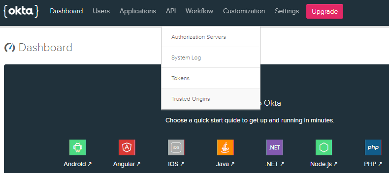

On the following screen select `Add Origin` and make the following...

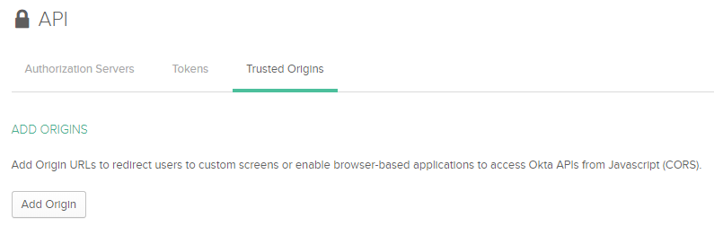

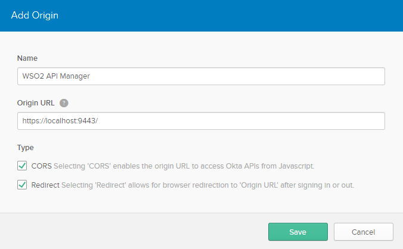

`Save` the configurations.

### Okta Username Format

If you encounter any error related to Username format as email while performing SSO, please follow the given instructions to change the Username format from Email pattern to any other...

Login to the Okta developer portal and navigate to `Users` > `Profile Editor`


Select the `Profile` of the Okta User. On the following screen, select the info icon of the Username attribute to edit it.

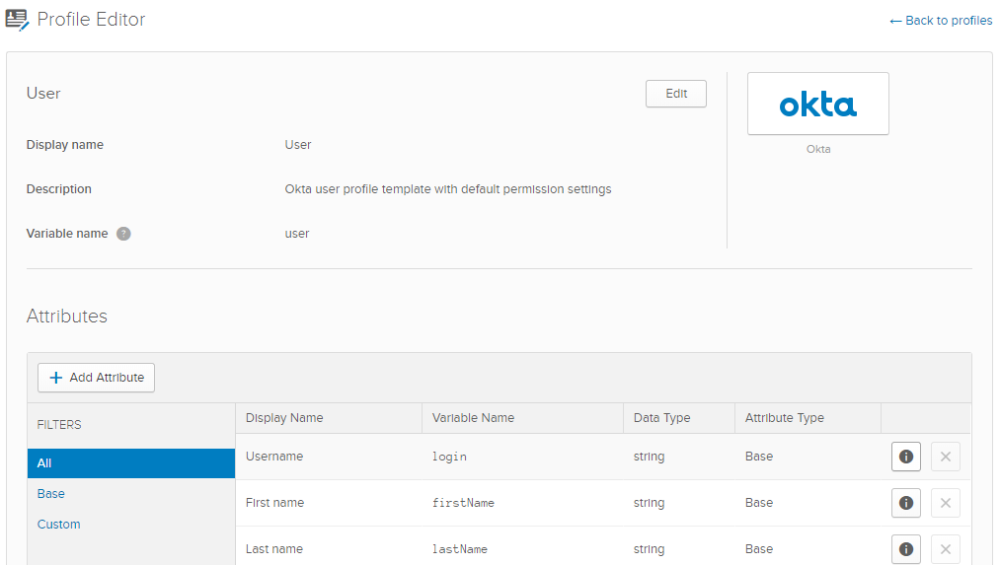

Change the `Format Restrictions` from `Email Format` to `None` or `Custom Character Restrictions` and `Save Attribute`.

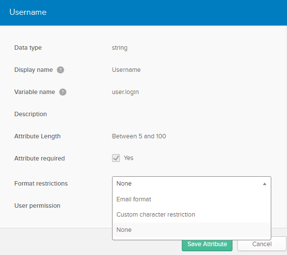

<hr class="three--dots"/>
