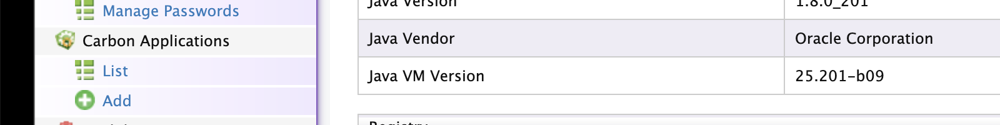
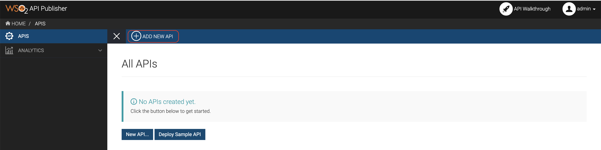
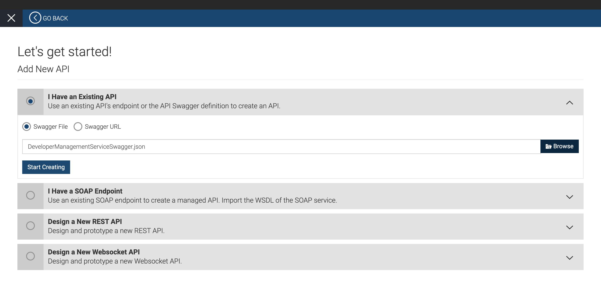
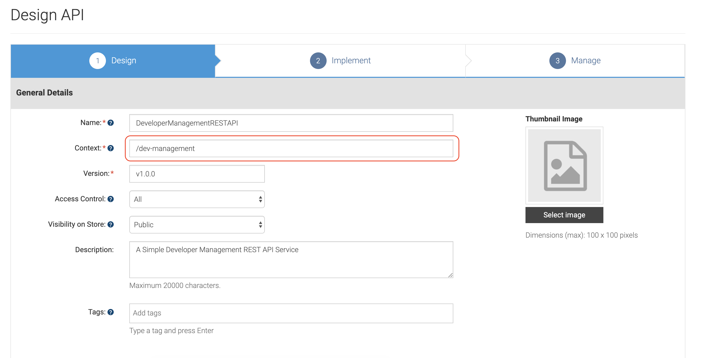
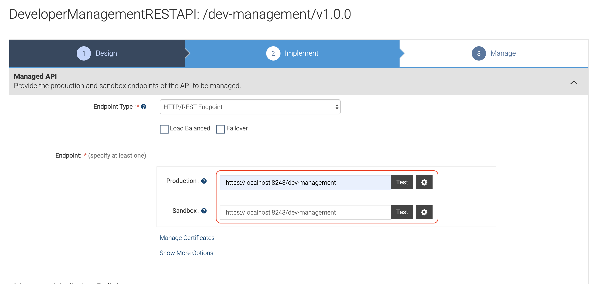
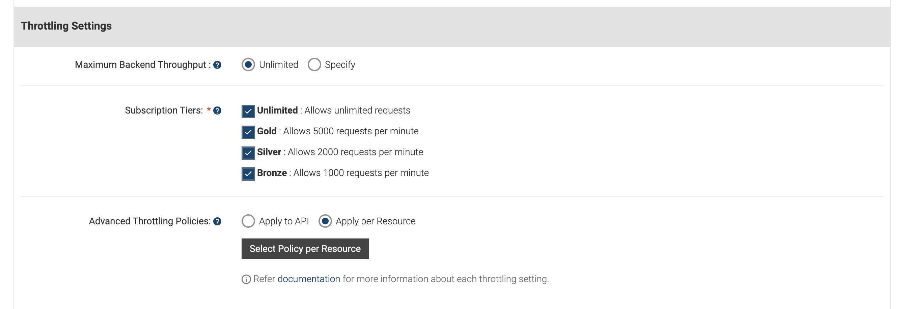
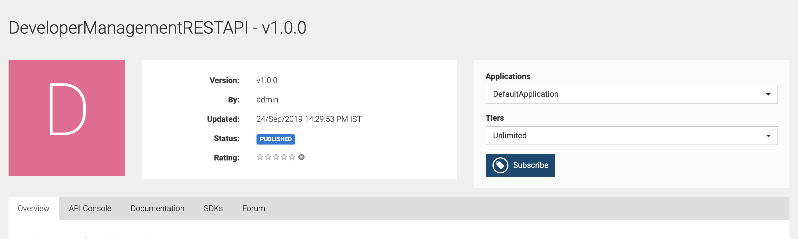
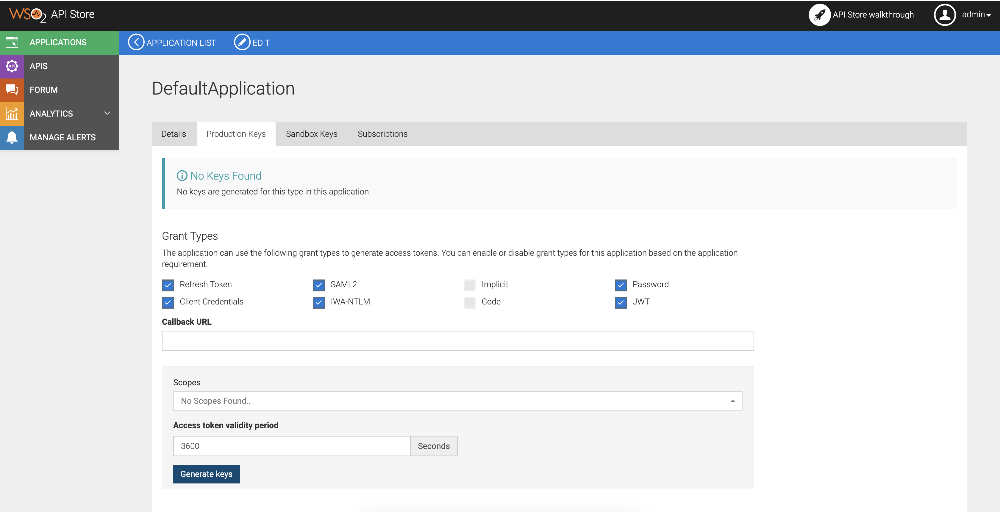

## Intro

In this medium, we will be looking on how to expose a legacy web-service / SOAP service as REST APIs using both WSO2 API Manager (2.6.0) and Enterprise Integrator (6.5.0).

> **Why EI & API Manager? Can’t we do it using either one of them?**
>
> Of course we can. It is possible to expose a SOAP service as REST APIs using either API Manager or Enterprise Integrator. But, if you have added additional mediations and performing heavy-duty mediations in API sequences, then using both the API Manager and Enterprise Integrator is a best solution. Which is because, EI is scoped and capable to perform heavy-mediations as well as the API Manager is scoped to perform only API management processes.
>
> This post illustrates how to add an LDAP user-store as a secondary user-store in WSO2 API Manager (in almost every WSO2 Product).

For demo purposes, I have implemented a mock [Developer Management Web Service](https://github.com/athiththan11/RepoDeWS) using Spring Boot and will be using that to configure our EI and API Manager instances.

**Let’s dive into the demo …**

<br />

<a class="ul-disabled" href="https://github.com/athiththan11/RepoDeWS">
    <div class="card">
        <div class="card-horizontal">
            <div class="card-body py-4 px-5">
                <h4 class="card-title mt-4">RepoDeWS</h4>
                <p>A Simple Spring Boot (SOAP) Web Service</p>
                <footer class="blockquote-footer">
                    <small class="text-muted">
                        athiththan11
                    </small>
                </footer>
            </div>
            <div class="img-square-wrapper">
                
            </div>
        </div>
    </div>
</a>

## Legacy Service

### Entities & Services

The Developer Management Web Service contains the following entities and services …

```text
Developer
    - Add Developer
    - Get Developer
    - Delete Developer

Repo
    - Add Repo
    - Get Repo
```

### Build & Run

Clone or download the project from GitHub, and execute the following command from the root folder to start the web-service server

```shell
mvn spring-boot:run
```

If you don’t have maven installed, then use the following to start the server

```shell
./mvnw spring-boot:run
```

After a successful startup, navigate to [`https://localhost:8443/ws/developers.wsdl`](https://localhost:8443/ws/developers.wsdl) to access the WSDL definitions of our Developer Management service.

## WSO2 Enterprise Integrator

We will be starting from **WSO2 Enterprise Integrator** instance to expose the provided legacy service as REST service.

### Truststore & Certificate

Beforehand, we want to export the self-signed certificate of our Developer Management service to our EI instance for a hassle-free SSL connectivity and HTTPS communication.

Follow the given steps to export and import certificates of our legacy service to the EI’s trust-store.

* Export or download the self-signed certificate of our legacy service from the browser.

Follow this https://www.shellhacks.com/get-ssl-certificate-from-server-site-url-export-download/ to export and download the self-signed certificate from the browser

* Execute the following command to import the certificate to our EI instance

> Navigate to `<EI>/repository/resources/security` folder and execute the following command. Enter `wso2carbon` as the password if it prompts

```shell
keytool -importcert -file <path to crt> -keystore client-truststore.jks -alias hydrogen.com
```

### Carbon Artifact

Start the EI instance by navigating to the `/bin` folder and execute the following command based on your environment …

```shell
# linux env
sh integrator.sh

# windows env
integrator.bat
```

Fire up your favorite browser and route to [`https://localhost:9443/carbon`](https://localhost:9443/carbon) and log in using the following credentials

* username: `admin`
* password: `admin`

I have implemented and provided a carbon archive with configurations related to SOAP to REST services, endpoints, and sequences. You can use the following artifact and deploy it our EI instance without any configurations hassle.

<a class="ul-disabled" href="https://drive.google.com/open?id=1PHMufZ1K4cBT_hry76fC2GgGyiDDT_N7&source=post_page-----838ec110392d----------------------">
    <div class="card">
        <div class="card-horizontal">
            <div class="card-body py-4 px-5">
                <h4 class="card-title mt-4">DevManagementServiceAPI_1.0-0.car</h4>
                <p>Carbon Artifact of Developer Management Service API</p>
                <footer class="blockquote-footer">
                    <small class="text-muted">
                        athiththan11
                    </small>
                </footer>
            </div>
        </div>
    </div>
</a>



Select `Add` under `Carbon Applications` section and upload and deploy the above-provided carbon archive.

Below given is the source code of Developer Management Service API Carbon artifact

<a class="ul-disabled" href="https://drive.google.com/open?id=1CcEBGEEWCN8z8Dpnk6t56b8KNRW9HBQi&source=post_page-----838ec110392d----------------------">
    <div class="card">
        <div class="card-horizontal">
            <div class="card-body py-4 px-5">
                <h4 class="card-title mt-4">DevManagementServiceAPI.zip</h4>
                <p>Source code of Developer Management Service API</p>
                <footer class="blockquote-footer">
                    <small class="text-muted">
                        athiththan11
                    </small>
                </footer>
            </div>
        </div>
    </div>
</a>

### Run & Test

> Before testing, make sure to verify whether the EI instance is running and deploy the provided Carbon archive

Test the exposed REST API service using the below cURL commands. Given below are a couple of cURL commands to test the exposed REST APIs.

> Given below is a .http file, can be used with VS Code with REST Client Extension

`gist:athiththan11/96ef52ab35dea69562119183cd2d3bda#wso2-trilogy-ei-curl.http`

## WSO2 API Manager

Thereafter, we’ll configure a WSO2 API Manager instance to manage the API lifecycle, traffic, subscriptions, and analytics of our exposed REST service.

### Port Offset

In advance, we need to configure a port off-set for our API Manager instance, this done because both our EI and API Manager instances will be running on a single machine.

Navigate to `<APIM>/repository/conf/carbon.xml` and change the `<Offset>` value from `0` to `1`. And, start the API Manager instance by navigating to `<APIM>/bin` folder and execute the following command based on your environment …

```shell
# linux env
sh wso2server.sh

# windows env
wso2server.bat
```

### Design & Publish REST API

After a successful startup, route to [`https://localhost:9444/publisher`](https://localhost:9444/publisher) and login using admin as both the username and password.

Given below is a complete Swagger definition for our Developer Management REST API.

<a class="ul-disabled" href="https://drive.google.com/open?id=1wpuTovkYs90j7OxU6vbXFQc_lUsVVyet&source=post_page-----838ec110392d----------------------">
    <div class="card">
        <div class="card-horizontal">
            <div class="card-body py-4 px-5">
                <h4 class="card-title mt-4">DeveloperManagementServiceSwagger.json</h4>
                <p>Swagger Definition of Developer Management REST API</p>
                <footer class="blockquote-footer">
                    <small class="text-muted">
                        athiththan11
                    </small>
                </footer>
            </div>
        </div>
    </div>
</a>

Click on `Add New API`



Then select `I Have an Existing API` and upload the provided swagger file.



Add the context as `/dev-management` and click `Next: Implement`



Add [`https://localhost:8243/dev-management`](https://localhost:8243/dev-management) as the `Production Endpoint` and click `Next: Manage`



Select all applicable throttling tiers and click `Save & Publish` to publish the Developer Management REST API to the Store portal.



### Subscribe API

After publishing the REST API from the Publisher portal, navigate to the Store portal by [`https://localhost:9444/store`](https://localhost:9444/store) and log in as `admin`.

Select our published API and subscribe to the `DefaultApplication` with `Unlimited Tier`.

> You can create a new application by navigating to the Application section in the Store portal and subscribe to that API with applicable Tier



Select `View Subscriptions` from the alert box and then navigate to the `Production Keys` tab and select `Generate Keys` to generate new consumer keys for our `DefaultApplication`.



After a successful generation, copy the `Access Token` value to invoke our defined REST APIs.

### Run & Test

> Before testing, make sure to verify whether the APIM instance is running and have successfully published the REST API and subscribed

Test the exposed REST APIs using the below cURL commands. Given below are a couple of cURL commands to test the exposed REST APIs. We can also test the REST APIs using the integrated Swagger tool in the Store portal.

> You can replace the `consumer-key` and `consumer-secret` fields with the generated values or you can replace the `{{access-token}}` with the copied `Access Token` value and execute the cURL commands

`gist:athiththan11/5d67ee4f67f298c48066556ae7a94a97#wso2-trilogy-apim-curl.http`

## GitHub

<br />

<a class="ul-disabled" href="https://github.com/athiththan11/RepoDeWS">
    <div class="card">
        <div class="card-horizontal">
            <div class="card-body py-4 px-5">
                <h4 class="card-title mt-4">RepoDeWS</h4>
                <p>A Simple Spring Boot (SOAP) Web Service</p>
                <footer class="blockquote-footer">
                    <small class="text-muted">
                        athiththan11
                    </small>
                </footer>
            </div>
            <div class="img-square-wrapper">
                
            </div>
        </div>
    </div>
</a>

<hr class="three--dots"/>
