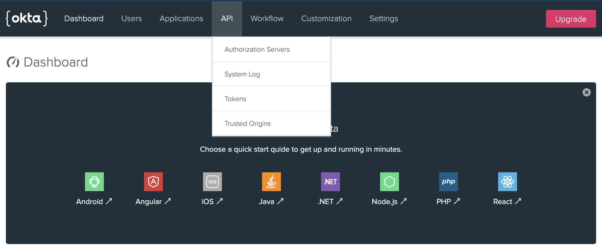
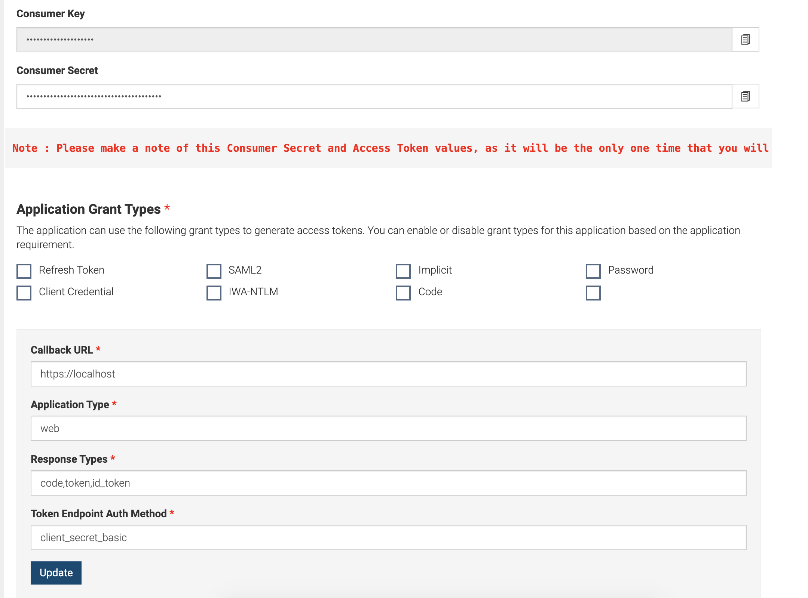

## Intro

This medium walks-through how to configure Okta IdP as third-party Key Manager with WSO2 API Manager

> NOTE: Tested versions are WSO2 APIM v2.6

## Guide

We will be swimming through the following steps

* Create an Okta Developer account
* Create an Authorization Server in Okta
* Create an Okta Application
* Configure Okta Extensions with WSO2 API Manager

## Okta

### Okta Developer Account

Our very first step will be to create an Okta Developer account to test and trial our Key Manager configurations.

Navigate to [https://developer.okta.com](https://developer.okta.com) and create a new Developer account to enjoy free trial on using Okta cloud IdP.

### Okta Authorization Server

After successful account creation, now we have to create and register an Authorization server in Okta to communicate and to perform authorization flows.

In the Okta developer portal navigate to `API` > `Authorization Servers` (refer to the attached screen-shot)



We will be looking at a similar page as follows with a default Authorization server created in Okta.

> For security concerns, all attached screenshots are masked

We can either create a new Authorization server or we can continue using the default Authorization server to configure Okta. Therefore, we will be continuing our configurations with the Default Authorization Server created by Okta...


Select the default Authorization server and click on the `Scopes` tab to create a Default Scope for the defined Authorization Server. Click on `Add Scope` and prompt the following

* Name: `default`
* Description: `Default Scope`
* Default Scope: `true`
* Metadata: `true`

and click `Create` to create the Default scope.


Next, select the `Tokens` tab to create a new API Token for WSO2 API Manager to communicate with our Okta server.


Click on `Create Token` and enter a name for the Token and copy and save the generated token value for future references. From now onwards, We will be referring to the token as `Okta API Token`.


### Okta Application

Next, we have to create a client application in the Okta IdP to acquire the Consumer secrets to communicate with the Server.

Select the `Applications` from the top navigation bar and then select `Add Application` to create one.


On the next UI, select the platform as `Web` and click `Next`. Enter the Application name and tick the `Client Credentials` under `Grant Type Allowed` section and `Done`.


After the successful creation of the Application, copy both the Consumer Key and Consumer Secret for future references.

## WSO2 API Manager

### Okta Extension

Clone or download the WSO2 API Manager Okta extension implementation from [here](https://github.com/athiththan11/apim-keymanager-okta).

<br />

<a class="ul-disabled" href="https://github.com/athiththan11/apim-keymanager-okta">
    <div class="card">
        <div class="card-horizontal">
            <div class="card-body py-4 px-5">
                <h4 class="card-title mt-4">APIM Keymanager Okta</h4>
                <p>Okta key-manager implementation for WSO2 API Manager</p>
                <footer class="blockquote-footer">
                    <small class="text-muted">
                        athiththan11
                    </small>
                </footer>
            </div>
            <div class="img-square-wrapper">
                
            </div>
        </div>
    </div>
</a>

Navigate to the `/artifacts` folder in the root of the project to find the pre-built okta extension JAR artifacts and other related configuration artifacts. Moreover, you are welcomed to build the okta extension JAR artifact by building the project.

Copy and place the `oktaoauthclient-x.x.x.jar` inside the `<APIM>/repository/components/lib` directory.

### API Manager XML

Download the WSO2 APIM v2.6 pack, extract and navigate to `<APIM>/repostiry/conf/api-manager.xml` to configure third-party Key Manager.

Uncomment the `APIKeyManager` configuration block in the `api-manager.xml` and edit/add the following

```xml
<APIKeyManager>
    <KeyManagerClientImpl>org.wso2.okta.client.OktaOAuthClient</KeyManagerClientImpl>
    <Configuration>
        <oktaInstanceUrl>{Okta Instance URL}</oktaInstanceUrl>
        <authorizationServerId>{Okta Authorization Server Name/ID}</authorizationServerId>
        <apiKey>{Okta Authorization Server API Token}</apiKey>
        <client_id>{Okta Application Client ID}</client_id>
        <client_secret>{Okta Application Client Secret}</client_secret>
    </Configuration>
</APIKeyManager>
```

Given below is a sample configuration

```xml
<APIKeyManager>
    <KeyManagerClientImpl>org.wso2.okta.client.OktaOAuthClient</KeyManagerClientImpl>
    <Configuration>
        <oktaInstanceUrl>https://dev-12345.oktapreview.com</oktaInstanceUrl>
        <authorizationServerId>default</authorizationServerId>
        <apiKey>00adc_bXcT123456789</apiKey>
        <client_id>0o2fg123456789gfL0h7</client_id>
        <client_secret>BwhHU123456789_wpKQg</client_secret>
    </Configuration>
</APIKeyManager>
```

### Store Sub-Theme

As of the next step, we will be configuring the Store portal theme to revamp the Application generation UI to support Okta connected parameters and input fields.

Navigate to the `<OktaProject>/artifacts/store` directory and copy and place/replace the `locale_default.json` into `<APIM>/repository/deployment/server/jaggeryapps/store/site/conf/locales/jaggery` directory.

Copy the `okta` theme folder and place it inside the `<APIM>/repository/deployment/server/jaggeryapps/store/site/themes/wso2/subthemes` directory.

Open up the `<APIM>/repository/deployment/server/jaggeryapps/store/site/conf/site.json` and declare the `okta` as a sub-theme by making the following changes

```json
{
  "theme": {
    "base": "wso2",
    "subtheme": "okta"
  }
  ...
}
```

## 🎉 Voila!!! 🎉

Now we have successfully configured Okta as a third-party Key Manager with the WSO2 API Manager. Let’s dive into a test-drive.

### Test Drive with Okta

Let’s start the WSO2 API Manager server by navigating to `<APIM>/bin` directory and executing the following based on your environment

```shell
# linux
./wso2server.sh

# windows
wso2server.bat
```

After a successful startup, direct to `https://<ip>:9443/publisher` and log in with the admin credentials

* Username: `admin`
* Password: `admin`

and deploy a sample API for our test drive (let’s deploy the one and only PizzaShack API).

Next, direct to the Store portal by routing to `https://<ip>:9443/store` and let’s sign-in with the above-mentioned admin credentials.

Steer to `Applications` > `Add Application` to create a new Store Application.

> By default, there will be a Default Application created (once logged in) for each and every user who has the `internal/subscriber` role and permissions


Give inputs to all required fields and click on Add to create the Application.


After the successful creation of our demo application, let’s direct to `Production Keys` tab to generate Consumer Secrets and Access Tokens using Okta third-party Key Manager.

> **A Quick Glance on the Generation Flow**
>
> At the generation of `Production Keys` and `Sandbox Keys` of an Application, the APIM will communicate with the configured Okta IdP to create a dynamic-client using the DCR (Dynamic Client Registration) endpoint. Upon successful creation, Okta responds back to the APIM Server with the populated metadata to store and to communicate again with Okta to generate the access tokens to invoke the APIs.
>
> Please follow the given instructions in [here](https://github.com/wso2-extensions/apim-keymanager-okta/blob/master/docs/config.md) to change the endpoints of Token, and Revoke endpoints to point to the Okta server.
>
> All created dynamic-clients will follow the naming structure as `{ApplicationName_[PRODUCTION|SANDBOX]}` to keep track of the created clients based on the Key Type

Provide the following at the prompted UI to generate the Consumer keys

* Callback URL: `https://localhost`
* Application Type: `web`
* Response Type: `code,token,id_token`
* Token Endpoint Auth Method: `client_secret_basic`
* Token Scope: `default`
* Token Grant Type: `client_credentials`


Upon successful generation of the key, the APIM server will prompt a similar UI as following

> Please make sure to note the generated Consumer Key and Consumer Secret because as this will be only displayed one time



If we navigate to the Okta Dev portal, there we can see a new application with the name `OktaDemoApplication_PRODUCTION` as follows


As of next step, copy the generated access token and invoke the deployed sample PizzaShack API.

**Keep Stacking !!!**

<hr class="three--dots"/>
